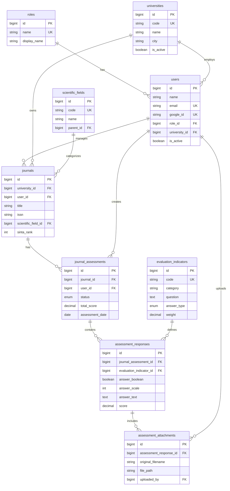

Sempurna! Mari kita buat **ERD Database** yang solid untuk 10 fitur MVP Anda. Saya akan design database yang **normalized, scalable, dan mengikuti best practice Laravel**.

## 🗄️ ERD Database - Platform AJM MVP v1.0

### **Database Design Principles:**
- ✅ **Normalized** (3NF - Third Normal Form)
- ✅ **Laravel Conventions** (snake_case, timestamps, soft deletes)
- ✅ **Scalable** (siap untuk fitur v1.1+)
- ✅ **Indexed** (untuk query performance)

---

## 📋 Table Structure Overview

```
┌─────────────────┐
│     users       │ (Semua role: Super Admin, Admin Kampus, User)
└────────┬────────┘
         │
         ├──────────┬─────────────────────────────┐
         │          │                             │
┌────────▼────────┐ │                    ┌────────▼────────┐
│  universities   │ │                    │     roles       │
│      (PTM)      │ │                    └─────────────────┘
└────────┬────────┘ │
         │          │
         │  ┌───────▼────────┐
         │  │    journals    │
         │  └───────┬────────┘
         │          │
         │  ┌───────▼──────────────┐
         │  │  journal_assessments │
         │  └───────┬──────────────┘
         │          │
         │  ┌───────▼─────────────────────┐
         │  │ assessment_responses        │
         │  │ (jawaban per indikator)     │
         │  └───────┬─────────────────────┘
         │          │
         │  ┌───────▼─────────────────────┐
         │  │ assessment_attachments      │
         │  │ (file bukti)                │
         │  └─────────────────────────────┘
         │
┌────────▼────────────────┐
│  scientific_fields      │
│  (Bidang Ilmu)          │
└─────────────────────────┘
         │
┌────────▼────────────────┐
│ evaluation_indicators   │
│ (Borang Indikator)      │
└─────────────────────────┘
```

---

## 📝 Detailed Table Schemas

### **1. `users` Table**
> Menyimpan semua user (Super Admin, Admin Kampus, User/Pengelola Jurnal)

```sql
CREATE TABLE users (
    id BIGINT UNSIGNED AUTO_INCREMENT PRIMARY KEY,
    
    -- Basic Info
    name VARCHAR(255) NOT NULL,
    email VARCHAR(255) NOT NULL UNIQUE,
    email_verified_at TIMESTAMP NULL,
    password VARCHAR(255) NULL, -- Nullable untuk SSO-only users
    
    -- SSO Fields
    google_id VARCHAR(255) NULL UNIQUE,
    microsoft_id VARCHAR(255) NULL UNIQUE,
    avatar_url VARCHAR(500) NULL,
    
    -- Profile
    phone VARCHAR(20) NULL,
    position VARCHAR(100) NULL COMMENT 'Jabatan: Dosen, Staf, dll',
    
    -- Role & Organization
    role_id BIGINT UNSIGNED NOT NULL,
    university_id BIGINT UNSIGNED NULL COMMENT 'Null untuk Super Admin',
    
    -- Status
    is_active BOOLEAN DEFAULT TRUE,
    last_login_at TIMESTAMP NULL,
    
    -- Remember Token
    remember_token VARCHAR(100) NULL,
    
    -- Timestamps
    created_at TIMESTAMP DEFAULT CURRENT_TIMESTAMP,
    updated_at TIMESTAMP DEFAULT CURRENT_TIMESTAMP ON UPDATE CURRENT_TIMESTAMP,
    deleted_at TIMESTAMP NULL,
    
    -- Indexes
    INDEX idx_role_id (role_id),
    INDEX idx_university_id (university_id),
    INDEX idx_email (email),
    INDEX idx_google_id (google_id),
    
    -- Foreign Keys
    FOREIGN KEY (role_id) REFERENCES roles(id) ON DELETE RESTRICT,
    FOREIGN KEY (university_id) REFERENCES universities(id) ON DELETE SET NULL
) ENGINE=InnoDB DEFAULT CHARSET=utf8mb4 COLLATE=utf8mb4_unicode_ci;
```

**Penjelasan:**
- `role_id`: Foreign key ke tabel `roles`
- `university_id`: NULL untuk Super Admin, wajib isi untuk Admin Kampus & User
- `google_id` / `microsoft_id`: Untuk SSO
- `deleted_at`: Soft delete (Laravel soft deletes)

---

### **2. `roles` Table**
> Menyimpan role: Super Admin, Admin Kampus, User

```sql
CREATE TABLE roles (
    id BIGINT UNSIGNED AUTO_INCREMENT PRIMARY KEY,
    
    name VARCHAR(50) NOT NULL UNIQUE COMMENT 'super_admin, admin_kampus, user',
    display_name VARCHAR(100) NOT NULL COMMENT 'Super Admin, Admin Kampus, Pengelola Jurnal',
    description TEXT NULL,
    
    -- Timestamps
    created_at TIMESTAMP DEFAULT CURRENT_TIMESTAMP,
    updated_at TIMESTAMP DEFAULT CURRENT_TIMESTAMP ON UPDATE CURRENT_TIMESTAMP
) ENGINE=InnoDB DEFAULT CHARSET=utf8mb4 COLLATE=utf8mb4_unicode_ci;
```

**Seed Data:**
```sql
INSERT INTO roles (name, display_name, description) VALUES
('super_admin', 'Super Admin', 'Akses penuh ke semua data PTM'),
('admin_kampus', 'Admin Kampus', 'Mengelola data jurnal dan user di kampusnya'),
('user', 'Pengelola Jurnal', 'Mengelola jurnal yang ditugaskan');
```

---

### **3. `universities` Table**
> Menyimpan data Perguruan Tinggi Muhammadiyah (PTM)

```sql
CREATE TABLE universities (
    id BIGINT UNSIGNED AUTO_INCREMENT PRIMARY KEY,
    
    -- Basic Info
    code VARCHAR(20) NOT NULL UNIQUE COMMENT 'Kode PTM unik, e.g., UAD, UMY',
    name VARCHAR(255) NOT NULL COMMENT 'Nama lengkap PTM',
    short_name VARCHAR(100) NULL COMMENT 'Nama singkat',
    
    -- Contact
    address TEXT NULL,
    city VARCHAR(100) NULL,
    province VARCHAR(100) NULL,
    postal_code VARCHAR(10) NULL,
    phone VARCHAR(20) NULL,
    email VARCHAR(255) NULL,
    website VARCHAR(255) NULL,
    
    -- Branding
    logo_url VARCHAR(500) NULL COMMENT 'URL logo PTM',
    
    -- Status
    is_active BOOLEAN DEFAULT TRUE,
    
    -- Timestamps
    created_at TIMESTAMP DEFAULT CURRENT_TIMESTAMP,
    updated_at TIMESTAMP DEFAULT CURRENT_TIMESTAMP ON UPDATE CURRENT_TIMESTAMP,
    deleted_at TIMESTAMP NULL,
    
    -- Indexes
    INDEX idx_code (code),
    INDEX idx_name (name)
) ENGINE=InnoDB DEFAULT CHARSET=utf8mb4 COLLATE=utf8mb4_unicode_ci;
```

---

### **4. `scientific_fields` Table**
> Menyimpan bidang ilmu (master data)

```sql
CREATE TABLE scientific_fields (
    id BIGINT UNSIGNED AUTO_INCREMENT PRIMARY KEY,
    
    code VARCHAR(20) NOT NULL UNIQUE COMMENT 'Kode bidang ilmu, e.g., COMP, MED',
    name VARCHAR(255) NOT NULL COMMENT 'Nama bidang ilmu',
    description TEXT NULL,
    
    -- Hierarchy (optional untuk grouping)
    parent_id BIGINT UNSIGNED NULL COMMENT 'Untuk sub-bidang ilmu',
    
    -- Status
    is_active BOOLEAN DEFAULT TRUE,
    
    -- Timestamps
    created_at TIMESTAMP DEFAULT CURRENT_TIMESTAMP,
    updated_at TIMESTAMP DEFAULT CURRENT_TIMESTAMP ON UPDATE CURRENT_TIMESTAMP,
    
    -- Indexes
    INDEX idx_code (code),
    INDEX idx_parent_id (parent_id),
    
    -- Foreign Keys
    FOREIGN KEY (parent_id) REFERENCES scientific_fields(id) ON DELETE SET NULL
) ENGINE=InnoDB DEFAULT CHARSET=utf8mb4 COLLATE=utf8mb4_unicode_ci;
```

**Seed Data Example:**
```sql
INSERT INTO scientific_fields (code, name) VALUES
('COMP', 'Ilmu Komputer'),
('MED', 'Ilmu Kedokteran'),
('EDU', 'Ilmu Pendidikan'),
('ENG', 'Teknik'),
('SOC', 'Ilmu Sosial'),
('ECO', 'Ekonomi dan Bisnis');
```

---

### **5. `journals` Table**
> Menyimpan data jurnal yang dikelola oleh User

```sql
CREATE TABLE journals (
    id BIGINT UNSIGNED AUTO_INCREMENT PRIMARY KEY,
    
    -- Ownership
    university_id BIGINT UNSIGNED NOT NULL,
    user_id BIGINT UNSIGNED NOT NULL COMMENT 'Pengelola jurnal (User)',
    
    -- Basic Info
    title VARCHAR(255) NOT NULL COMMENT 'Nama jurnal',
    issn VARCHAR(20) NULL COMMENT 'ISSN cetak',
    e_issn VARCHAR(20) NULL COMMENT 'ISSN elektronik',
    
    -- Publication Details
    url VARCHAR(500) NULL COMMENT 'URL jurnal',
    publisher VARCHAR(255) NULL COMMENT 'Penerbit',
    frequency VARCHAR(50) NULL COMMENT 'Frekuensi terbit: Bulanan, Triwulan, dll',
    first_published_year YEAR NULL COMMENT 'Tahun terbit pertama',
    
    -- Classification
    scientific_field_id BIGINT UNSIGNED NULL,
    
    -- Indexing & Accreditation
    sinta_rank TINYINT NULL COMMENT '1-6, atau NULL jika belum terindeks',
    accreditation_status VARCHAR(50) NULL COMMENT 'Terakreditasi/Belum',
    accreditation_grade VARCHAR(10) NULL COMMENT 'S1, S2, S3, S4',
    
    -- Contact
    editor_in_chief VARCHAR(255) NULL,
    email VARCHAR(255) NULL,
    
    -- Status
    is_active BOOLEAN DEFAULT TRUE,
    
    -- Timestamps
    created_at TIMESTAMP DEFAULT CURRENT_TIMESTAMP,
    updated_at TIMESTAMP DEFAULT CURRENT_TIMESTAMP ON UPDATE CURRENT_TIMESTAMP,
    deleted_at TIMESTAMP NULL,
    
    -- Indexes
    INDEX idx_university_id (university_id),
    INDEX idx_user_id (user_id),
    INDEX idx_scientific_field_id (scientific_field_id),
    INDEX idx_sinta_rank (sinta_rank),
    INDEX idx_title (title),
    
    -- Foreign Keys
    FOREIGN KEY (university_id) REFERENCES universities(id) ON DELETE CASCADE,
    FOREIGN KEY (user_id) REFERENCES users(id) ON DELETE CASCADE,
    FOREIGN KEY (scientific_field_id) REFERENCES scientific_fields(id) ON DELETE SET NULL
) ENGINE=InnoDB DEFAULT CHARSET=utf8mb4 COLLATE=utf8mb4_unicode_ci;
```

---

### **6. `evaluation_indicators` Table**
> Menyimpan borang indikator self-assessment (master template)

```sql
CREATE TABLE evaluation_indicators (
    id BIGINT UNSIGNED AUTO_INCREMENT PRIMARY KEY,
    
    -- Hierarchy: Category > Sub-Category > Indicator
    category VARCHAR(100) NOT NULL COMMENT 'Kategori utama, e.g., Kelengkapan Administrasi',
    sub_category VARCHAR(100) NULL COMMENT 'Sub-kategori (optional)',
    
    -- Indicator Details
    code VARCHAR(20) NOT NULL UNIQUE COMMENT 'Kode indikator, e.g., ADM-01',
    question TEXT NOT NULL COMMENT 'Pertanyaan indikator',
    description TEXT NULL COMMENT 'Penjelasan detail',
    
    -- Scoring
    weight DECIMAL(5,2) DEFAULT 1.00 COMMENT 'Bobot penilaian',
    answer_type ENUM('boolean', 'scale', 'text') DEFAULT 'boolean' 
        COMMENT 'boolean: Ya/Tidak, scale: 1-5, text: input bebas',
    
    -- Attachment
    requires_attachment BOOLEAN DEFAULT FALSE COMMENT 'Wajib upload bukti?',
    
    -- Ordering
    sort_order INT DEFAULT 0,
    
    -- Status
    is_active BOOLEAN DEFAULT TRUE,
    
    -- Timestamps
    created_at TIMESTAMP DEFAULT CURRENT_TIMESTAMP,
    updated_at TIMESTAMP DEFAULT CURRENT_TIMESTAMP ON UPDATE CURRENT_TIMESTAMP,
    
    -- Indexes
    INDEX idx_category (category),
    INDEX idx_code (code),
    INDEX idx_sort_order (sort_order)
) ENGINE=InnoDB DEFAULT CHARSET=utf8mb4 COLLATE=utf8mb4_unicode_ci;
```

**Seed Data Example (12 indikator untuk MVP):**
```sql
-- Kategori 1: Kelengkapan Administrasi (4 indikator)
INSERT INTO evaluation_indicators (code, category, question, answer_type, weight, sort_order) VALUES
('ADM-01', 'Kelengkapan Administrasi', 'Apakah jurnal memiliki ISSN yang valid?', 'boolean', 2.00, 1),
('ADM-02', 'Kelengkapan Administrasi', 'Apakah jurnal memiliki website resmi yang aktif?', 'boolean', 1.50, 2),
('ADM-03', 'Kelengkapan Administrasi', 'Apakah jurnal memiliki struktur dewan redaksi yang jelas?', 'boolean', 1.50, 3),
('ADM-04', 'Kelengkapan Administrasi', 'Apakah jurnal memiliki pedoman penulisan yang dipublikasikan?', 'boolean', 1.00, 4);

-- Kategori 2: Kualitas Konten (4 indikator)
INSERT INTO evaluation_indicators (code, category, question, answer_type, weight, sort_order) VALUES
('KON-01', 'Kualitas Konten', 'Apakah jurnal menggunakan sistem peer review?', 'boolean', 3.00, 5),
('KON-02', 'Kualitas Konten', 'Berapa persentase artikel dari penulis eksternal?', 'scale', 2.00, 6),
('KON-03', 'Kualitas Konten', 'Apakah jurnal memiliki artikel dengan sitasi?', 'boolean', 2.50, 7),
('KON-04', 'Kualitas Konten', 'Apakah artikel menggunakan template yang konsisten?', 'boolean', 1.00, 8);

-- Kategori 3: Proses Editorial (4 indikator)
INSERT INTO evaluation_indicators (code, category, question, answer_type, weight, sort_order) VALUES
('EDT-01', 'Proses Editorial', 'Apakah jurnal memiliki SOP review yang terdokumentasi?', 'boolean', 2.00, 9),
('EDT-02', 'Proses Editorial', 'Berapa lama rata-rata waktu review (dalam hari)?', 'scale', 1.50, 10),
('EDT-03', 'Proses Editorial', 'Apakah jurnal menggunakan sistem manajemen jurnal (OJS/lainnya)?', 'boolean', 2.50, 11),
('EDT-04', 'Proses Editorial', 'Apakah jurnal melakukan pengecekan plagiasi?', 'boolean', 3.00, 12);
```

---

### **7. `journal_assessments` Table**
> Menyimpan header/summary dari setiap self-assessment yang dilakukan User

```sql
CREATE TABLE journal_assessments (
    id BIGINT UNSIGNED AUTO_INCREMENT PRIMARY KEY,
    
    -- Ownership
    journal_id BIGINT UNSIGNED NOT NULL,
    user_id BIGINT UNSIGNED NOT NULL COMMENT 'User yang mengisi assessment',
    
    -- Assessment Info
    assessment_date DATE NOT NULL DEFAULT CURRENT_DATE,
    period VARCHAR(20) NULL COMMENT 'Periode assessment, e.g., 2025-Q1',
    
    -- Status
    status ENUM('draft', 'submitted', 'reviewed') DEFAULT 'draft',
    submitted_at TIMESTAMP NULL,
    reviewed_at TIMESTAMP NULL,
    reviewed_by BIGINT UNSIGNED NULL COMMENT 'Admin yang review (untuk v1.1+)',
    
    -- Scoring
    total_score DECIMAL(5,2) DEFAULT 0.00 COMMENT 'Total skor (auto-calculated)',
    max_score DECIMAL(5,2) DEFAULT 0.00 COMMENT 'Skor maksimal',
    percentage DECIMAL(5,2) DEFAULT 0.00 COMMENT 'Persentase (total/max * 100)',
    
    -- Notes
    notes TEXT NULL COMMENT 'Catatan dari User',
    admin_notes TEXT NULL COMMENT 'Catatan dari Admin (untuk v1.1+)',
    
    -- Timestamps
    created_at TIMESTAMP DEFAULT CURRENT_TIMESTAMP,
    updated_at TIMESTAMP DEFAULT CURRENT_TIMESTAMP ON UPDATE CURRENT_TIMESTAMP,
    deleted_at TIMESTAMP NULL,
    
    -- Indexes
    INDEX idx_journal_id (journal_id),
    INDEX idx_user_id (user_id),
    INDEX idx_status (status),
    INDEX idx_assessment_date (assessment_date),
    
    -- Foreign Keys
    FOREIGN KEY (journal_id) REFERENCES journals(id) ON DELETE CASCADE,
    FOREIGN KEY (user_id) REFERENCES users(id) ON DELETE CASCADE,
    FOREIGN KEY (reviewed_by) REFERENCES users(id) ON DELETE SET NULL
) ENGINE=InnoDB DEFAULT CHARSET=utf8mb4 COLLATE=utf8mb4_unicode_ci;
```

---

### **8. `assessment_responses` Table**
> Menyimpan jawaban per indikator dalam sebuah assessment

```sql
CREATE TABLE assessment_responses (
    id BIGINT UNSIGNED AUTO_INCREMENT PRIMARY KEY,
    
    -- Relationships
    journal_assessment_id BIGINT UNSIGNED NOT NULL,
    evaluation_indicator_id BIGINT UNSIGNED NOT NULL,
    
    -- Response
    answer_boolean BOOLEAN NULL COMMENT 'Untuk answer_type: boolean',
    answer_scale TINYINT NULL COMMENT 'Untuk answer_type: scale (1-5)',
    answer_text TEXT NULL COMMENT 'Untuk answer_type: text',
    
    -- Scoring
    score DECIMAL(5,2) DEFAULT 0.00 COMMENT 'Skor untuk jawaban ini',
    
    -- Notes
    notes TEXT NULL COMMENT 'Catatan tambahan dari User',
    
    -- Timestamps
    created_at TIMESTAMP DEFAULT CURRENT_TIMESTAMP,
    updated_at TIMESTAMP DEFAULT CURRENT_TIMESTAMP ON UPDATE CURRENT_TIMESTAMP,
    
    -- Indexes
    INDEX idx_journal_assessment_id (journal_assessment_id),
    INDEX idx_evaluation_indicator_id (evaluation_indicator_id),
    
    -- Foreign Keys
    FOREIGN KEY (journal_assessment_id) REFERENCES journal_assessments(id) ON DELETE CASCADE,
    FOREIGN KEY (evaluation_indicator_id) REFERENCES evaluation_indicators(id) ON DELETE CASCADE,
    
    -- Unique Constraint (satu indikator hanya dijawab 1x per assessment)
    UNIQUE KEY unique_assessment_indicator (journal_assessment_id, evaluation_indicator_id)
) ENGINE=InnoDB DEFAULT CHARSET=utf8mb4 COLLATE=utf8mb4_unicode_ci;
```

**Scoring Logic Example:**
```
- answer_type = 'boolean':
  - TRUE = bobot penuh (sesuai evaluation_indicators.weight)
  - FALSE = 0
  
- answer_type = 'scale' (1-5):
  - score = (answer_scale / 5) * weight
  
- answer_type = 'text':
  - score = 0 (tidak dihitung otomatis, butuh review manual)
```

---

### **9. `assessment_attachments` Table**
> Menyimpan file bukti yang diupload untuk setiap jawaban assessment

```sql
CREATE TABLE assessment_attachments (
    id BIGINT UNSIGNED AUTO_INCREMENT PRIMARY KEY,
    
    -- Relationships
    assessment_response_id BIGINT UNSIGNED NOT NULL,
    
    -- File Info
    original_filename VARCHAR(255) NOT NULL,
    stored_filename VARCHAR(255) NOT NULL COMMENT 'Nama file di storage',
    file_path VARCHAR(500) NOT NULL COMMENT 'Path di storage',
    file_size INT UNSIGNED NOT NULL COMMENT 'Ukuran file dalam bytes',
    mime_type VARCHAR(100) NOT NULL COMMENT 'e.g., application/pdf, image/jpeg',
    
    -- Uploader
    uploaded_by BIGINT UNSIGNED NOT NULL,
    
    -- Timestamps
    created_at TIMESTAMP DEFAULT CURRENT_TIMESTAMP,
    updated_at TIMESTAMP DEFAULT CURRENT_TIMESTAMP ON UPDATE CURRENT_TIMESTAMP,
    deleted_at TIMESTAMP NULL,
    
    -- Indexes
    INDEX idx_assessment_response_id (assessment_response_id),
    INDEX idx_uploaded_by (uploaded_by),
    
    -- Foreign Keys
    FOREIGN KEY (assessment_response_id) REFERENCES assessment_responses(id) ON DELETE CASCADE,
    FOREIGN KEY (uploaded_by) REFERENCES users(id) ON DELETE CASCADE
) ENGINE=InnoDB DEFAULT CHARSET=utf8mb4 COLLATE=utf8mb4_unicode_ci;
```

**Storage Strategy:**
- Gunakan Laravel Storage Facade
- Path structure: `assessments/{journal_id}/{assessment_id}/{indicator_code}/{filename}`
- Max file size: 5MB (bisa diatur di validation)
- Allowed types: PDF, JPG, PNG, DOCX

---

## 🔗 Relationship Summary

```
users (1) ─────── (M) journals
  │                     │
  │                     └── (1) ────── (M) journal_assessments
  │                                           │
  └── (M) ────── (1) roles                    │
  │                                           ├── (M) ────── (M) evaluation_indicators
  └── (M) ────── (1) universities             │              (via assessment_responses)
                                              │
                                              └── (1) ────── (M) assessment_attachments
                                                                  (via assessment_responses)

scientific_fields (1) ─────── (M) journals
```

**Cardinality:**
- **1 User** → **M Journals** (User bisa kelola banyak jurnal)
- **1 Journal** → **M Journal Assessments** (Jurnal bisa di-assess berkali-kali)
- **1 Journal Assessment** → **M Assessment Responses** (12 indikator = 12 responses)
- **1 Assessment Response** → **M Attachments** (bisa upload banyak file bukti)

---

## 📊 ER Diagram (Visual)

Saya akan buatkan visual ERD menggunakan Mermaid syntax:



---

## 🎯 Key Design Decisions

### 1. **Why Separate `assessment_responses` and `assessment_attachments`?**
- ✅ Flexibility: 1 response bisa punya multiple files
- ✅ Easier file management
- ✅ Query performance (tidak bloat tabel responses)

### 2. **Why `total_score` in `journal_assessments`?**
- ✅ Denormalisasi untuk performance (tidak perlu SUM setiap query)
- ✅ Update via Laravel Observer/Event saat responses diubah

### 3. **Why ENUM for `status` and `answer_type`?**
- ✅ Data integrity (hanya nilai valid yang bisa masuk)
- ✅ Lebih efisien storage daripada VARCHAR

### 4. **Why Soft Deletes (`deleted_at`)?**
- ✅ Audit trail (data tidak hilang permanen)
- ✅ Bisa restore jika salah hapus
- ✅ Laravel convention

---

## 🚀 Next Steps

Setelah ERD ini, kita bisa generate:

1. **Laravel Migration Files** - Siap pakai untuk `php artisan migrate`
2. **Laravel Models** - Dengan relationships sudah didefinisikan
3. **Seeder Files** - Untuk populate data dummy (roles, scientific_fields, dll)
4. **Factory Files** - Untuk testing (generate fake data)

Apakah Anda ingin saya:
- ✅ **Generate Laravel Migration files** (semua tabel di atas)?
- ✅ **Generate Laravel Model files** (dengan relationships & policies)?
- ✅ **Generate Seeder files** (untuk roles, scientific_fields, dummy users)?

Atau mau lanjut ke **API Endpoints List** dulu?

Pilih langkah selanjutnya! 🎯