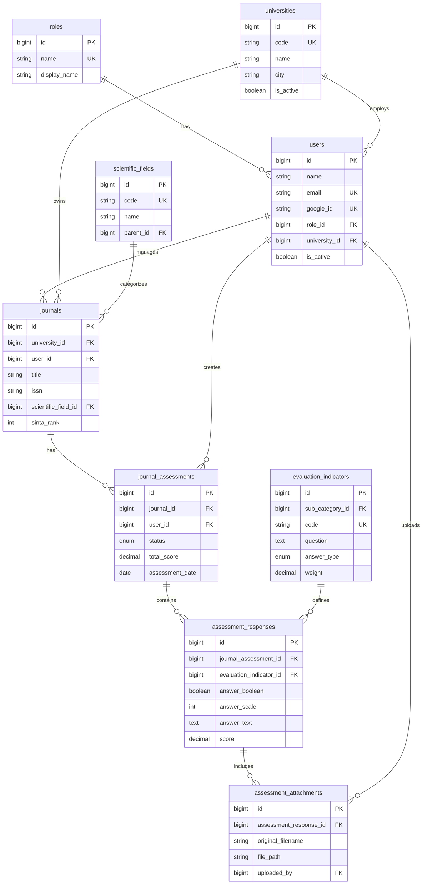
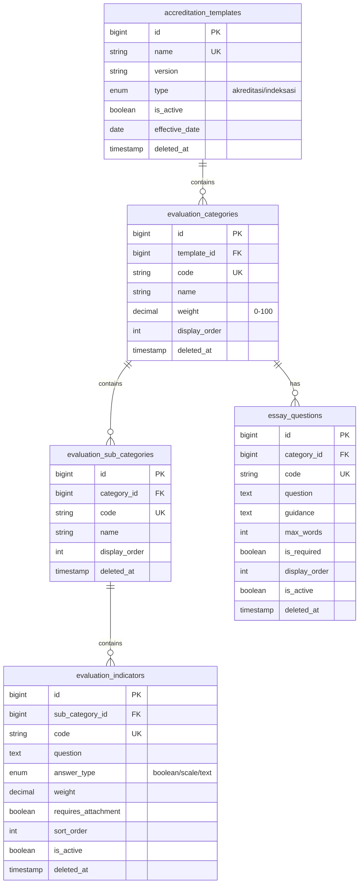
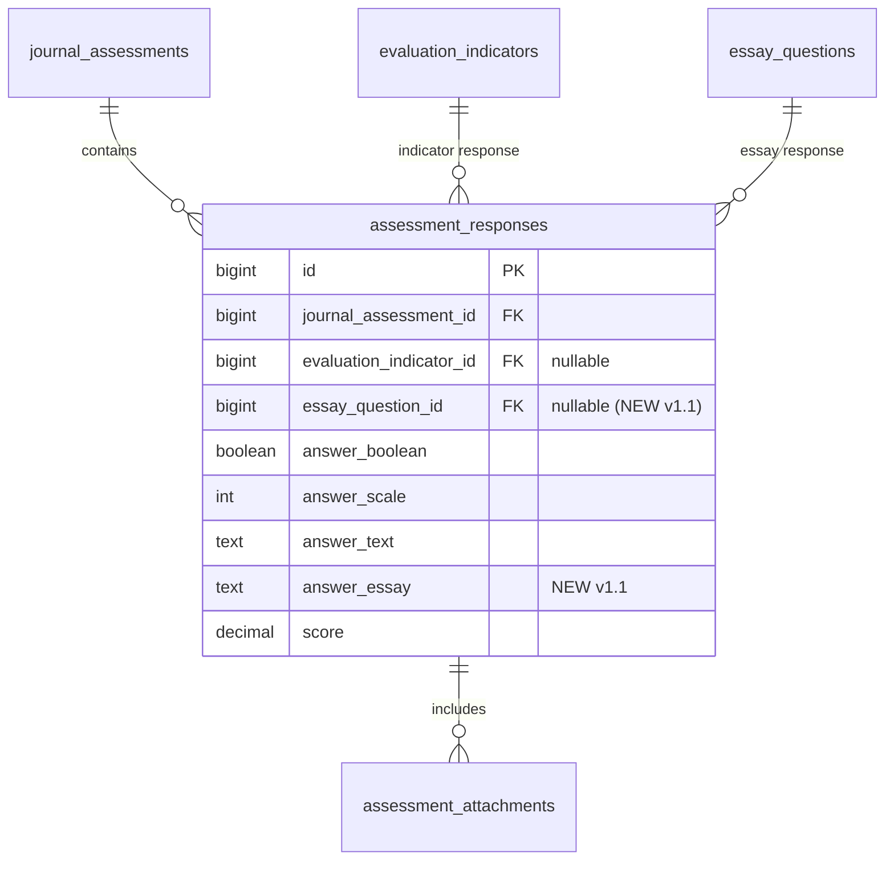
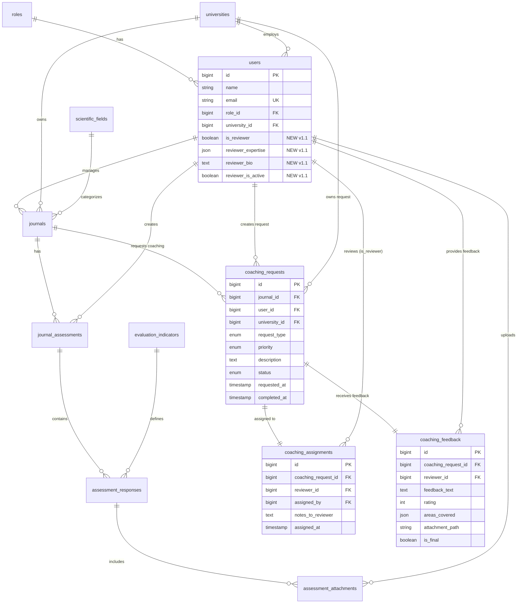

Sempurna! Mari kita buat **ERD Database** yang solid untuk 10 fitur MVP Anda. Saya akan design database yang **normalized, scalable, dan mengikuti best practice Laravel**.

## 🗄️ ERD Database - Platform AJM (Updated for v1.1)

**Version History:**
- **v1.0 (Q1 2026):** Base MVP schema - Authentication, RBAC, Journals, Self-Assessment
- **v1.1 (Q2 2026):** Added Pembinaan/Coaching tables, Reviewer management, **Hierarchical Borang Indikator Management** (Akreditasi & Indeksasi)

### **Database Design Principles:**
- ✅ **Normalized** (3NF - Third Normal Form)
- ✅ **Laravel Conventions** (snake_case, timestamps, soft deletes)
- ✅ **Scalable** (siap untuk fitur v1.1+)
- ✅ **Indexed** (untuk query performance)

---

## 📋 Table Structure Overview

### **v1.0 Tables (Base MVP)**
```
┌─────────────────┐
│     users       │ (Semua role: Super Admin, Admin Kampus, User)
└────────┬────────┘
         │
         ├──────────┬─────────────────────────────┐
         │          │                             │
┌────────▼────────┐ │                    ┌────────▼────────┐
│  universities   │ │                    │     roles       │
│      (PTM)      │ │                    └─────────────────┘
└────────┬────────┘ │
         │          │
         │  ┌───────▼────────┐
         │  │    journals    │
         │  └───────┬────────┘
         │          │
         │  ┌───────▼──────────────┐
         │  │  journal_assessments │
         │  └───────┬──────────────┘
         │          │
         │  ┌───────▼─────────────────────┐
         │  │ assessment_responses        │
         │  │ (jawaban per indikator)     │
         │  └───────┬─────────────────────┘
         │          │
         │  ┌───────▼─────────────────────┐
         │  │ assessment_attachments      │
         │  │ (file bukti)                │
         │  └─────────────────────────────┘
         │
┌────────▼────────────────┐
│  scientific_fields      │
│  (Bidang Ilmu)          │
└─────────────────────────┘
         │
┌────────▼────────────────┐
│ evaluation_indicators   │
│ (Borang Indikator)      │
└─────────────────────────┘
```

### **v1.1 New Tables (Pembinaan/Coaching Module)**
```
┌───────────────────┐
│     journals      │ (from v1.0)
└─────────┬─────────┘
          │
          │  ┌────────────────────────┐
          └──│  coaching_requests     │
             │  (User requests help)  │
             └─────────┬──────────────┘
                       │
                       ├──────────────────────────────────┐
                       │                                  │
              ┌────────▼───────────────┐        ┌────────▼────────────┐
              │ coaching_assignments   │        │  coaching_feedback  │
              │ (Admin assigns reviewer)│        │ (Reviewer feedback) │
              └────────────────────────┘        └─────────────────────┘
                       │
              ┌────────▼────────┐
              │     users       │ (reviewers: is_reviewer=true)
              └─────────────────┘
```

### **v1.1 New Tables (Hierarchical Borang Indikator Management)**
```
┌──────────────────────────────┐
│   accreditation_templates    │ (Top-level: BAN-PT 2024, Scopus 2024)
│   type: 'akreditasi'/'indeksasi' │
└──────────────┬───────────────┘
               │
               │ (1) ────── (M)
               │
      ┌────────▼──────────────┐
      │  evaluation_categories │ (Unsur Evaluasi)
      │  (weight, display_order)│
      └────────┬───────────────┘
               │
               ├── (1) ────── (M) ────────┐
               │                          │
      ┌────────▼──────────────────┐  ┌───▼────────────┐
      │ evaluation_sub_categories │  │ essay_questions│
      │  (Sub Unsur, display_order)│  │ (Esai per Unsur)│
      └────────┬──────────────────┘  └────────────────┘
               │
               │ (1) ────── (M)
               │
      ┌────────▼──────────────────┐
      │  evaluation_indicators    │ (Indikator pilihan ganda/scale)
      │  (UPDATED: + sub_category_id FK)│
      │  (OLD: category, sub_category strings retained)│
      └───────────────────────────┘
```

---

## 📝 Detailed Table Schemas

### **1. `users` Table**
> Menyimpan semua user (Super Admin, Admin Kampus, User/Pengelola Jurnal)

```sql
CREATE TABLE users (
    id BIGINT UNSIGNED AUTO_INCREMENT PRIMARY KEY,
    
    -- Basic Info
    name VARCHAR(255) NOT NULL,
    email VARCHAR(255) NOT NULL UNIQUE,
    email_verified_at TIMESTAMP NULL,
    password VARCHAR(255) NULL, -- Nullable untuk SSO-only users
    
    -- SSO Fields
    google_id VARCHAR(255) NULL UNIQUE,
    microsoft_id VARCHAR(255) NULL UNIQUE,
    avatar_url VARCHAR(500) NULL,
    
    -- Profile
    phone VARCHAR(20) NULL,
    position VARCHAR(100) NULL COMMENT 'Jabatan: Dosen, Staf, dll',
    
    -- Role & Organization
    role_id BIGINT UNSIGNED NOT NULL,
    university_id BIGINT UNSIGNED NULL COMMENT 'Null untuk Super Admin',
    
    -- Status
    is_active BOOLEAN DEFAULT TRUE,
    last_login_at TIMESTAMP NULL,
    
    -- Remember Token
    remember_token VARCHAR(100) NULL,
    
    -- Timestamps
    created_at TIMESTAMP DEFAULT CURRENT_TIMESTAMP,
    updated_at TIMESTAMP DEFAULT CURRENT_TIMESTAMP ON UPDATE CURRENT_TIMESTAMP,
    deleted_at TIMESTAMP NULL,
    
    -- Indexes
    INDEX idx_role_id (role_id),
    INDEX idx_university_id (university_id),
    INDEX idx_email (email),
    INDEX idx_google_id (google_id),
    
    -- Foreign Keys
    FOREIGN KEY (role_id) REFERENCES roles(id) ON DELETE RESTRICT,
    FOREIGN KEY (university_id) REFERENCES universities(id) ON DELETE SET NULL
) ENGINE=InnoDB DEFAULT CHARSET=utf8mb4 COLLATE=utf8mb4_unicode_ci;
```

**Penjelasan:**
- `role_id`: Foreign key ke tabel `roles`
- `university_id`: NULL untuk Super Admin, wajib isi untuk Admin Kampus & User
- `google_id` / `microsoft_id`: Untuk SSO
- `deleted_at`: Soft delete (Laravel soft deletes)

---

### **2. `roles` Table**
> Menyimpan role: Super Admin, Admin Kampus, User

```sql
CREATE TABLE roles (
    id BIGINT UNSIGNED AUTO_INCREMENT PRIMARY KEY,
    
    name VARCHAR(50) NOT NULL UNIQUE COMMENT 'super_admin, admin_kampus, user',
    display_name VARCHAR(100) NOT NULL COMMENT 'Super Admin, Admin Kampus, Pengelola Jurnal',
    description TEXT NULL,
    
    -- Timestamps
    created_at TIMESTAMP DEFAULT CURRENT_TIMESTAMP,
    updated_at TIMESTAMP DEFAULT CURRENT_TIMESTAMP ON UPDATE CURRENT_TIMESTAMP
) ENGINE=InnoDB DEFAULT CHARSET=utf8mb4 COLLATE=utf8mb4_unicode_ci;
```

**Seed Data:**
```sql
INSERT INTO roles (name, display_name, description) VALUES
('super_admin', 'Super Admin', 'Akses penuh ke semua data PTM'),
('admin_kampus', 'Admin Kampus', 'Mengelola data jurnal dan user di kampusnya'),
('user', 'Pengelola Jurnal', 'Mengelola jurnal yang ditugaskan');
```

---

### **3. `universities` Table**
> Menyimpan data Perguruan Tinggi Muhammadiyah (PTM)

```sql
CREATE TABLE universities (
    id BIGINT UNSIGNED AUTO_INCREMENT PRIMARY KEY,
    
    -- Basic Info
    code VARCHAR(20) NOT NULL UNIQUE COMMENT 'Kode PTM unik, e.g., UAD, UMY',
    name VARCHAR(255) NOT NULL COMMENT 'Nama lengkap PTM',
    short_name VARCHAR(100) NULL COMMENT 'Nama singkat',
    
    -- Contact
    address TEXT NULL,
    city VARCHAR(100) NULL,
    province VARCHAR(100) NULL,
    postal_code VARCHAR(10) NULL,
    phone VARCHAR(20) NULL,
    email VARCHAR(255) NULL,
    website VARCHAR(255) NULL,
    
    -- Branding
    logo_url VARCHAR(500) NULL COMMENT 'URL logo PTM',
    
    -- Status
    is_active BOOLEAN DEFAULT TRUE,
    
    -- Timestamps
    created_at TIMESTAMP DEFAULT CURRENT_TIMESTAMP,
    updated_at TIMESTAMP DEFAULT CURRENT_TIMESTAMP ON UPDATE CURRENT_TIMESTAMP,
    deleted_at TIMESTAMP NULL,
    
    -- Indexes
    INDEX idx_code (code),
    INDEX idx_name (name)
) ENGINE=InnoDB DEFAULT CHARSET=utf8mb4 COLLATE=utf8mb4_unicode_ci;
```

---

### **4. `scientific_fields` Table**
> Menyimpan bidang ilmu (master data)

```sql
CREATE TABLE scientific_fields (
    id BIGINT UNSIGNED AUTO_INCREMENT PRIMARY KEY,
    
    code VARCHAR(20) NOT NULL UNIQUE COMMENT 'Kode bidang ilmu, e.g., COMP, MED',
    name VARCHAR(255) NOT NULL COMMENT 'Nama bidang ilmu',
    description TEXT NULL,
    
    -- Hierarchy (optional untuk grouping)
    parent_id BIGINT UNSIGNED NULL COMMENT 'Untuk sub-bidang ilmu',
    
    -- Status
    is_active BOOLEAN DEFAULT TRUE,
    
    -- Timestamps
    created_at TIMESTAMP DEFAULT CURRENT_TIMESTAMP,
    updated_at TIMESTAMP DEFAULT CURRENT_TIMESTAMP ON UPDATE CURRENT_TIMESTAMP,
    
    -- Indexes
    INDEX idx_code (code),
    INDEX idx_parent_id (parent_id),
    
    -- Foreign Keys
    FOREIGN KEY (parent_id) REFERENCES scientific_fields(id) ON DELETE SET NULL
) ENGINE=InnoDB DEFAULT CHARSET=utf8mb4 COLLATE=utf8mb4_unicode_ci;
```

**Seed Data Example:**
```sql
INSERT INTO scientific_fields (code, name) VALUES
('COMP', 'Ilmu Komputer'),
('MED', 'Ilmu Kedokteran'),
('EDU', 'Ilmu Pendidikan'),
('ENG', 'Teknik'),
('SOC', 'Ilmu Sosial'),
('ECO', 'Ekonomi dan Bisnis');
```

---

### **5. `accreditation_templates` Table** ⭐ **NEW v1.1**
> Top-level template untuk borang indikator (Akreditasi/Indeksasi)

```sql
CREATE TABLE accreditation_templates (
    id BIGINT UNSIGNED AUTO_INCREMENT PRIMARY KEY,
    
    -- Template Info
    name VARCHAR(255) NOT NULL COMMENT 'e.g., BAN-PT 2024 - Akreditasi, Scopus 2024 - Indeksasi',
    description TEXT NULL COMMENT 'Deskripsi lengkap template',
    version VARCHAR(20) NULL COMMENT 'Versi template, e.g., v1.0, v2.1',
    
    -- Template Type
    type ENUM('akreditasi', 'indeksasi') NOT NULL COMMENT 'Kategori template',
    
    -- Status
    is_active BOOLEAN DEFAULT TRUE COMMENT 'Template aktif untuk digunakan',
    effective_date DATE NULL COMMENT 'Tanggal mulai berlaku',
    
    -- Timestamps
    created_at TIMESTAMP DEFAULT CURRENT_TIMESTAMP,
    updated_at TIMESTAMP DEFAULT CURRENT_TIMESTAMP ON UPDATE CURRENT_TIMESTAMP,
    deleted_at TIMESTAMP NULL COMMENT 'Soft delete',
    
    -- Indexes
    INDEX idx_type (type),
    INDEX idx_is_active (is_active),
    INDEX idx_name (name)
) ENGINE=InnoDB DEFAULT CHARSET=utf8mb4 COLLATE=utf8mb4_unicode_ci;
```

**Seed Data Example:**
```sql
INSERT INTO accreditation_templates (name, description, version, type, is_active, effective_date) VALUES
('BAN-PT 2024 - Akreditasi', 'Template borang akreditasi jurnal nasional berdasarkan standar BAN-PT 2024', 'v1.0', 'akreditasi', TRUE, '2024-01-01'),
('Scopus 2024 - Indeksasi', 'Template evaluasi untuk persiapan indeksasi Scopus', 'v1.0', 'indeksasi', TRUE, '2024-01-01');
```

---

### **6. `evaluation_categories` Table** ⭐ **NEW v1.1**
> Level 1: Unsur Evaluasi (parent dari Sub-Unsur)

```sql
CREATE TABLE evaluation_categories (
    id BIGINT UNSIGNED AUTO_INCREMENT PRIMARY KEY,
    
    -- Hierarchy
    template_id BIGINT UNSIGNED NOT NULL COMMENT 'Foreign key to accreditation_templates',
    
    -- Category Details
    code VARCHAR(20) NOT NULL COMMENT 'Kode unsur, e.g., ADM, KON, EDT',
    name VARCHAR(255) NOT NULL COMMENT 'Nama unsur, e.g., Kelengkapan Administrasi',
    description TEXT NULL COMMENT 'Penjelasan detail unsur',
    
    -- Weighting
    weight DECIMAL(5,2) DEFAULT 0.00 COMMENT 'Bobot kategori (0-100), sum per template harus <= 100',
    
    -- Ordering
    display_order INT DEFAULT 0 COMMENT 'Urutan tampilan',
    
    -- Timestamps
    created_at TIMESTAMP DEFAULT CURRENT_TIMESTAMP,
    updated_at TIMESTAMP DEFAULT CURRENT_TIMESTAMP ON UPDATE CURRENT_TIMESTAMP,
    deleted_at TIMESTAMP NULL,
    
    -- Indexes
    INDEX idx_template_id (template_id),
    INDEX idx_code (code),
    INDEX idx_display_order (display_order),
    
    -- Unique Constraint
    UNIQUE KEY unique_code_per_template (template_id, code),
    
    -- Foreign Keys
    FOREIGN KEY (template_id) REFERENCES accreditation_templates(id) ON DELETE CASCADE
) ENGINE=InnoDB DEFAULT CHARSET=utf8mb4 COLLATE=utf8mb4_unicode_ci;
```

**Seed Data Example:**
```sql
-- Untuk template "BAN-PT 2024 - Akreditasi"
INSERT INTO evaluation_categories (template_id, code, name, description, weight, display_order) VALUES
(1, 'ADM', 'Kelengkapan Administrasi', 'Evaluasi kelengkapan dokumen dan administrasi jurnal', 25.00, 1),
(1, 'KON', 'Kualitas Konten', 'Evaluasi kualitas naskah dan proses editorial', 40.00, 2),
(1, 'EDT', 'Proses Editorial', 'Evaluasi sistem dan proses editorial', 35.00, 3);
```

---

### **7. `evaluation_sub_categories` Table** ⭐ **NEW v1.1**
> Level 2: Sub-Unsur (parent dari Indikator)

```sql
CREATE TABLE evaluation_sub_categories (
    id BIGINT UNSIGNED AUTO_INCREMENT PRIMARY KEY,
    
    -- Hierarchy
    category_id BIGINT UNSIGNED NOT NULL COMMENT 'Foreign key to evaluation_categories',
    
    -- Sub-Category Details
    code VARCHAR(20) NOT NULL COMMENT 'Kode sub-unsur, e.g., ADM-ID, KON-PEER',
    name VARCHAR(255) NOT NULL COMMENT 'Nama sub-unsur, e.g., Identitas Jurnal',
    description TEXT NULL,
    
    -- Ordering
    display_order INT DEFAULT 0,
    
    -- Timestamps
    created_at TIMESTAMP DEFAULT CURRENT_TIMESTAMP,
    updated_at TIMESTAMP DEFAULT CURRENT_TIMESTAMP ON UPDATE CURRENT_TIMESTAMP,
    deleted_at TIMESTAMP NULL,
    
    -- Indexes
    INDEX idx_category_id (category_id),
    INDEX idx_code (code),
    INDEX idx_display_order (display_order),
    
    -- Unique Constraint
    UNIQUE KEY unique_code_per_category (category_id, code),
    
    -- Foreign Keys
    FOREIGN KEY (category_id) REFERENCES evaluation_categories(id) ON DELETE CASCADE
) ENGINE=InnoDB DEFAULT CHARSET=utf8mb4 COLLATE=utf8mb4_unicode_ci;
```

**Seed Data Example:**
```sql
-- Sub-unsur untuk "Kelengkapan Administrasi" (category_id = 1)
INSERT INTO evaluation_sub_categories (category_id, code, name, description, display_order) VALUES
(1, 'ADM-ID', 'Identitas Jurnal', 'ISSN, nama jurnal, penerbit', 1),
(1, 'ADM-WEB', 'Website & Online Presence', 'Website resmi, domain, aksesibilitas', 2);

-- Sub-unsur untuk "Kualitas Konten" (category_id = 2)
INSERT INTO evaluation_sub_categories (category_id, code, name, description, display_order) VALUES
(2, 'KON-PEER', 'Peer Review System', 'Sistem review mitra bestari', 1),
(2, 'KON-AUTH', 'Author Diversity', 'Keberagaman penulis', 2);
```

---

### **8. `essay_questions` Table** ⭐ **NEW v1.1**
> Pertanyaan esai per Unsur Evaluasi (berbeda dari indikator pilihan ganda)

```sql
CREATE TABLE essay_questions (
    id BIGINT UNSIGNED AUTO_INCREMENT PRIMARY KEY,
    
    -- Hierarchy (linked to Category, not SubCategory)
    category_id BIGINT UNSIGNED NOT NULL COMMENT 'Foreign key to evaluation_categories',
    
    -- Question Details
    code VARCHAR(20) NOT NULL COMMENT 'Kode essay, e.g., ESS-ADM-01',
    question TEXT NOT NULL COMMENT 'Pertanyaan essay',
    guidance TEXT NULL COMMENT 'Panduan/hint untuk menjawab',
    
    -- Constraints
    max_words INT DEFAULT 500 COMMENT 'Maksimal jumlah kata',
    is_required BOOLEAN DEFAULT TRUE COMMENT 'Wajib diisi atau opsional',
    
    -- Ordering
    display_order INT DEFAULT 0,
    
    -- Status
    is_active BOOLEAN DEFAULT TRUE,
    
    -- Timestamps
    created_at TIMESTAMP DEFAULT CURRENT_TIMESTAMP,
    updated_at TIMESTAMP DEFAULT CURRENT_TIMESTAMP ON UPDATE CURRENT_TIMESTAMP,
    deleted_at TIMESTAMP NULL,
    
    -- Indexes
    INDEX idx_category_id (category_id),
    INDEX idx_code (code),
    INDEX idx_is_active (is_active),
    INDEX idx_display_order (display_order),
    
    -- Unique Constraint
    UNIQUE KEY unique_code_per_category (category_id, code),
    
    -- Foreign Keys
    FOREIGN KEY (category_id) REFERENCES evaluation_categories(id) ON DELETE CASCADE
) ENGINE=InnoDB DEFAULT CHARSET=utf8mb4 COLLATE=utf8mb4_unicode_ci;
```

**Seed Data Example:**
```sql
-- Essay questions untuk "Kelengkapan Administrasi" (category_id = 1)
INSERT INTO essay_questions (category_id, code, question, guidance, max_words, is_required, display_order) VALUES
(1, 'ESS-ADM-01', 'Jelaskan strategi jurnal Anda dalam meningkatkan kualitas administrasi dalam 2 tahun terakhir.', 
    'Sertakan contoh konkret: perubahan sistem, pelatihan tim, adopsi tools baru, dll.', 500, TRUE, 1),
(1, 'ESS-ADM-02', 'Apa tantangan utama yang dihadapi dalam memenuhi standar administrasi akreditasi?', 
    'Fokus pada kendala teknis, SDM, atau infrastruktur.', 300, FALSE, 2);

-- Essay questions untuk "Kualitas Konten" (category_id = 2)
INSERT INTO essay_questions (category_id, code, question, guidance, max_words, is_required, display_order) VALUES
(2, 'ESS-KON-01', 'Bagaimana jurnal memastikan kualitas naskah melalui proses peer review?', 
    'Jelaskan SOP review, kriteria reviewer, timeline, blind review policy.', 600, TRUE, 1);
```

---

### **9. `journals` Table**
> Menyimpan data jurnal yang dikelola oleh User

```sql
CREATE TABLE journals (
    id BIGINT UNSIGNED AUTO_INCREMENT PRIMARY KEY,
    
    -- Ownership
    university_id BIGINT UNSIGNED NOT NULL,
    user_id BIGINT UNSIGNED NOT NULL COMMENT 'Pengelola jurnal (User)',
    
    -- Basic Info
    title VARCHAR(255) NOT NULL COMMENT 'Nama jurnal',
    issn VARCHAR(20) NULL COMMENT 'ISSN cetak',
    e_issn VARCHAR(20) NULL COMMENT 'ISSN elektronik',
    
    -- Publication Details
    url VARCHAR(500) NULL COMMENT 'URL jurnal',
    publisher VARCHAR(255) NULL COMMENT 'Penerbit',
    frequency VARCHAR(50) NULL COMMENT 'Frekuensi terbit: Bulanan, Triwulan, dll',
    first_published_year YEAR NULL COMMENT 'Tahun terbit pertama',
    
    -- Classification
    scientific_field_id BIGINT UNSIGNED NULL,
    
    -- Indexing & Accreditation
    sinta_rank TINYINT NULL COMMENT '1-6, atau NULL jika belum terindeks',
    accreditation_status VARCHAR(50) NULL COMMENT 'Terakreditasi/Belum',
    accreditation_grade VARCHAR(10) NULL COMMENT 'S1, S2, S3, S4',
    
    -- Contact
    editor_in_chief VARCHAR(255) NULL,
    email VARCHAR(255) NULL,
    
    -- Status
    is_active BOOLEAN DEFAULT TRUE,
    
    -- Timestamps
    created_at TIMESTAMP DEFAULT CURRENT_TIMESTAMP,
    updated_at TIMESTAMP DEFAULT CURRENT_TIMESTAMP ON UPDATE CURRENT_TIMESTAMP,
    deleted_at TIMESTAMP NULL,
    
    -- Indexes
    INDEX idx_university_id (university_id),
    INDEX idx_user_id (user_id),
    INDEX idx_scientific_field_id (scientific_field_id),
    INDEX idx_sinta_rank (sinta_rank),
    INDEX idx_title (title),
    
    -- Foreign Keys
    FOREIGN KEY (university_id) REFERENCES universities(id) ON DELETE CASCADE,
    FOREIGN KEY (user_id) REFERENCES users(id) ON DELETE CASCADE,
    FOREIGN KEY (scientific_field_id) REFERENCES scientific_fields(id) ON DELETE SET NULL
) ENGINE=InnoDB DEFAULT CHARSET=utf8mb4 COLLATE=utf8mb4_unicode_ci;
```

---

### **10. `evaluation_indicators` Table** 🔄 **UPDATED v1.1**
> Menyimpan borang indikator self-assessment (master template) - Level 3 dalam hierarchy

```sql
CREATE TABLE evaluation_indicators (
    id BIGINT UNSIGNED AUTO_INCREMENT PRIMARY KEY,
    
    -- ⭐ NEW v1.1: Relational Hierarchy
    sub_category_id BIGINT UNSIGNED NULL COMMENT 'NEW: FK to evaluation_sub_categories (relational)',
    
    -- ⚠️ DEPRECATED v1.1: Flat String Hierarchy (retained for backward compatibility)
    category VARCHAR(100) NULL COMMENT 'DEPRECATED - Use sub_category_id relation. Remove in v1.2',
    sub_category VARCHAR(100) NULL COMMENT 'DEPRECATED - Use sub_category_id relation. Remove in v1.2',
    
    -- Indicator Details
    code VARCHAR(20) NOT NULL UNIQUE COMMENT 'Kode indikator, e.g., ADM-01, IND-SCO-01',
    question TEXT NOT NULL COMMENT 'Pertanyaan indikator',
    description TEXT NULL COMMENT 'Penjelasan detail',
    
    -- Scoring
    weight DECIMAL(5,2) DEFAULT 1.00 COMMENT 'Bobot penilaian',
    answer_type ENUM('boolean', 'scale', 'text') DEFAULT 'boolean' 
        COMMENT 'boolean: Ya/Tidak, scale: 1-5, text: input bebas',
    
    -- Attachment
    requires_attachment BOOLEAN DEFAULT FALSE COMMENT 'Wajib upload bukti?',
    
    -- Ordering
    sort_order INT DEFAULT 0 COMMENT 'Urutan dalam sub_category (jika relational)',
    
    -- Status
    is_active BOOLEAN DEFAULT TRUE,
    
    -- Timestamps
    created_at TIMESTAMP DEFAULT CURRENT_TIMESTAMP,
    updated_at TIMESTAMP DEFAULT CURRENT_TIMESTAMP ON UPDATE CURRENT_TIMESTAMP,
    deleted_at TIMESTAMP NULL COMMENT 'Soft delete',
    
    -- Indexes
    INDEX idx_sub_category_id (sub_category_id),
    INDEX idx_category (category),
    INDEX idx_code (code),
    INDEX idx_sort_order (sort_order),
    INDEX idx_is_active (is_active),
    
    -- Foreign Keys
    FOREIGN KEY (sub_category_id) REFERENCES evaluation_sub_categories(id) ON DELETE CASCADE
) ENGINE=InnoDB DEFAULT CHARSET=utf8mb4 COLLATE=utf8mb4_unicode_ci;
```

**Migration Strategy:**
```sql
-- v1.0 → v1.1: Add relational column (backward compatible)
ALTER TABLE evaluation_indicators 
    ADD COLUMN sub_category_id BIGINT UNSIGNED NULL AFTER id,
    ADD INDEX idx_sub_category_id (sub_category_id),
    ADD FOREIGN KEY (sub_category_id) REFERENCES evaluation_sub_categories(id) ON DELETE CASCADE;

-- Update comments for deprecated columns
ALTER TABLE evaluation_indicators 
    MODIFY category VARCHAR(100) NULL COMMENT 'DEPRECATED v1.1 - Use sub_category_id relation. Remove in v1.2',
    MODIFY sub_category VARCHAR(100) NULL COMMENT 'DEPRECATED v1.1 - Use sub_category_id relation. Remove in v1.2';
```

**Seed Data Example (12 indikator untuk MVP):**
```sql
-- ⚠️ OLD Format (v1.0 - will be migrated to relational in v1.1)
-- Kategori 1: Kelengkapan Administrasi (4 indikator)
INSERT INTO evaluation_indicators (code, category, sub_category, question, answer_type, weight, sort_order) VALUES
('ADM-01', 'Kelengkapan Administrasi', 'Identitas Jurnal', 'Apakah jurnal memiliki ISSN yang valid?', 'boolean', 2.00, 1),
('ADM-02', 'Kelengkapan Administrasi', 'Identitas Jurnal', 'Apakah jurnal memiliki website resmi yang aktif?', 'boolean', 1.50, 2),
('ADM-03', 'Kelengkapan Administrasi', 'Dewan Redaksi', 'Apakah jurnal memiliki struktur dewan redaksi yang jelas?', 'boolean', 1.50, 3),
('ADM-04', 'Kelengkapan Administrasi', 'Panduan Penulis', 'Apakah jurnal memiliki pedoman penulisan yang dipublikasikan?', 'boolean', 1.00, 4);

-- Kategori 2: Kualitas Konten (4 indikator)
INSERT INTO evaluation_indicators (code, category, sub_category, question, answer_type, weight, sort_order) VALUES
('KON-01', 'Kualitas Konten', 'Peer Review', 'Apakah jurnal menggunakan sistem peer review?', 'boolean', 3.00, 5),
('KON-02', 'Kualitas Konten', 'Keberagaman Penulis', 'Berapa persentase artikel dari penulis eksternal?', 'scale', 2.00, 6),
('KON-03', 'Kualitas Konten', 'Sitasi & Dampak', 'Apakah jurnal memiliki artikel dengan sitasi?', 'boolean', 2.50, 7),
('KON-04', 'Kualitas Konten', 'Format & Template', 'Apakah artikel menggunakan template yang konsisten?', 'boolean', 1.00, 8);

-- Kategori 3: Proses Editorial (4 indikator)
INSERT INTO evaluation_indicators (code, category, sub_category, question, answer_type, weight, sort_order) VALUES
('EDT-01', 'Proses Editorial', 'SOP Editorial', 'Apakah jurnal memiliki SOP review yang terdokumentasi?', 'boolean', 2.00, 9),
('EDT-02', 'Proses Editorial', 'Timeline Review', 'Berapa lama rata-rata waktu review (dalam hari)?', 'scale', 1.50, 10),
('EDT-03', 'Proses Editorial', 'Sistem Manajemen', 'Apakah jurnal menggunakan sistem manajemen jurnal (OJS/lainnya)?', 'boolean', 2.50, 11),
('EDT-04', 'Proses Editorial', 'Quality Control', 'Apakah jurnal melakukan pengecekan plagiasi?', 'boolean', 3.00, 12);

-- ⭐ NEW Format (v1.1 - relational, after migration script runs)
-- Assumes:
--   - sub_category_id = 1 for "Identitas Jurnal"
--   - sub_category_id = 2 for "Dewan Redaksi"
--   - sub_category_id = 3 for "Panduan Penulis", etc.
-- UPDATE evaluation_indicators SET sub_category_id = 1 WHERE code IN ('ADM-01', 'ADM-02');
-- UPDATE evaluation_indicators SET sub_category_id = 2 WHERE code = 'ADM-03';
-- ... (handled by DataMigrationSeeder in Step 4)
```

---

### **11. `journal_assessments` Table**
> Menyimpan header/summary dari setiap self-assessment yang dilakukan User

```sql
CREATE TABLE journal_assessments (
    id BIGINT UNSIGNED AUTO_INCREMENT PRIMARY KEY,
    
    -- Ownership
    journal_id BIGINT UNSIGNED NOT NULL,
    user_id BIGINT UNSIGNED NOT NULL COMMENT 'User yang mengisi assessment',
    
    -- Assessment Info
    assessment_date DATE NOT NULL DEFAULT CURRENT_DATE,
    period VARCHAR(20) NULL COMMENT 'Periode assessment, e.g., 2025-Q1',
    
    -- Status Flow: draft → submitted → reviewed (approved by Admin Kampus)
    status ENUM('draft', 'submitted', 'reviewed') DEFAULT 'draft',
    submitted_at TIMESTAMP NULL COMMENT 'When User submits assessment',
    
    -- Admin Kampus Approval (NEW Phase 3)
    admin_kampus_approved_by BIGINT UNSIGNED NULL COMMENT 'Admin Kampus who approved/rejected',
    admin_kampus_approved_at TIMESTAMP NULL COMMENT 'Approval/rejection timestamp',
    admin_kampus_approval_notes TEXT NULL COMMENT 'Admin Kampus notes (approval or rejection reason)',
    
    -- Final Review (for future Dikti reviewer)
    reviewed_at TIMESTAMP NULL COMMENT 'When reviewer completes review',
    reviewed_by BIGINT UNSIGNED NULL COMMENT 'Dikti reviewer ID (untuk v1.1+)',
    
    -- Scoring
    total_score DECIMAL(5,2) DEFAULT 0.00 COMMENT 'Total skor (auto-calculated)',
    max_score DECIMAL(5,2) DEFAULT 0.00 COMMENT 'Skor maksimal',
    percentage DECIMAL(5,2) DEFAULT 0.00 COMMENT 'Persentase (total/max * 100)',
    
    -- Notes
    notes TEXT NULL COMMENT 'User self-assessment notes',
    admin_notes TEXT NULL COMMENT 'Dikti reviewer notes (untuk v1.1+)',
    -- admin_kampus_approval_notes moved to Admin Kampus Approval section above
    
    -- Timestamps
    created_at TIMESTAMP DEFAULT CURRENT_TIMESTAMP,
    updated_at TIMESTAMP DEFAULT CURRENT_TIMESTAMP ON UPDATE CURRENT_TIMESTAMP,
    deleted_at TIMESTAMP NULL,
    
    -- Indexes
    INDEX idx_journal_id (journal_id),
    INDEX idx_user_id (user_id),
    INDEX idx_status (status),
    INDEX idx_assessment_date (assessment_date),
    
    -- Foreign Keys
    FOREIGN KEY (journal_id) REFERENCES journals(id) ON DELETE CASCADE,
    FOREIGN KEY (user_id) REFERENCES users(id) ON DELETE CASCADE,
    FOREIGN KEY (admin_kampus_approved_by) REFERENCES users(id) ON DELETE SET NULL COMMENT 'Admin Kampus',
    FOREIGN KEY (reviewed_by) REFERENCES users(id) ON DELETE SET NULL COMMENT 'Dikti Reviewer'
) ENGINE=InnoDB DEFAULT CHARSET=utf8mb4 COLLATE=utf8mb4_unicode_ci;
```

---

### **8. `assessment_responses` Table**
> Menyimpan jawaban per indikator dalam sebuah assessment

```sql
CREATE TABLE assessment_responses (
    id BIGINT UNSIGNED AUTO_INCREMENT PRIMARY KEY,
    
    -- Relationships
    journal_assessment_id BIGINT UNSIGNED NOT NULL,
    evaluation_indicator_id BIGINT UNSIGNED NOT NULL,
    
    -- Response
    answer_boolean BOOLEAN NULL COMMENT 'Untuk answer_type: boolean',
    answer_scale TINYINT NULL COMMENT 'Untuk answer_type: scale (1-5)',
    answer_text TEXT NULL COMMENT 'Untuk answer_type: text',
    
    -- Scoring
    score DECIMAL(5,2) DEFAULT 0.00 COMMENT 'Skor untuk jawaban ini',
    
    -- Notes
    notes TEXT NULL COMMENT 'Catatan tambahan dari User',
    
    -- Timestamps
    created_at TIMESTAMP DEFAULT CURRENT_TIMESTAMP,
    updated_at TIMESTAMP DEFAULT CURRENT_TIMESTAMP ON UPDATE CURRENT_TIMESTAMP,
    
    -- Indexes
    INDEX idx_journal_assessment_id (journal_assessment_id),
    INDEX idx_evaluation_indicator_id (evaluation_indicator_id),
    
    -- Foreign Keys
    FOREIGN KEY (journal_assessment_id) REFERENCES journal_assessments(id) ON DELETE CASCADE,
    FOREIGN KEY (evaluation_indicator_id) REFERENCES evaluation_indicators(id) ON DELETE CASCADE,
    
    -- Unique Constraint (satu indikator hanya dijawab 1x per assessment)
    UNIQUE KEY unique_assessment_indicator (journal_assessment_id, evaluation_indicator_id)
) ENGINE=InnoDB DEFAULT CHARSET=utf8mb4 COLLATE=utf8mb4_unicode_ci;
```

**Scoring Logic Example:**
```
- answer_type = 'boolean':
  - TRUE = bobot penuh (sesuai evaluation_indicators.weight)
  - FALSE = 0
  
- answer_type = 'scale' (1-5):
  - score = (answer_scale / 5) * weight
  
- answer_type = 'text':
  - score = 0 (tidak dihitung otomatis, butuh review manual)
```

---

### **9. `assessment_attachments` Table**
> Menyimpan file bukti yang diupload untuk setiap jawaban assessment

```sql
CREATE TABLE assessment_attachments (
    id BIGINT UNSIGNED AUTO_INCREMENT PRIMARY KEY,
    
    -- Relationships
    assessment_response_id BIGINT UNSIGNED NOT NULL,
    
    -- File Info
    original_filename VARCHAR(255) NOT NULL,
    stored_filename VARCHAR(255) NOT NULL COMMENT 'Nama file di storage',
    file_path VARCHAR(500) NOT NULL COMMENT 'Path di storage',
    file_size INT UNSIGNED NOT NULL COMMENT 'Ukuran file dalam bytes',
    mime_type VARCHAR(100) NOT NULL COMMENT 'e.g., application/pdf, image/jpeg',
    
    -- Uploader
    uploaded_by BIGINT UNSIGNED NOT NULL,
    
    -- Timestamps
    created_at TIMESTAMP DEFAULT CURRENT_TIMESTAMP,
    updated_at TIMESTAMP DEFAULT CURRENT_TIMESTAMP ON UPDATE CURRENT_TIMESTAMP,
    deleted_at TIMESTAMP NULL,
    
    -- Indexes
    INDEX idx_assessment_response_id (assessment_response_id),
    INDEX idx_uploaded_by (uploaded_by),
    
    -- Foreign Keys
    FOREIGN KEY (assessment_response_id) REFERENCES assessment_responses(id) ON DELETE CASCADE,
    FOREIGN KEY (uploaded_by) REFERENCES users(id) ON DELETE CASCADE
) ENGINE=InnoDB DEFAULT CHARSET=utf8mb4 COLLATE=utf8mb4_unicode_ci;
```

**Storage Strategy:**
- Gunakan Laravel Storage Facade
- Path structure: `assessments/{journal_id}/{assessment_id}/{indicator_code}/{filename}`
- Max file size: 5MB (bisa diatur di validation)
- Allowed types: PDF, JPG, PNG, DOCX

---

## 🔗 Relationship Summary

### **v1.0 Core Relationships**
```
users (1) ─────── (M) journals
  │                     │
  │                     └── (1) ────── (M) journal_assessments
  │                                           │
  └── (M) ────── (1) roles                    │
  │                                           ├── (M) ────── (M) evaluation_indicators
  └── (M) ────── (1) universities             │              (via assessment_responses)
                                              │
                                              └── (1) ────── (M) assessment_attachments
                                                                  (via assessment_responses)

scientific_fields (1) ─────── (M) journals
```

### **v1.1 NEW: Hierarchical Borang Relationships** ⭐
```
accreditation_templates (1)
    │
    ├── (M) evaluation_categories
    │       │
    │       ├── (M) evaluation_sub_categories
    │       │       │
    │       │       └── (M) evaluation_indicators (via sub_category_id FK)
    │       │
    │       └── (M) essay_questions (linked to category directly)
    │
    └── Constraint: type ENUM ('akreditasi', 'indeksasi')

assessment_responses (1:M with both):
    ├── (M:1) evaluation_indicators (answer_type: boolean/scale/text)
    └── (M:1) essay_questions (answer_essay TEXT)
```

**Cardinality v1.0:**
- **1 User** → **M Journals** (User bisa kelola banyak jurnal)
- **1 Journal** → **M Journal Assessments** (Jurnal bisa di-assess berkali-kali)
- **1 Journal Assessment** → **M Assessment Responses** (12+ indikator + essays)
- **1 Assessment Response** → **M Attachments** (bisa upload banyak file bukti)

**Cardinality v1.1 (Hierarchical):**
- **1 Accreditation Template** → **M Categories** (Unsur Evaluasi)
- **1 Category** → **M Sub-Categories** (Sub-Unsur)
- **1 Category** → **M Essay Questions** (Essays per Unsur)
- **1 Sub-Category** → **M Indicators** (Indikator pilihan ganda/scale)
- **Cascade Delete**: Template → Categories → SubCategories → Indicators (all soft delete)

---

## 📊 ER Diagram (Visual)

Saya akan buatkan visual ERD menggunakan Mermaid syntax:

### **Core v1.0 ERD (Authentication & Assessment)**


### **v1.1 NEW: Hierarchical Borang Management ERD** ⭐


### **v1.1: Assessment Responses with Essays** 🔄


---

## 🎯 Key Design Decisions

### **v1.0 Core Design**

### 1. **Why Separate `assessment_responses` and `assessment_attachments`?**
- ✅ Flexibility: 1 response bisa punya multiple files
- ✅ Easier file management
- ✅ Query performance (tidak bloat tabel responses)

### 2. **Why `total_score` in `journal_assessments`?**
- ✅ Denormalisasi untuk performance (tidak perlu SUM setiap query)
- ✅ Update via Laravel Observer/Event saat responses diubah

### 3. **Why ENUM for `status` and `answer_type`?**
- ✅ Data integrity (hanya nilai valid yang bisa masuk)
- ✅ Lebih efisien storage daripada VARCHAR

### 4. **Why Soft Deletes (`deleted_at`)?**
- ✅ Audit trail (data tidak hilang permanen)
- ✅ Bisa restore jika salah hapus
- ✅ Laravel convention

### **v1.1 Hierarchical Design Decisions** ⭐

### 5. **Why 4-Level Hierarchy (Template → Category → SubCategory → Indicator)?**
- ✅ **Flexibility**: Super Admin dapat mengatur struktur borang tanpa developer
- ✅ **Scalability**: Support multiple templates (Akreditasi vs Indeksasi)
- ✅ **Versioning**: Template dapat di-clone untuk perubahan standar akreditasi baru
- ✅ **Weight Management**: Category-level weighting (25% ADM, 40% KON, 35% EDT)
- ✅ **Separation of Concerns**: Essays linked to Category, Indicators linked to SubCategory

### 6. **Why Keep Deprecated `category`/`sub_category` Columns in `evaluation_indicators`?**
- ✅ **Backward Compatibility**: Existing assessments (v1.0) tetap berfungsi tanpa migration error
- ✅ **Gradual Migration**: Data migration script dapat berjalan tanpa downtime
- ✅ **Rollback Safety**: Jika v1.1 migration di-rollback, v1.0 code tetap baca column lama
- ⚠️ **Plan**: Remove columns di v1.2 setelah 3 bulan production stability

### 7. **Why `essay_questions` Separate from `evaluation_indicators`?**
- ✅ **Different Scoring Logic**: Essays tidak punya weight otomatis (manual review)
- ✅ **Different UI Flow**: Essays ditampilkan per Category, bukan per SubCategory
- ✅ **Constraints**: `max_words`, `guidance` tidak applicable untuk indicator boolean/scale
- ✅ **Query Optimization**: Indicator queries tidak terbebani JOIN essay data

### 8. **Why Essay Linked to `category_id` NOT `sub_category_id`?**
- ✅ **Per Stakeholder Input**: "Essay pertanyaan umum per Unsur Evaluasi, bukan per Sub-Unsur"
- ✅ **UX Simplicity**: User mengisi essays SETELAH semua indicators di satu Category
- ✅ **Example**: Essay "Jelaskan strategi peningkatan kualitas konten" (Category-level), bukan spesifik ke sub-kategori "Peer Review"

### 9. **Why `type` ENUM ('akreditasi', 'indeksasi') at Template Level?**
- ✅ **Business Logic**: Accreditation (BAN-PT) vs Indexation (Scopus/Sinta) punya standar berbeda
- ✅ **Filter UI**: Super Admin dapat manage templates per type
- ✅ **Future Extensibility**: Bisa tambah type baru: 'internasional', 'regional', dll
- ✅ **Validation**: Prevent mixing Akreditasi indicators dengan Indeksasi template

### 10. **Why `display_order` Instead of Timestamps for Ordering?**
- ✅ **Explicit Control**: Super Admin dapat atur urutan exact via drag-and-drop
- ✅ **Batch Reordering**: Update `display_order` via single API call (transaction-safe)
- ✅ **Predictable**: Tidak bergantung pada created_at yang bisa berubah saat clone/import

### 11. **Why Cascade DELETE for Hierarchy?**
- ✅ **Data Integrity**: Delete Template → auto cleanup semua Categories/SubCategories/Indicators
- ✅ **Prevent Orphans**: Tidak ada SubCategory tanpa parent Category
- ⚠️ **Safety**: Check submitted assessments BEFORE allowing template delete (business logic di Controller)
- ✅ **Soft Delete**: Cascade delete respects `deleted_at`, jadi data tetap di-archive

---

## 🚀 Next Steps

Setelah ERD ini, kita bisa generate:

1. **Laravel Migration Files** - Siap pakai untuk `php artisan migrate`
2. **Laravel Models** - Dengan relationships sudah didefinisikan
3. **Seeder Files** - Untuk populate data dummy (roles, scientific_fields, dll)
4. **Factory Files** - Untuk testing (generate fake data)

---

## 📋 v1.1 Hierarchical Borang Implementation Checklist

### **Step 1: Create New Tables (Migration Order)**
```bash
# Priority 1: Foundation tables
1. 2026_01_27_100000_create_accreditation_templates_table.php
2. 2026_01_27_110000_create_evaluation_categories_table.php
3. 2026_01_27_120000_create_evaluation_sub_categories_table.php
4. 2026_01_27_130000_create_essay_questions_table.php

# Priority 2: Alter existing table
5. 2026_01_27_140000_alter_evaluation_indicators_add_hierarchy.php
```

### **Step 2: Data Migration Script**
```php
// DataMigrationSeeder.php - Run AFTER Step 1 migrations
- Create 2 templates: "BAN-PT 2024 - Akreditasi", "Scopus 2024 - Indeksasi"
- Extract unique categories from existing indicators → Create evaluation_categories
- Extract unique sub_categories → Create evaluation_sub_categories
- Update evaluation_indicators.sub_category_id via code matching
- Seed 6 sample essay_questions (3 per template)
```

### **Step 3: Rollback Testing**
```bash
# Test rollback safety
php artisan migrate:rollback --step=5
# Expected: All 4 new tables + altered column dropped
# Verify: Old v1.0 assessments still queryable via category/sub_category strings

# Re-apply
php artisan migrate
php artisan db:seed --class=DataMigrationSeeder
```

### **Step 4: Models & Relationships**
- [ ] `AccreditationTemplate.php` - hasMany(categories), hasManyThrough(indicators)
- [ ] `EvaluationCategory.php` - belongsTo(template), hasMany(subCategories, essays)
- [ ] `EvaluationSubCategory.php` - belongsTo(category), hasMany(indicators)
- [ ] `EssayQuestion.php` - belongsTo(category)
- [ ] Update `EvaluationIndicator.php` - belongsTo(subCategory)

### **Step 5: Policies (All Super Admin Only)**
- [ ] `AccreditationTemplatePolicy`
- [ ] `EvaluationCategoryPolicy`
- [ ] `EvaluationSubCategoryPolicy`
- [ ] `EssayQuestionPolicy`
- [ ] `EvaluationIndicatorPolicy` (NEW - sebelumnya tidak ada)

---

## 🆕 V1.1 NEW TABLES (Pembinaan/Coaching Module)

### **10. `coaching_requests` Table**
> Menyimpan permintaan pembinaan/coaching dari User untuk jurnal mereka

```sql
CREATE TABLE coaching_requests (
    id BIGINT UNSIGNED AUTO_INCREMENT PRIMARY KEY,
    
    -- Relationships
    journal_id BIGINT UNSIGNED NOT NULL,
    user_id BIGINT UNSIGNED NOT NULL COMMENT 'Requester (User yang minta pembinaan)',
    university_id BIGINT UNSIGNED NOT NULL COMMENT 'For scoping by Admin Kampus',
    
    -- Request Details
    request_type ENUM('akreditasi', 'indeksasi', 'editorial', 'technical') NOT NULL
        COMMENT 'Jenis bantuan yang diminta',
    priority ENUM('low', 'medium', 'high') DEFAULT 'medium',
    description TEXT NOT NULL COMMENT 'Penjelasan kebutuhan pembinaan',
    attachment_path VARCHAR(500) NULL COMMENT 'File pendukung (optional)',
    
    -- Status Tracking
    status ENUM('pending', 'assigned', 'in_progress', 'completed', 'rejected') DEFAULT 'pending',
    requested_at TIMESTAMP DEFAULT CURRENT_TIMESTAMP,
    completed_at TIMESTAMP NULL,
    rejected_reason TEXT NULL COMMENT 'Alasan jika ditolak',
    
    -- Timestamps
    created_at TIMESTAMP DEFAULT CURRENT_TIMESTAMP,
    updated_at TIMESTAMP DEFAULT CURRENT_TIMESTAMP ON UPDATE CURRENT_TIMESTAMP,
    deleted_at TIMESTAMP NULL,
    
    -- Indexes
    INDEX idx_journal_id (journal_id),
    INDEX idx_user_id (user_id),
    INDEX idx_university_id (university_id),
    INDEX idx_status (status),
    INDEX idx_priority (priority),
    INDEX idx_requested_at (requested_at),
    
    -- Foreign Keys
    FOREIGN KEY (journal_id) REFERENCES journals(id) ON DELETE CASCADE,
    FOREIGN KEY (user_id) REFERENCES users(id) ON DELETE CASCADE,
    FOREIGN KEY (university_id) REFERENCES universities(id) ON DELETE CASCADE
) ENGINE=InnoDB DEFAULT CHARSET=utf8mb4 COLLATE=utf8mb4_unicode_ci;
```

**Business Rules:**
- User can only request coaching for journals with **reviewed assessments** (status='reviewed')
- One journal can have multiple coaching requests over time
- Requests can be edited/deleted only if status='pending'

---

### **11. `coaching_assignments` Table**
> Menyimpan assignment reviewer ke coaching request oleh Admin Kampus

```sql
CREATE TABLE coaching_assignments (
    id BIGINT UNSIGNED AUTO_INCREMENT PRIMARY KEY,
    
    -- Relationships
    coaching_request_id BIGINT UNSIGNED NOT NULL,
    reviewer_id BIGINT UNSIGNED NOT NULL COMMENT 'User yang ditugaskan sebagai reviewer',
    assigned_by BIGINT UNSIGNED NOT NULL COMMENT 'Admin Kampus yang assign',
    
    -- Assignment Details
    notes_to_reviewer TEXT NULL COMMENT 'Catatan dari admin untuk reviewer',
    assigned_at TIMESTAMP DEFAULT CURRENT_TIMESTAMP,
    
    -- Timestamps
    created_at TIMESTAMP DEFAULT CURRENT_TIMESTAMP,
    updated_at TIMESTAMP DEFAULT CURRENT_TIMESTAMP ON UPDATE CURRENT_TIMESTAMP,
    
    -- Indexes
    INDEX idx_coaching_request_id (coaching_request_id),
    INDEX idx_reviewer_id (reviewer_id),
    INDEX idx_assigned_by (assigned_by),
    
    -- Foreign Keys
    FOREIGN KEY (coaching_request_id) REFERENCES coaching_requests(id) ON DELETE CASCADE,
    FOREIGN KEY (reviewer_id) REFERENCES users(id) ON DELETE CASCADE,
    FOREIGN KEY (assigned_by) REFERENCES users(id) ON DELETE CASCADE,
    
    -- Business Rule: 1 coaching request = 1 active assignment (can be reassigned)
    UNIQUE KEY unique_coaching_request (coaching_request_id)
) ENGINE=InnoDB DEFAULT CHARSET=utf8mb4 COLLATE=utf8mb4_unicode_ci;
```

**Business Rules:**
- One coaching request can only have ONE active assignment at a time
- Admin can reassign (delete old assignment, create new one)
- When assigned, coaching_requests.status changes to 'assigned'

---

### **12. `coaching_feedback` Table**
> Menyimpan feedback dari reviewer untuk coaching request

```sql
CREATE TABLE coaching_feedback (
    id BIGINT UNSIGNED AUTO_INCREMENT PRIMARY KEY,
    
    -- Relationships
    coaching_request_id BIGINT UNSIGNED NOT NULL,
    reviewer_id BIGINT UNSIGNED NOT NULL COMMENT 'User yang memberikan feedback',
    
    -- Feedback Content
    feedback_text TEXT NOT NULL COMMENT 'Detailed feedback from reviewer',
    rating TINYINT NULL CHECK (rating BETWEEN 1 AND 5) 
        COMMENT 'Overall journal quality rating (1-5)',
    areas_covered JSON NULL COMMENT 'Checklist: ["administrative", "content", "editorial", "technical"]',
    attachment_path VARCHAR(500) NULL COMMENT 'File dari reviewer (template, marked-up docs)',
    
    -- Status
    is_final BOOLEAN DEFAULT FALSE COMMENT 'Jika true, feedback sudah final dan coaching complete',
    
    -- Timestamps
    created_at TIMESTAMP DEFAULT CURRENT_TIMESTAMP,
    updated_at TIMESTAMP DEFAULT CURRENT_TIMESTAMP ON UPDATE CURRENT_TIMESTAMP,
    
    -- Indexes
    INDEX idx_coaching_request_id (coaching_request_id),
    INDEX idx_reviewer_id (reviewer_id),
    
    -- Foreign Keys
    FOREIGN KEY (coaching_request_id) REFERENCES coaching_requests(id) ON DELETE CASCADE,
    FOREIGN KEY (reviewer_id) REFERENCES users(id) ON DELETE CASCADE,
    
    -- Business Rule: 1 coaching request = 1 feedback (can be updated before marked final)
    UNIQUE KEY unique_coaching_feedback (coaching_request_id)
) ENGINE=InnoDB DEFAULT CHARSET=utf8mb4 COLLATE=utf8mb4_unicode_ci;
```

**Business Rules:**
- Reviewer can save draft feedback (is_final=false) and update multiple times
- When is_final=true, coaching_requests.status changes to 'completed'
- Once marked final, feedback can still be updated but original is preserved (via updated_at)

---

### **V1.1 Changes to Existing Tables**

#### **`users` Table - Add Reviewer Fields**

```sql
ALTER TABLE users 
ADD COLUMN is_reviewer BOOLEAN DEFAULT FALSE COMMENT 'User can act as reviewer for coaching',
ADD COLUMN reviewer_expertise JSON NULL COMMENT 'Array of scientific_field_id for expertise matching',
ADD COLUMN reviewer_bio TEXT NULL COMMENT 'Qualifications and experience',
ADD COLUMN reviewer_is_active BOOLEAN DEFAULT TRUE COMMENT 'Active reviewer status';

-- Add index for reviewer queries
CREATE INDEX idx_is_reviewer ON users(is_reviewer);
```

**Usage:**
- Admin Kampus can promote users to reviewers by setting `is_reviewer = true`
- `reviewer_expertise` stores scientific field IDs: `[1, 3, 5]` for matching with journals
- When assigning coaching, system can suggest reviewers with matching expertise

---

#### **`evaluation_indicators` Table - Add Admin Tracking (Optional)**

```sql
ALTER TABLE evaluation_indicators 
ADD COLUMN help_text TEXT NULL COMMENT 'Tooltip guidance for indicator',
ADD COLUMN last_modified_by BIGINT UNSIGNED NULL COMMENT 'Admin who last edited',
ADD FOREIGN KEY (last_modified_by) REFERENCES users(id) ON DELETE SET NULL;
```

**Usage:**
- Track who modified indicators for audit trail
- Help text shown as tooltip in assessment form

---

## 🔗 Updated Relationship Summary (v1.1)

```
users (1) ─────── (M) journals
  │                     │
  │                     ├── (1) ────── (M) journal_assessments
  │                     │
  │                     └── (1) ────── (M) coaching_requests ───┐
  │                                                               │
  └── (M) ────── (1) roles                                       │
  │                                                               │
  └── (M) ────── (1) universities                                │
  │                                                               │
  └── (is_reviewer=true) ────── (1) coaching_assignments         │
                                      │                          │
                                      └──────────────────────────┘
                                                                  │
scientific_fields (1) ─────── (M) journals                       │
                │                                                 │
                └─── (via users.reviewer_expertise) ─────────────┤
                                                                  │
coaching_feedback (1) ────────────────────────────────────────────┘
```

**New Cardinality:**
- **1 Journal** → **M Coaching Requests** (dapat request coaching berkali-kali)
- **1 Coaching Request** → **1 Coaching Assignment** (1 request = 1 reviewer)
- **1 Coaching Request** → **1 Coaching Feedback** (1 request = 1 feedback)
- **1 User (reviewer)** → **M Coaching Assignments** (1 reviewer bisa handle banyak requests)

---

## 📊 Updated ER Diagram (v1.1)



---

## 🎯 V1.1 Data Flow Examples

### **Flow 1: Request Coaching**
```
1. User (Budi) submits assessment → status='submitted'
2. Admin Kampus (Siti) reviews → status='reviewed'
3. Budi clicks "Request Pembinaan" on journal detail page
4. System checks: journal has reviewed assessment? ✅
5. Budi fills form:
   - request_type = 'indeksasi'
   - priority = 'high'
   - description = "Need help getting into Scopus"
   - uploads rejection letter (attachment_path)
6. INSERT INTO coaching_requests:
   - journal_id = Budi's journal
   - user_id = Budi
   - university_id = Budi's university
   - status = 'pending'
7. Email notification sent to Admin Kampus (Siti)
```

### **Flow 2: Assign Reviewer**
```
1. Admin Kampus (Siti) views coaching requests (filter: status='pending')
2. Clicks on Budi's request
3. System shows:
   - Request details
   - Journal info
   - Assessment results (link)
4. Siti clicks "Assign Reviewer"
5. Modal shows reviewers from same university with expertise matching
   - Dr. Ahmad: reviewer_expertise = [1, 2] (Informatics, Engineering)
   - Budi's journal: scientific_field_id = 1 (Informatics)
   - Dr. Ahmad highlighted as "Recommended"
6. Siti selects Dr. Ahmad, adds notes: "Please focus on indexation strategy"
7. INSERT INTO coaching_assignments:
   - coaching_request_id = Budi's request
   - reviewer_id = Dr. Ahmad
   - assigned_by = Siti
8. UPDATE coaching_requests SET status='assigned'
9. Email notification to Dr. Ahmad and Budi
```

### **Flow 3: Provide Feedback**
```
1. Reviewer (Dr. Ahmad) logs in
2. Views "My Assigned Coaching Requests" (filter: status='assigned')
3. Clicks on Budi's request
4. Reads:
   - Journal assessment results
   - Budi's description
   - Downloads Budi's attachment (rejection letter)
5. Fills feedback form:
   - feedback_text = "Here's a detailed plan for Scopus indexation..."
   - rating = 4 (out of 5)
   - areas_covered = ["administrative", "content", "editorial"]
   - uploads marked-up template (attachment_path)
   - Checks "Mark as Complete" (is_final = true)
6. INSERT/UPDATE coaching_feedback
7. UPDATE coaching_requests SET status='completed', completed_at=NOW()
8. Email notification to Budi and Siti
9. Budi views feedback and downloads Dr. Ahmad's template
```

---

## 🚀 Migration Strategy (v1.0 → v1.1)

### **Migration Order (Important!)**

#### **Phase 1: Hierarchical Borang Management (Priority)**
```bash
# Step 1: Foundation tables (NO dependencies)
1. php artisan migrate --path=database/migrations/2026_01_27_100000_create_accreditation_templates_table.php
2. php artisan migrate --path=database/migrations/2026_01_27_110000_create_evaluation_categories_table.php
3. php artisan migrate --path=database/migrations/2026_01_27_120000_create_evaluation_sub_categories_table.php
4. php artisan migrate --path=database/migrations/2026_01_27_130000_create_essay_questions_table.php

# Step 2: Alter existing table (DEPENDS on sub_categories)
5. php artisan migrate --path=database/migrations/2026_01_27_140000_alter_evaluation_indicators_add_hierarchy.php

# Step 3: Seed data
php artisan db:seed --class=AccreditationTemplateSeeder
php artisan db:seed --class=DataMigrationSeeder  # Migrates v1.0 data to v1.1 structure
```

#### **Phase 2: Pembinaan/Coaching Module**
```bash
# v1.1 Coaching Tables
6. php artisan migrate --path=database/migrations/2026_02_01_create_coaching_requests_table.php
7. php artisan migrate --path=database/migrations/2026_02_01_create_coaching_assignments_table.php
8. php artisan migrate --path=database/migrations/2026_02_01_create_coaching_feedback_table.php

# v1.1 Alter Existing Tables for Reviewer Support
9. php artisan migrate --path=database/migrations/2026_02_02_add_reviewer_fields_to_users_table.php
```

---

### **Rollback Safety** 🔄

#### **Transaction-Based Rollback Strategy**

All v1.1 migrations MUST implement proper `down()` methods for safe rollback via:
```bash
php artisan migrate:rollback --step=N
```

#### **Rollback Order (REVERSE of migration order)**
```bash
# Rollback Hierarchical Borang (5 steps)
php artisan migrate:rollback --step=5

# Expected sequence:
# 5. DROP column sub_category_id from evaluation_indicators
# 4. DROP TABLE essay_questions
# 3. DROP TABLE evaluation_sub_categories
# 2. DROP TABLE evaluation_categories
# 1. DROP TABLE accreditation_templates
```

#### **Migration DOWN() Method Examples**

**1. accreditation_templates (Simple Drop)**
```php
public function down(): void
{
    Schema::dropIfExists('accreditation_templates');
}
```

**2. evaluation_categories (Drop Foreign Keys First)**
```php
public function down(): void
{
    Schema::table('evaluation_categories', function (Blueprint $table) {
        // Drop foreign key constraint before dropping table
        $table->dropForeign(['template_id']);
    });
    
    Schema::dropIfExists('evaluation_categories');
}
```

**3. evaluation_sub_categories (Cascade Drop)**
```php
public function down(): void
{
    Schema::table('evaluation_sub_categories', function (Blueprint $table) {
        $table->dropForeign(['category_id']);
    });
    
    Schema::dropIfExists('evaluation_sub_categories');
}
```

**4. essay_questions (Cascade Drop)**
```php
public function down(): void
{
    Schema::table('essay_questions', function (Blueprint $table) {
        $table->dropForeign(['category_id']);
    });
    
    Schema::dropIfExists('essay_questions');
}
```

**5. ALTER evaluation_indicators (Critical - Drop FK & Column)**
```php
public function down(): void
{
    Schema::table('evaluation_indicators', function (Blueprint $table) {
        // MUST drop foreign key before dropping column
        $table->dropForeign(['sub_category_id']);
        $table->dropIndex('idx_sub_category_id');
        $table->dropColumn('sub_category_id');
        
        // Revert comments to v1.0 state
        DB::statement("ALTER TABLE evaluation_indicators 
            MODIFY category VARCHAR(100) NOT NULL COMMENT 'Kategori utama, e.g., Kelengkapan Administrasi',
            MODIFY sub_category VARCHAR(100) NULL COMMENT 'Sub-kategori (optional)'
        ");
    });
}
```

#### **Coaching Module Rollback**
```php
// coaching_feedback
public function down(): void
{
    Schema::dropIfExists('coaching_feedback');
}

// coaching_assignments
public function down(): void
{
    Schema::dropIfExists('coaching_assignments');
}

// coaching_requests
public function down(): void
{
    Schema::dropIfExists('coaching_requests');
}

// users (ALTER)
public function down(): void
{
    Schema::table('users', function (Blueprint $table) {
        $table->dropColumn(['is_reviewer', 'reviewer_expertise', 'reviewer_bio', 'reviewer_is_active']);
        $table->dropIndex('idx_is_reviewer');
    });
}
```

---

### **Rollback Testing Checklist** ✅

Before deploying to production, test rollback in **development/staging**:

```bash
# 1. Apply all v1.1 migrations
php artisan migrate
php artisan db:seed --class=AccreditationTemplateSeeder
php artisan db:seed --class=DataMigrationSeeder

# 2. Verify v1.1 features work
# - Create template via UI
# - Add category/subcategory/indicator
# - Check assessments still work with old data

# 3. Rollback Hierarchical Borang
php artisan migrate:rollback --step=5

# 4. Verify v1.0 still works
# - Old assessments queryable via category/sub_category strings
# - User can still submit new assessments (using v1.0 flat structure)
# - No 404/500 errors on assessment pages

# 5. Re-apply migrations
php artisan migrate
php artisan db:seed --class=AccreditationTemplateSeeder
php artisan db:seed --class=DataMigrationSeeder

# 6. Verify data restored correctly
# - Check sub_category_id populated
# - Verify template/category/subcategory counts match
```

---

### **Production Rollback Procedure** 🚨

**IF v1.1 deployment fails or critical bugs found:**

```bash
# 1. Enable maintenance mode
php artisan down --retry=60 --secret="rollback-v11"

# 2. Backup current database (just in case)
mysqldump -u root -p jurnal_mu > rollback_backup_$(date +%Y%m%d_%H%M%S).sql

# 3. Rollback migrations (Hierarchical Borang only)
cd /path/to/jurnal_mu
php artisan migrate:rollback --step=5

# 4. Verify rollback successful
php artisan migrate:status
# Expected: All v1.1 hierarchical migrations show "N"

# 5. Clear caches
php artisan optimize:clear
php artisan config:cache
php artisan route:cache

# 6. Test v1.0 functionality
# - Login as User
# - Open existing assessment → Should display correctly
# - Submit new assessment → Should work with flat structure

# 7. Disable maintenance mode
php artisan up

# 8. Monitor logs for 30 minutes
tail -f storage/logs/laravel.log
```

**Rollback Success Criteria:**
- ✅ No 500 errors in logs
- ✅ Existing assessments still viewable
- ✅ Users can submit new assessments (v1.0 flow)
- ✅ Admin dashboard accessible
- ✅ All v1.0 features functional

**IF rollback fails:**
- Restore from backup: `mysql -u root -p jurnal_mu < rollback_backup_YYYYMMDD_HHMMSS.sql`
- Contact developer team for manual intervention

---

### **Data Integrity Checks Post-Migration**

After running v1.1 migrations, verify data integrity:

```sql
-- 1. Check all indicators have sub_category_id (after DataMigrationSeeder)
SELECT COUNT(*) as total, 
       COUNT(sub_category_id) as with_hierarchy,
       COUNT(*) - COUNT(sub_category_id) as orphaned
FROM evaluation_indicators;
-- Expected: orphaned = 0

-- 2. Check category weight sums per template (<= 100)
SELECT template_id, SUM(weight) as total_weight
FROM evaluation_categories
GROUP BY template_id
HAVING total_weight > 100;
-- Expected: 0 rows

-- 3. Check no orphaned sub_categories
SELECT sc.id, sc.name
FROM evaluation_sub_categories sc
LEFT JOIN evaluation_categories c ON sc.category_id = c.id
WHERE c.id IS NULL;
-- Expected: 0 rows

-- 4. Check no orphaned indicators
SELECT ei.id, ei.code
FROM evaluation_indicators ei
LEFT JOIN evaluation_sub_categories sc ON ei.sub_category_id = sc.id
WHERE ei.sub_category_id IS NOT NULL AND sc.id IS NULL;
-- Expected: 0 rows

-- 5. Verify backward compatibility (old assessments still work)
SELECT ja.id, ja.status, COUNT(ar.id) as response_count
FROM journal_assessments ja
LEFT JOIN assessment_responses ar ON ja.id = ar.journal_assessment_id
WHERE ja.created_at < '2026-01-27'  -- Before v1.1 migration date
GROUP BY ja.id, ja.status
HAVING response_count = 0;
-- Expected: 0 rows (all old assessments have responses intact)
```

---

## 📝 Notes for Developers

### **V1.0 Tables (Already Implemented)**
All v1.0 tables exist in production. Do NOT modify structure:
- ✅ `roles`
- ✅ `users` (will be altered in v1.1 for reviewer fields)
- ✅ `universities`
- ✅ `scientific_fields`
- ✅ `journals`
- ✅ `evaluation_indicators` (will be altered in v1.1 for sub_category_id)
- ✅ `journal_assessments`
- ✅ `assessment_responses`
- ✅ `assessment_attachments`

### **V1.1 New Tables (To Be Created)**

**Phase 1: Hierarchical Borang Management** ⭐ **PRIORITY**
- 🆕 `accreditation_templates` (Template top-level: Akreditasi/Indeksasi)
- 🆕 `evaluation_categories` (Level 1: Unsur Evaluasi)
- 🆕 `evaluation_sub_categories` (Level 2: Sub-Unsur)
- 🆕 `essay_questions` (Essay questions per Category)

**Phase 2: Pembinaan/Coaching Module**
- 🆕 `coaching_requests`
- 🆕 `coaching_assignments`
- 🆕 `coaching_feedback`

### **V1.1 Alterations (Add Columns)**

**Phase 1: Hierarchical Borang**
- 🔧 `evaluation_indicators`:
  - ADD `sub_category_id` BIGINT UNSIGNED NULL (FK to evaluation_sub_categories)
  - MODIFY `category` VARCHAR(100) NULL (DEPRECATED, keep for backward compatibility)
  - MODIFY `sub_category` VARCHAR(100) NULL (DEPRECATED, keep for backward compatibility)

**Phase 2: Reviewer Support**
- 🔧 `users`:
  - ADD `is_reviewer` BOOLEAN DEFAULT FALSE
  - ADD `reviewer_expertise` JSON NULL
  - ADD `reviewer_bio` TEXT NULL
  - ADD `reviewer_is_active` BOOLEAN DEFAULT TRUE

---

## 🎓 Best Practices Applied

1. **Soft Deletes:** All coaching tables use `deleted_at` for audit trail
2. **Foreign Keys:** Proper CASCADE and SET NULL rules
3. **Indexes:** Added on all FK columns and filter columns (status, priority)
4. **JSON Columns:** Used for flexible arrays (reviewer_expertise, areas_covered)
5. **ENUMs:** Used for fixed value sets (status, request_type, priority)
6. **Timestamps:** All tables have created_at, updated_at
7. **Unique Constraints:** Prevent duplicate assignments/feedback
8. **CHECK Constraints:** Rating must be 1-5

---

## 📚 Related Documentation

- **[JurnalMu MVP v1.1 - UPDATED](jurnal_mu MVP v1.1 - UPDATED.md)** - Complete feature specification with hierarchical borang
- **[JurnalMu Roadmap v1.1 - UPDATED](jurnal_mu roadmap v1.1.md)** - Development timeline (17 weeks, Weeks 3-7 for Hierarchical Borang)
- **[V1.1 Migration Strategy](v1.1 Migration Strategy.md)** - Deployment guide
- **[Policy Testing Guide](policy testing.md)** - Authorization testing patterns

---

## 🎓 Best Practices Applied

**Database Design:**
1. **Normalized (3NF):** No redundant data, proper foreign keys
2. **Soft Deletes:** All tables use `deleted_at` for audit trail (CASCADE respects soft deletes)
3. **Indexes:** Added on all FK columns and filter columns (status, display_order, type)
4. **Foreign Keys:** Proper CASCADE DELETE and SET NULL rules
5. **ENUMs:** Used for fixed value sets (type, status, answer_type)
6. **Timestamps:** All tables have created_at, updated_at
7. **Unique Constraints:** Prevent duplicates (code per template, code per category)

**Laravel Conventions:**
8. **snake_case:** All table and column names
9. **Singular Model Names:** `AccreditationTemplate`, `EvaluationCategory`, `EssayQuestion`
10. **Plural Table Names:** `accreditation_templates`, `evaluation_categories`, `essay_questions`
11. **id as Primary Key:** BIGINT UNSIGNED AUTO_INCREMENT
12. **Foreign Key Naming:** `{model}_id` (e.g., `template_id`, `category_id`)

**Hierarchical Design:**
13. **4-Level Hierarchy:** Template → Category → SubCategory → Indicator (optimized for query performance)
14. **Explicit Ordering:** `display_order` columns for drag-and-drop reordering (not dependent on timestamps)
15. **Type Segregation:** `type` ENUM at template level (Akreditasi vs Indeksasi)
16. **Backward Compatibility:** Deprecated columns retained for safe migration
17. **Essay Separation:** Essays linked to Category (not SubCategory) per stakeholder input

---

**ERD Document Version:** 1.1 (Hierarchical Borang Update)  
**Last Updated:** January 16, 2026  
**Status:** ✅ Ready for Implementation - Step 1 Complete  
**Next Steps:** 
- Step 2: Create Database Migrations with Rollback Strategy (Week 3, Days 11-13)
- Step 3: Build Eloquent Models & Policies (Week 3, Days 13-15)
- Step 4: Seed Default Data & Migration Script (Week 3, Day 15 + Week 4, Days 16-17)

---

## 🚀 Quick Start Implementation Guide

### **For Developers Starting Hierarchical Borang Feature:**

1. **Read This ERD First** - Understand 4-level hierarchy and relationships
2. **Review Rollback Strategy** - Section "Migration Strategy → Rollback Safety"
3. **Start with Migrations** - Follow migration order strictly (Step 2 in plan)
4. **Test Rollback Early** - Don't wait until production to test `down()` methods
5. **Run Data Integrity Checks** - Use SQL queries in "Data Integrity Checks" section
6. **Seed Test Data** - Use `AccreditationTemplateSeeder` + `DataMigrationSeeder`
7. **Verify Backward Compatibility** - Old assessments must still work after v1.1 migration

### **Common Pitfalls to Avoid:**

- ❌ **DON'T** remove deprecated `category`/`sub_category` columns yet (wait for v1.2)
- ❌ **DON'T** forget `dropForeign()` in `down()` methods before `dropColumn()`
- ❌ **DON'T** allow users to delete templates with submitted assessments (add business logic validation)
- ❌ **DON'T** exceed 100% total weight sum per template (add validation in CategoryController)
- ✅ **DO** use transactions for batch updates (display_order reordering)
- ✅ **DO** eager load relationships to avoid N+1 queries (use `with()`)
- ✅ **DO** test cascade deletes thoroughly in staging before production

---

**Siap untuk implementasi! 🎯**

Dokumentasi ERD Database v1.1 dengan **Hierarchical Borang Indikator Management** (Akreditasi & Indeksasi) sudah lengkap dan siap digunakan sebagai referensi untuk Step 2: Create Database Migrations.

Pilih langkah selanjutnya! 🎯