# UI Progress Screenshots - Jurnal_mu Project (Development Branch)

Dokumentasi ini menunjukkan progress user interface yang sudah dibuat untuk aplikasi Jurnal_mu dari branch **development** per tanggal **6 Januari 2026**.

## Ringkasan

Aplikasi Jurnal_mu (Asistensi Jurnal Muhammadiyah) adalah sistem manajemen jurnal akademik untuk Perguruan Tinggi Muhammadiyah yang dibangun menggunakan Laravel (backend) dan React dengan TypeScript (frontend). Branch development memiliki fitur yang jauh lebih lengkap dibandingkan branch main.

## 1. Welcome/Landing Page

**URL:** `/`

**Screenshot:** 

**Fitur:**
- Halaman landing page dengan desain Laravel starter kit
- Logo Laravel yang prominent
- Call-to-action untuk Login dan Register
- Link ke dokumentasi dan tutorial Laravel

**Status:** ✅ Selesai

---

## 2. Login Page

**URL:** `/login`

**Screenshot:** 

**Fitur:**
- **Branding custom:** "Asistensi Jurnal Muhammadiyah - Platform Manajemen Jurnal Ilmiah PTM"
- Form login dengan email dan password
- Checkbox "Remember me"
- **Integrasi Google OAuth** - tombol "Login with Google"
- Link ke halaman register ("Daftar sekarang")
- Desain modern dengan layout terpusat
- Text dalam Bahasa Indonesia

**Status:** ✅ Selesai dengan custom branding

---

## 3. Register Page

**URL:** `/register`

**Screenshot:** 

**Fitur:**
- **Branding custom:** "Asistensi Jurnal Muhammadiyah"
- Form registrasi dengan field lengkap:
  - Nama Lengkap (required)
  - Email (required)
  - No. Telepon (opsional)
  - Jabatan (opsional) - placeholder: "Dosen, Staf, dll"
  - Password (required)
  - Konfirmasi Password (required)
- Link ke halaman login
- Text dalam Bahasa Indonesia
- Desain konsisten dengan login page

**Status:** ✅ Selesai dengan custom branding

---

## 4. Dashboard - Super Admin

**URL:** `/dashboard` (role: Super Admin)

**Screenshot:** 

**Fitur:**
- **Role-based dashboard** dengan statistik spesifik untuk Super Admin
- **Metrics Cards:**
  - Total Jurnal: 5
  - Total Asesmen: 0
  - Rata-rata Skor: 0.0
- Sidebar navigation (masih Laravel Starter Kit branding)
- User profile di sidebar: "SA - Super Administrator"
- Breadcrumb navigation
- Toggle sidebar button
- Placeholder untuk konten tambahan (chart area)

**Status:** ✅ Selesai dengan role-based statistics

---

## 5. Dashboard - Admin Kampus

**URL:** `/dashboard` (role: Admin Kampus)

**Screenshot:** 

**Fitur:**
- **Role-based dashboard** dengan statistik berbeda dari Super Admin
- **Metrics Cards (filtered by university):**
  - Total Jurnal: 2 (hanya dari universitas mereka)
  - Total Asesmen: 0
  - Rata-rata Skor: 0.0
- User profile di sidebar: "DM - Dr. Ahmad Fauzi, M.Kom"
- Layout sama dengan Super Admin tapi data berbeda sesuai scope

**Status:** ✅ Selesai dengan role-based filtering

---

## 6. Admin - Universities Management

**URL:** `/admin/universities` (Super Admin only)

**Screenshot:** 

**Fitur:**
- **CRUD untuk Perguruan Tinggi Muhammadiyah**
- Header dengan icon dan deskripsi
- Tombol "Add University"
- **Search dan Filter:**
  - Search box: "Search by name, code, or city..."
  - Filter by status: All Status / Active / Inactive
  - Tombol Search
- **Tabel dengan kolom:**
  - Code (UAD, UMY, UMS, dll)
  - Name (dengan subtitle)
  - Location (city, province)
  - Status badge (Active/Inactive)
  - Users count dengan icon
  - Journals count dengan icon
  - Actions (View, Edit, Toggle Active)
- **Data yang ditampilkan:** 5 PTM
  - Universitas Ahmad Dahlan (UAD) - 3 users, 2 journals
  - Universitas Muhammadiyah Yogyakarta (UMY) - 3 users, 2 journals
  - Universitas Muhammadiyah Surakarta (UMS) - 2 users, 1 journal
  - Universitas Muhammadiyah Malang (UMM) - 1 user, 0 journals
  - Universitas Muhammadiyah Makassar (UNISMUH) - 0 users, 0 journals

**Status:** ✅ Fully functional CRUD

---

## 7. Admin - University Detail Page

**URL:** `/admin/universities/{id}` (Super Admin only)

**Screenshot:** 

**Fitur:**
- **Back to List** button
- **University Header:**
  - Logo placeholder
  - Nama universitas
  - Code badge (UAD)
  - Status badge (Active)
  - Edit button
- **Contact Information Section:**
  - Address dengan icon
  - Phone dengan link (tel:)
  - Email dengan link (mailto:)
  - Website dengan link
- **Users List (3):**
  - Dr. Ahmad Fauzi, M.Kom - Administrator Kampus
  - Andi Prasetyo, S.Kom, M.T - Pengelola Jurnal
  - Dewi Kartika, S.Pd, M.Pd - Pengelola Jurnal
- **Journals List (2):**
  - Jurnal Informatika dan Teknologi (ISSN: 2088-3714)
  - Jurnal Pendidikan dan Pembelajaran (ISSN: 2337-9294)
- **Statistics Sidebar:**
  - Total Users: 3
  - Total Journals: 2
- **Metadata:**
  - Created At
  - Last Updated

**Status:** ✅ Comprehensive detail view

---

## 8. Admin - Admin Kampus Management

**URL:** `/admin/admin-kampus` (Super Admin only)

**Screenshot:** 

**Fitur:**
- **CRUD untuk Admin Kampus (University Administrators)**
- Header dengan icon
- Tombol "Add Admin Kampus"
- **Search dan Filter:**
  - Search box: "Search by name or email..."
  - Filter by University (dropdown)
  - Filter by Status (dropdown)
  - Tombol Search
- **Tabel dengan kolom:**
  - Admin Kampus (nama lengkap dengan avatar placeholder)
  - University (code dan nama)
  - Contact (email dan phone)
  - Status badge
  - Journals count
  - Last Login (timestamp)
  - Actions (View, Edit, Toggle Active)
- **Breadcrumb navigation:** Dashboard > Admin Kampus
- **Data yang ditampilkan:** 3 Admin Kampus
  - Dr. Ahmad Fauzi, M.Kom (UAD) - Last login: 2025-12-31
  - Dr. Siti Nurjanah, M.Si (UMY) - Last login: 2025-12-30
  - Prof. Dr. Budi Santoso, M.T (UMS) - Never logged in

**Status:** ✅ Fully functional CRUD

---

## 9. Admin Kampus - Users Management

**URL:** `/admin-kampus/users` (Admin Kampus only)

**Screenshot:** 

**Fitur:**
- **CRUD untuk Users (Pengelola Jurnal) di universitas mereka**
- Header: "Manage users (Pengelola Jurnal) for Universitas Ahmad Dahlan"
- Tombol "Add User"
- **Search dan Filter:**
  - Search box: "Search by name or email..."
  - Filter by Status
  - Tombol Search
- **Breadcrumb:** Dashboard > User Management
- **Tabel dengan kolom:**
  - User (nama dan avatar)
  - Contact (email dan phone)
  - Status
  - Journals count
  - Last Login
  - Actions
- **Empty State:** "No users found." (tabel kosong untuk testing)

**Status:** ✅ Scoped to university

---

---

## 10. Authentication Pages

### Forgot Password Page

**URL:** `/forgot-password`

**Screenshot:** 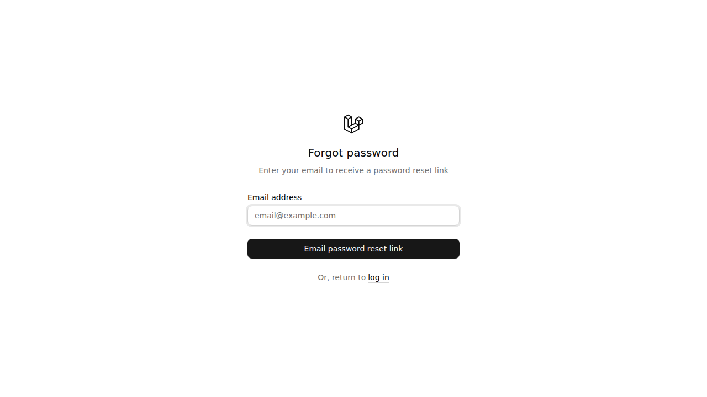

**Fitur:**
- Simple form untuk request password reset link
- Input email dengan validasi
- Link kembali ke halaman login
- Desain clean dengan branding yang konsisten

**Status:** ✅ Selesai

---

### Reset Password Page

**URL:** `/reset-password/{token}`

**Screenshot:** 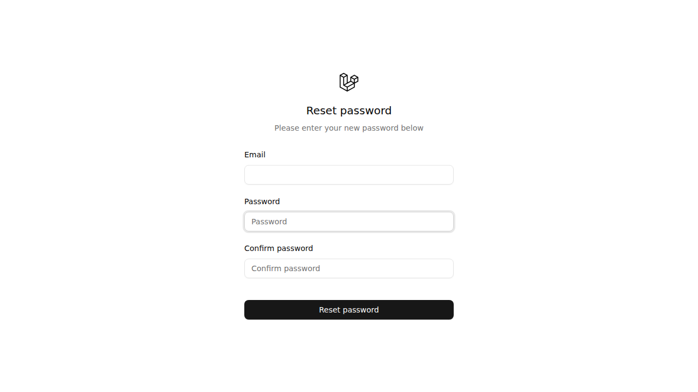

**Fitur:**
- Form untuk set password baru
- Fields: Email, Password, Confirm Password
- Validasi password strength
- Token validation di backend

**Status:** ✅ Selesai

---

### Confirm Password Page

**URL:** `/confirm-password`

**Screenshot:** 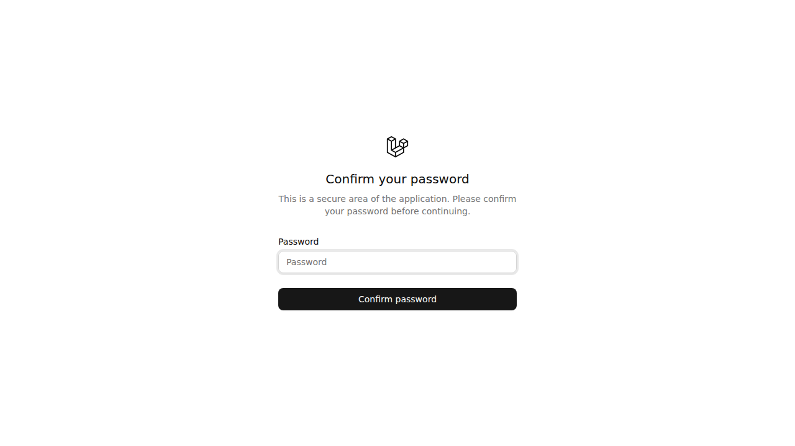

**Fitur:**
- Security confirmation untuk sensitive operations
- Simple password input
- Digunakan sebelum akses fitur sensitif

**Status:** ✅ Selesai

---

## 11. Settings Pages

### Profile Settings

**URL:** `/settings/profile`

**Screenshot:** 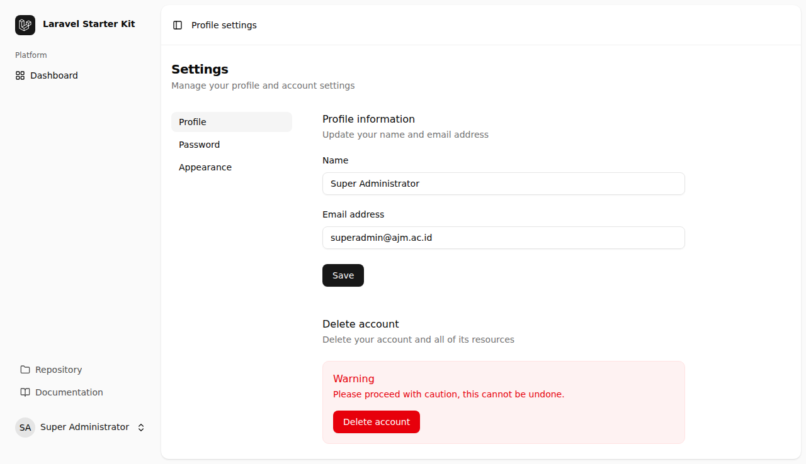

**Fitur:**
- **Sidebar navigation** dengan 3 tabs: Profile, Password, Appearance
- **Profile Information Section:**
  - Edit nama lengkap
  - Edit email address
  - Save button untuk update
- **Delete Account Section:**
  - Warning message tentang permanent deletion
  - Delete account button
- Breadcrumb navigation
- Consistent layout dengan aplikasi

**Status:** ✅ Selesai

---

### Password Settings

**URL:** `/settings/password`

**Screenshot:** 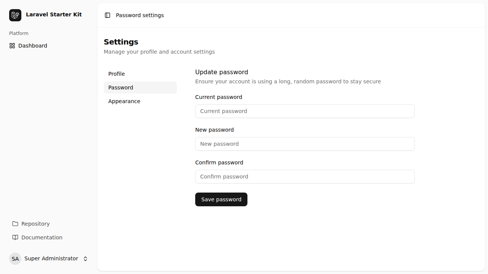

**Fitur:**
- **Sidebar navigation** (shared dengan Profile dan Appearance)
- **Update Password Form:**
  - Current password field
  - New password field
  - Confirm password field
  - Password strength validation
  - Save password button
- Security best practices messaging

**Status:** ✅ Selesai

---

### Appearance Settings

**URL:** `/settings/appearance`

**Screenshot:** 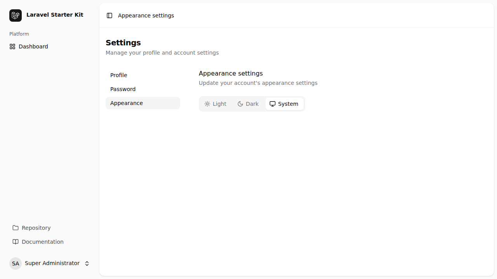

**Fitur:**
- **Sidebar navigation** (shared dengan Profile dan Password)
- **Theme Selection:**
  - Light mode option dengan icon
  - Dark mode option dengan icon
  - System mode option (follow OS preference)
- Modern card-based selection interface

**Status:** ✅ Selesai

---

## 12. Admin - Create University Form

**URL:** `/admin/universities/create` (Super Admin only)

**Screenshot:** 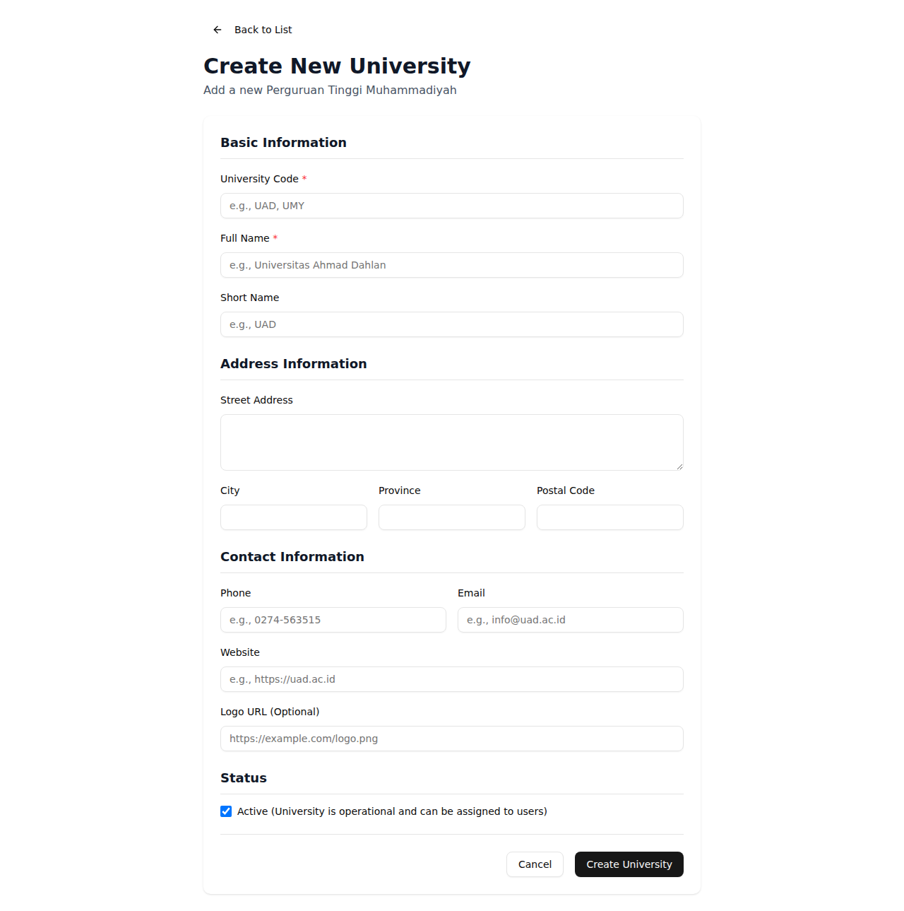

**Fitur:**
- **Back to List** button
- **Form Sections:**
  - **Basic Information:** Code, Full Name, Short Name
  - **Address Information:** Street, City, Province, Postal Code
  - **Contact Information:** Phone, Email, Website, Logo URL
  - **Status:** Active/Inactive checkbox
- Field validation dengan required indicators (*)
- Cancel dan Create University buttons
- Professional form layout dengan grouped sections

**Status:** ✅ Selesai

---

## 13. Admin - Edit University Form

**URL:** `/admin/universities/{id}/edit` (Super Admin only)

**Screenshot:** 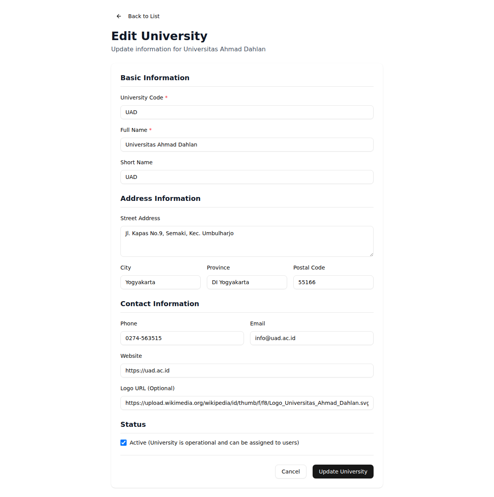

**Fitur:**
- Same form structure as Create University
- Pre-filled dengan existing data
- **Example Data (UAD):**
  - Code: UAD
  - Name: Universitas Ahmad Dahlan
  - Address: Jl. Kapas No.9, Semaki
  - City: Yogyakarta
  - Contact info: phone, email, website
  - Logo URL dari Wikipedia
- Update University button instead of Create

**Status:** ✅ Selesai

---

## 14. Admin - Create Admin Kampus Form

**URL:** `/admin/admin-kampus/create` (Super Admin only)

**Screenshot:** 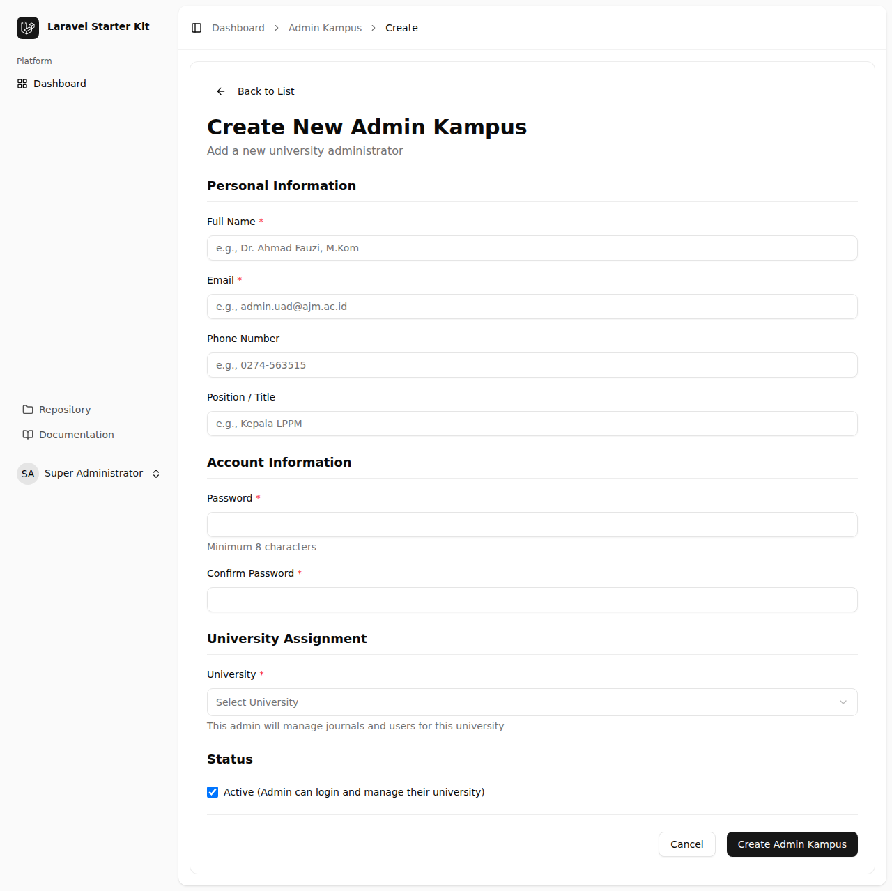

**Fitur:**
- **Form Sections:**
  - **Personal Information:** Name, Email, Phone, Position
  - **Account Information:** Password, Confirm Password (dengan hint)
  - **University Assignment:** Dropdown untuk pilih university
  - **Status:** Active/Inactive checkbox
- Breadcrumb: Dashboard > Admin Kampus > Create
- Help text: "This admin will manage journals and users for this university"
- Password requirements: Minimum 8 characters

**Status:** ✅ Selesai

---

## 15. Admin - Edit Admin Kampus Form

**URL:** `/admin/admin-kampus/{id}/edit` (Super Admin only)

**Screenshot:** 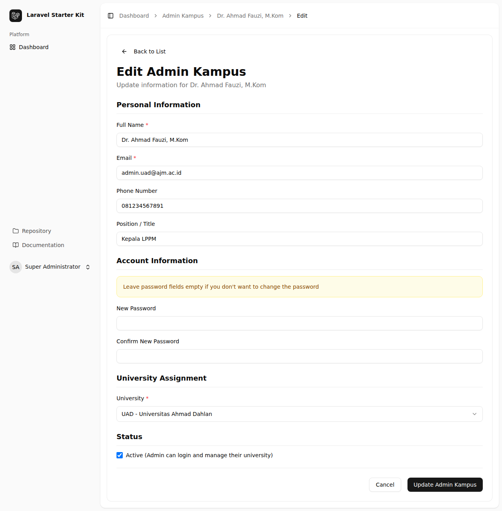

**Fitur:**
- Pre-filled dengan data existing Admin Kampus
- **Example Data (Dr. Ahmad Fauzi):**
  - Name: Dr. Ahmad Fauzi, M.Kom
  - Email: admin.uad@ajm.ac.id
  - Phone: 081234567891
  - Position: Kepala LPPM
  - University: UAD - Universitas Ahmad Dahlan
- Password fields kosong dengan hint: "Leave empty to keep current password"
- Update Admin Kampus button

**Status:** ✅ Selesai

---

## 16. Admin - Admin Kampus Detail View

**URL:** `/admin/admin-kampus/{id}` (Super Admin only)

**Screenshot:** 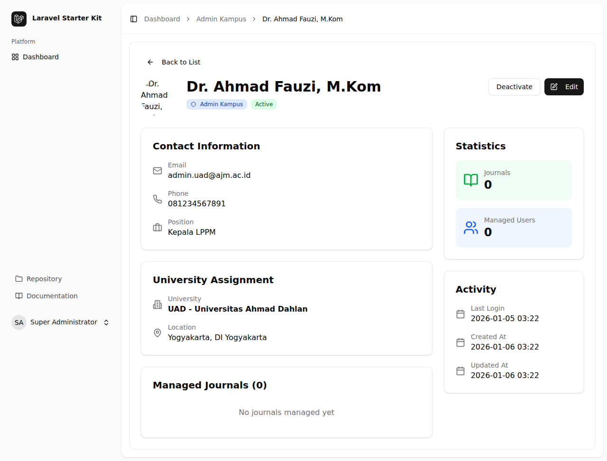

**Fitur:**
- **Header Section:**
  - Avatar placeholder
  - Name dan role badge
  - Active status badge
  - Deactivate dan Edit buttons
- **Contact Information:**
  - Email dengan icon
  - Phone dengan icon
  - Position dengan icon
- **University Assignment:**
  - University name dan code
  - Location (city, province)
- **Statistics Sidebar:**
  - Journals count: 0
  - Managed Users count: 0
- **Activity Section:**
  - Last Login timestamp
  - Created At
  - Updated At
- **Managed Journals Section:** Empty state message

**Status:** ✅ Selesai

---

## 17. Admin Kampus - Create User Form

**URL:** `/admin-kampus/users/create` (Admin Kampus only)

**Screenshot:** 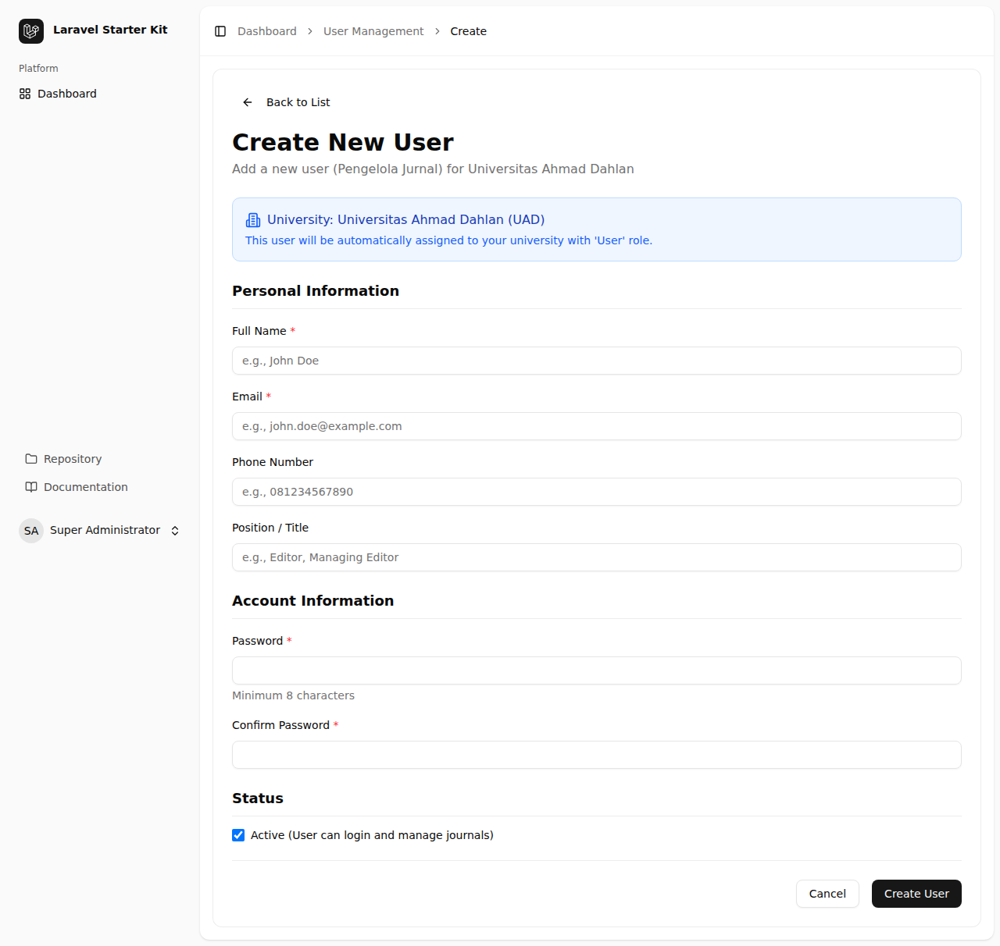

**Fitur:**
- **University Context Banner:**
  - Shows university name (Universitas Ahmad Dahlan)
  - Auto-assignment message
- **Form Sections:**
  - **Personal Information:** Name, Email, Phone, Position
  - **Account Information:** Password, Confirm Password
  - **Status:** Active/Inactive checkbox
- Help text: "This user will be automatically assigned to your university with 'User' role"
- Breadcrumb: Dashboard > User Management > Create
- Scoped to Admin Kampus's university only

**Status:** ✅ Selesai

---

## 18. Admin Kampus - Edit User Form

**URL:** `/admin-kampus/users/{id}/edit` (Admin Kampus only)

**Screenshot:** 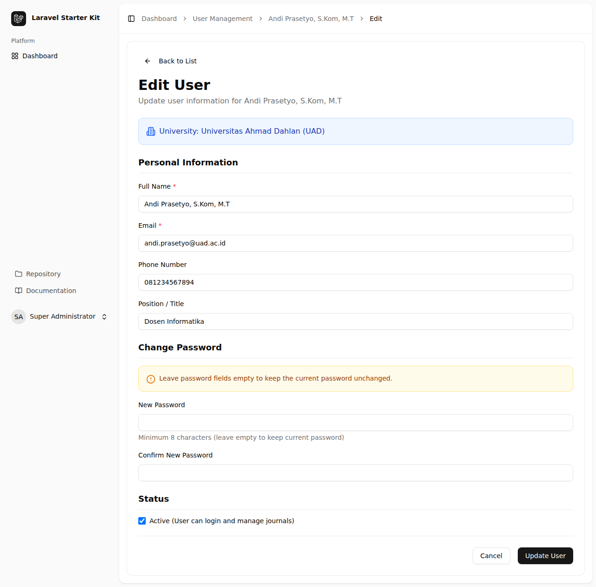

**Fitur:**
- Pre-filled dengan data existing user
- **Example Data (Andi Prasetyo):**
  - Name: Andi Prasetyo, S.Kom, M.T
  - Email: andi.prasetyo@uad.ac.id
  - Phone: 081234567894
  - Position: Dosen Informatika
  - University: UAD (read-only, shown in banner)
- **Change Password Section:**
  - Info icon dengan explanation
  - New Password field (optional)
  - Confirm New Password field
  - Help text: "Leave empty to keep current password"
- Update User button

**Status:** ✅ Selesai

---

## 19. Admin Kampus - User Detail View

**URL:** `/admin-kampus/users/{id}` (Admin Kampus only)

**Screenshot:** 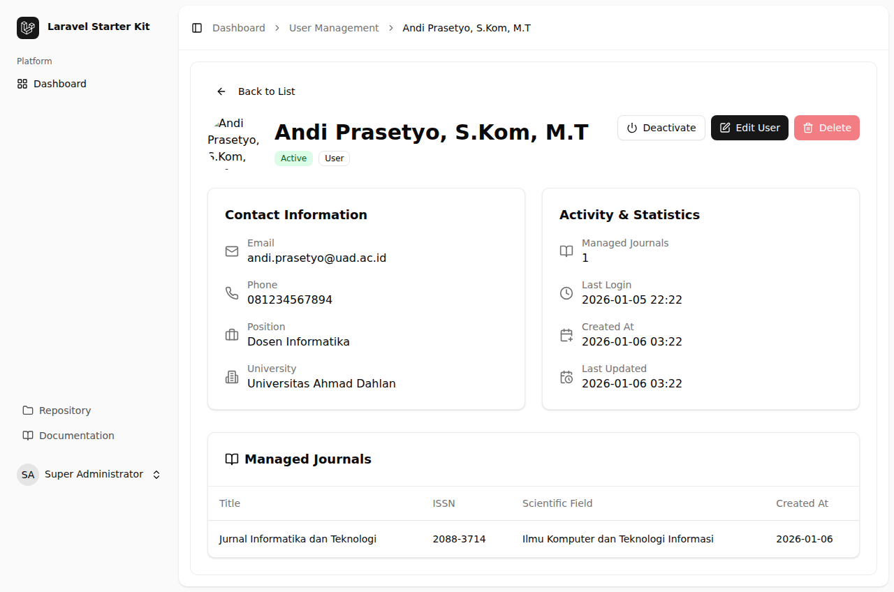

**Fitur:**
- **Header Section:**
  - User avatar
  - Name
  - Active status badge
  - User role badge
  - Action buttons: Deactivate, Edit User, Delete (disabled)
- **Contact Information:**
  - Email, Phone, Position, University
- **Activity & Statistics:**
  - Managed Journals count: 1
  - Last Login timestamp
  - Created At
  - Last Updated
- **Managed Journals Table:**
  - Columns: Title, ISSN, Scientific Field, Created At
  - Example: "Jurnal Informatika dan Teknologi" (ISSN: 2088-3714)
- Professional detail view dengan comprehensive information

**Status:** ✅ Selesai

---

## 20. Error Page - 403 Forbidden

**URL:** `/403` (or any unauthorized access)

**Screenshot:** 

**Fitur:**
- Clean error page design
- Large "403" display
- Clear message: "You do not have permission to access this page."
- Triggered when users try to access routes outside their role permissions

**Status:** ✅ Selesai

---

## Halaman yang Sudah Ada (Tidak Difoto Karena Teknis)

### Authentication Pages (Not Screenshotted)
- **Verify Email** - `/verify-email` - Hanya muncul untuk user dengan email belum verified, redirects to dashboard jika sudah verified
- **Google Callback** - `/auth/google/callback` - OAuth callback handler, automatic redirect page

---

## Technology Stack

### Frontend:
- **React 18** - UI Library
- **TypeScript** - Type-safe JavaScript
- **Inertia.js** - Modern monolith stack (SPA-like without building API)
- **Tailwind CSS** - Utility-first CSS framework
- **Vite 7** - Build tool dan dev server
- **shadcn/ui** - Component library (Radix UI + Tailwind)
- **Lucide React** - Icon library

### Backend:
- **Laravel 12.x** - PHP Framework
- **PHP 8.3.6**
- **SQLite** - Database (development)
- **Laravel Socialite** - OAuth authentication (Google)
- **Laravel Sanctum** - API authentication

### Database Schema (Migrations):
- `roles` - User roles (Super Admin, Admin Kampus, User)
- `universities` - Perguruan Tinggi Muhammadiyah
- `scientific_fields` - Bidang keilmuan jurnal
- `users` - All users dengan role-based access
- `evaluation_indicators` - Indikator evaluasi jurnal
- `journals` - Data jurnal ilmiah
- `journal_assessments` - Self-assessment jurnal
- `assessment_responses` - Jawaban assessment per indikator
- `assessment_attachments` - File attachments untuk assessment
- `personal_access_tokens` - API tokens
- `sessions` - User sessions
- `cache` - Application cache

### Seeders (Data Testing):
- **RoleSeeder** - 3 roles: Super Admin, Admin Kampus, User
- **UniversitySeeder** - 5 PTM (UAD, UMY, UMS, UMM, UNISMUH)
- **ScientificFieldSeeder** - 10 bidang keilmuan
- **UserSeeder** - 10 users dengan berbagai roles
- **EvaluationIndicatorSeeder** - 12 indikator evaluasi
- **JournalSeeder** - 5 sample journals

### Default Credentials (dari Seeder):
```
Super Admin:
Email: superadmin@ajm.ac.id
Password: password123

Admin UAD:
Email: admin.uad@ajm.ac.id
Password: password123

User UAD:
Email: andi.prasetyo@uad.ac.id
Password: password123
```

---

## Design System

### Karakteristik UI:
- **Professional & Clean** - Design yang profesional untuk institusi pendidikan
- **Role-Based Access** - Setiap role melihat data yang berbeda
- **Data-Rich Tables** - Tabel dengan banyak informasi dan actions
- **Search & Filter** - Semua list page memiliki search dan filter
- **Responsive** - Layout adaptif untuk berbagai ukuran layar
- **Indonesian Language** - Interface dalam Bahasa Indonesia

### Color Scheme:
- Background: White/Light gray
- Primary: Blue/Gray untuk actions
- Status badges: Green (Active), Red (Inactive)
- Icons: Gray dengan hover states

### Components Used:
- Tables dengan sorting dan filtering
- Badge components untuk status
- Avatar placeholders (ui-avatars.com)
- Icon buttons untuk actions
- Search inputs dengan icons
- Dropdown filters (combobox)
- Breadcrumb navigation
- Statistics cards dengan icons

---

## Status Keseluruhan

### ✅ Completed (Development Branch):

**Authentication & Authorization:**
- Login dengan email/password ✅
- Register dengan validasi ✅
- Google OAuth integration ✅
- Role-based access control ✅
- Session management ✅

**Super Admin Features:**
- Role-based dashboard dengan statistics ✅
- Universities CRUD (list, create, edit, view, delete, toggle active) ✅
- Admin Kampus CRUD (list, create, edit, view, delete, toggle active) ✅
- Search dan filter untuk semua list pages ✅
- Breadcrumb navigation ✅

**Admin Kampus Features:**
- Role-based dashboard (scoped to university) ✅
- Users CRUD (Pengelola Jurnal) scoped to their university ✅
- Search dan filter ✅

**UI/UX:**
- Custom branding "Asistensi Jurnal Muhammadiyah" ✅
- Responsive sidebar navigation ✅
- User profile menu ✅
- Indonesian language interface ✅
- Modern component library (shadcn/ui) ✅

### 🚧 Partially Implemented:

**Journal Management:**
- Database schema sudah ada ✅
- Seeders untuk sample data ✅
- UI belum diimplementasikan ⚠️

**Assessment Features:**
- Database schema sudah ada ✅
- Evaluation indicators seeded ✅
- UI belum diimplementasikan ⚠️

**Settings Pages:**
- Routing sudah ada (dari main branch) ✅
- Mungkin belum terintegrasi dengan development ⚠️

### 📋 Perlu Dikembangkan:

**User (Pengelola Jurnal) Features:**
- Journal submission workflow
- Self-assessment form
- Assessment history
- Journal detail pages

**Journal Management UI:**
- List journals dengan filter
- Create/edit journal form
- Journal detail page
- ISSN validation

**Assessment Workflow:**
- Create assessment untuk journal
- Fill assessment responses
- Upload attachments
- Submit for review
- View assessment results

**Admin Kampus Review:**
- Review submitted assessments
- Provide feedback
- Approve/reject assessments

**Reports & Analytics:**
- Dashboard charts dan visualizations
- Export assessment reports
- University performance metrics

**Notifications:**
- Email notifications untuk status changes
- In-app notifications

---

## Perbedaan Branch Main vs Development

### Main Branch:
- Laravel + React starter kit (default)
- Basic authentication (no OAuth)
- Generic branding "Laravel Starter Kit"
- Settings pages (Profile, Password, Appearance)
- Placeholder dashboard
- English interface

### Development Branch:
- Custom branding "Asistensi Jurnal Muhammadiyah"
- Google OAuth integration
- Role-based dashboards dengan real statistics
- Admin modules:
  - Universities CRUD
  - Admin Kampus CRUD
  - Users CRUD (Admin Kampus)
- Complete database schema dengan seeders
- Indonesian language interface
- Production-ready CRUD operations

---

## Next Steps (Prioritas)

1. **Implement Journal Management UI**
   - Journal list page untuk semua roles
   - Journal create/edit form (User role)
   - Journal detail page dengan full information

2. **Implement Assessment Workflow**
   - Assessment form dengan evaluation indicators
   - File upload untuk attachments
   - Submit assessment untuk review

3. **Admin Kampus Review Interface**
   - Review queue untuk submitted assessments
   - Feedback form
   - Approve/reject actions

4. **Dashboard Enhancements**
   - Add charts untuk visualization
   - Recent activities list
   - Quick actions buttons

5. **Update Sidebar Navigation**
   - Replace "Laravel Starter Kit" dengan "Jurnal_mu" branding
   - Add menu items untuk Journals dan Assessments
   - Role-specific menu items

6. **Integrate Settings Pages**
   - Ensure settings pages work dengan development branch
   - Add university-specific settings untuk Admin Kampus

7. **Notifications System**
   - Email notifications
   - In-app notifications bell icon

8. **Reports & Export**
   - PDF export untuk assessment results
   - Excel export untuk statistics

---

## Testing Credentials

Gunakan credentials berikut untuk testing berbagai roles:

**Super Admin:**
```
Email: superadmin@ajm.ac.id
Password: password123
```
Akses: Semua fitur admin, semua universitas

**Admin Kampus (UAD):**
```
Email: admin.uad@ajm.ac.id
Password: password123
```
Akses: Manage users untuk Universitas Ahmad Dahlan

**User (Pengelola Jurnal UAD):**
```
Email: andi.prasetyo@uad.ac.id
Password: password123
```
Akses: Manage journals (fitur belum tersedia di UI)

---

**Generated on:** 2026-01-06  
**Branch:** development  
**Total Pages Documented:** 20 pages with screenshots  
**Additional Pages:** 2 pages (Verify Email, Google Callback - technical/redirect pages)

---

## Kesimpulan

Branch **development** sudah memiliki foundation yang solid untuk aplikasi Jurnal_mu dengan:
- ✅ Complete authentication dan authorization
- ✅ Role-based access control
- ✅ Admin modules fully functional
- ✅ Professional UI/UX dengan custom branding
- ✅ Complete database schema
- ⚠️ Masih perlu implementasi UI untuk Journal dan Assessment workflow

Progress development branch jauh lebih maju dibanding main branch dan siap untuk fase development selanjutnya (Journal & Assessment features).
