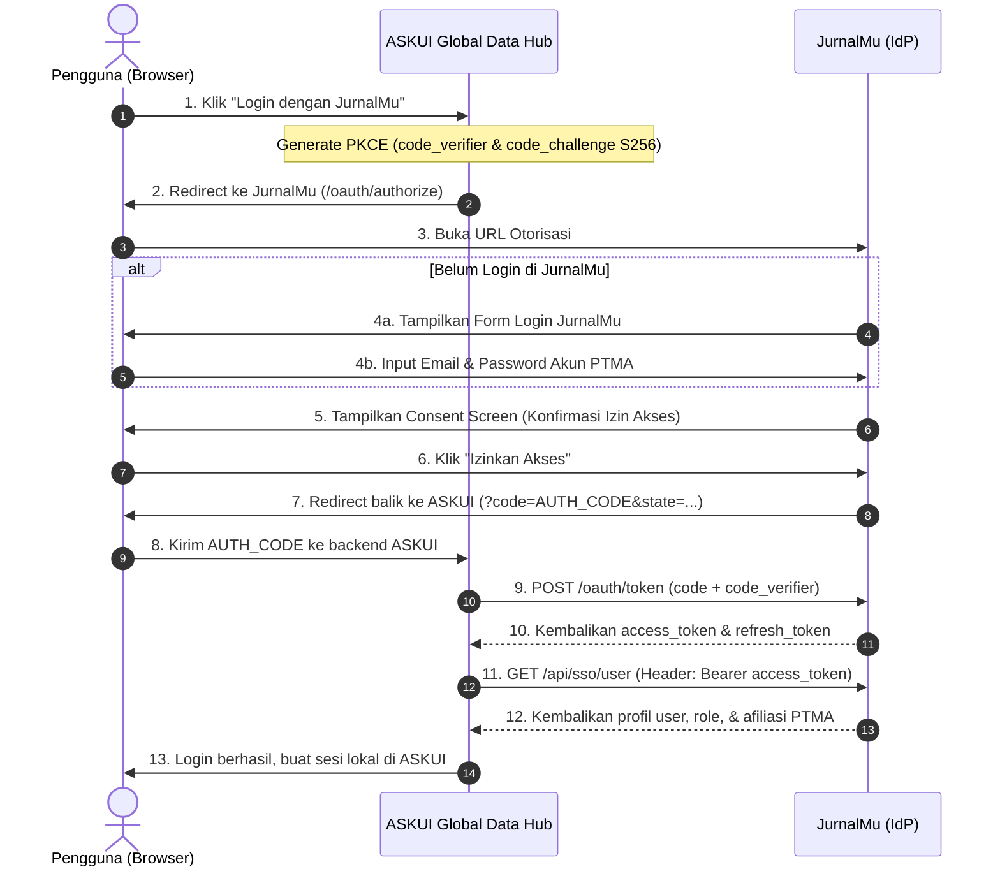

# Panduan Fitur: SSO OAuth 2.0 Identity Provider (JurnalMu & ASKUI)

**Versi:** 1.0.0  
**Tanggal Rilis:** 2026-10-02  
**Branch:** `feature/sso-askui-passport`  
**Protokol:** OAuth 2.0 Authorization Code Grant dengan PKCE (RFC 7636)  

---

## 1. Ringkasan & Tujuan

Fitur ini mengaktifkan **JurnalMu sebagai Identity Provider (IdP)** terpusat. Sistem informasi eksternal seperti **ASKUI Global Data Hub** (dan sistem mitra lainnya di masa mendatang) dapat menggunakan akun pengguna JurnalMu untuk proses autentikasi (Single Sign-On / SSO).

### Jaminan Keamanan Data Existing (PTMA)
- **Nol Dampak Skema**: Tabel `users`, `roles`, profil, dan data relasi PTMA tidak dimodifikasi atau direset.
- **Integritas Sandi**: Menggunakan enkripsi sandi standar yang sudah ada (Bcrypt/Argon2); pengguna tidak perlu melakukan reset sandi.
- **Isolasi Guard**: Guard `web` (sesi cookie/Inertia JurnalMu) beroperasi independen dari guard `api` (`passport` token bearer).

---

## 2. Arsitektur & Alur Otentikasi (PKCE Flow)



---

## 3. Daftar Endpoint API

| Method | Endpoint | Guard / Middleware | Deskripsi |
|---|---|---|---|
| `GET` | `/oauth/authorize` | `web`, `auth` | Menampilkan layar persetujuan (Consent Screen). |
| `POST` | `/oauth/authorize` | `web`, `auth` | Memproses persetujuan (`approve`) atau penolakan (`deny`). |
| `POST` | `/oauth/token` | Public | Penukaran authorization code + PKCE verifier menjadi access token. |
| `GET` | `/api/sso/user` | `auth:api` | Mengambil profil pengguna, status, peran, dan afiliasi PTMA. |
| `POST` | `/api/oauth/revoke-token` | `auth:api` | Mencabut masa aktif token saat pengguna logout dari ASKUI. |

---

## 4. Format Kontrak Data Pengguna (`GET /api/sso/user`)

Permintaan menyertakan header: `Authorization: Bearer <access_token>`.

### Respon Sukses (200 OK)
```json
{
  "id": 105,
  "name": "Dr. Ahmad Dahlan, M.Kom.",
  "email": "ahmad.dahlan@uad.ac.id",
  "email_verified": true,
  "avatar": "https://jurnalmu.id/storage/avatars/105.jpg",
  "status": "approved",
  "roles": [
    {
      "id": 2,
      "name": "Author",
      "slug": "author"
    },
    {
      "id": 4,
      "name": "Reviewer",
      "slug": "reviewer"
    }
  ],
  "primary_role": "Author",
  "affiliation": {
    "ptma_name": "Universitas Ahmad Dahlan",
    "faculty": "Fakultas Teknologi Industri",
    "department": "Informatika"
  }
}
```

---

## 5. Panduan Pendaftaran Client OAuth untuk ASKUI

Untuk mendaftarkan aplikasi ASKUI ke JurnalMu, jalankan perintah artisan berikut di server:

```bash
docker exec -i jurnal-mu-app php artisan passport:client
```

Pilih opsi:
1. **User ID**: Biarkan kosong (tekan Enter).
2. **Client Name**: `ASKUI Global Data Hub`
3. **Redirect URI**: Masukkan callback URL ASKUI, contoh: `https://askui.domain.ac.id/auth/callback`

Sistem akan menghasilkan:
- `Client ID` (contoh: `01931...`)
- `Client Secret` (contoh: `abc123...`)

Simpan kedua kredensial tersebut ke dalam file konfigurasi `.env` pada sistem ASKUI.

---

## 6. Panduan Integrasi di Sisi ASKUI

### Langkah 1: Inisiasi Login & Generate PKCE
ASKUI membuat parameter:
- `code_verifier`: String acak 43–128 karakter (A-Z, a-z, 0-9, `-`, `.`, `_`, `~`).
- `code_challenge`: `BASE64URL(SHA256(code_verifier))`.
- `state`: String acak CSRF protection token.

Redirect pengguna ke URL JurnalMu:
```text
https://jurnalmu.id/oauth/authorize?
    client_id=CLIENT_ID&
    redirect_uri=https://askui.domain.ac.id/auth/callback&
    response_type=code&
    scope=&
    state=CSRF_STATE&
    code_challenge=CODE_CHALLENGE&
    code_challenge_method=S256
```

### Langkah 2: Tangani Callback & Tukar Token
Pada handler `https://askui.domain.ac.id/auth/callback`:
1. Validasi `state` cocok dengan sesi lokal.
2. Ambil parameter `code` dari query string.
3. Lakukan request HTTP POST ke JurnalMu:
   ```http
   POST https://jurnalmu.id/oauth/token
   Content-Type: application/json

   {
     "grant_type": "authorization_code",
     "client_id": "CLIENT_ID",
     "client_secret": "CLIENT_SECRET",
     "redirect_uri": "https://askui.domain.ac.id/auth/callback",
     "code_verifier": "CODE_VERIFIER_ASLI",
     "code": "AUTH_CODE"
   }
   ```
4. Respon mengembalikan:
   ```json
   {
     "token_type": "Bearer",
     "expires_in": 3600,
     "access_token": "eyJ0eXAi...",
     "refresh_token": "def502..."
   }
   ```

### Langkah 3: Ambil Profil Pengguna
Lakukan request HTTP GET:
```http
GET https://jurnalmu.id/api/sso/user
Authorization: Bearer <access_token>
```
Gunakan `email` atau `id` dari respon untuk menghubungkan akun pengguna lokal ASKUI dengan akun JurnalMu.

### Langkah 4: Logout / Revoke Token
Ketika pengguna melakukan logout dari ASKUI:
```http
POST https://jurnalmu.id/api/oauth/revoke-token
Authorization: Bearer <access_token>
```

---

## 7. Verifikasi & Pengujian Otomatis

Seluruh suite pengujian fitur SSO berada pada direktori `tests/Feature/OAuth/`:

```bash
docker exec -i jurnal-mu-app php artisan test tests/Feature/OAuth
```

Daftar pengujian mencakup:
1. `PassportConfigTest`: Verifikasi guard `api` dan middleware proteksi `/oauth/authorize`.
2. `UserModelOAuthTest`: Verifikasi trait `HasApiTokens` pada model `User`.
3. `SSOUserInfoTest`: Verifikasi otentikasi Bearer token dan struktur payload profil PTMA.
4. `ConsentScreenTest`: Verifikasi tampilan form persetujuan (Approve/Deny) dan CSRF token.
5. `TokenRevokeTest`: Verifikasi pencabutan token aktif.
6. `OAuthPKCEFlowTest`: Verifikasi alur penuh end-to-end OAuth 2.0 PKCE dari awal hingga akhir.
