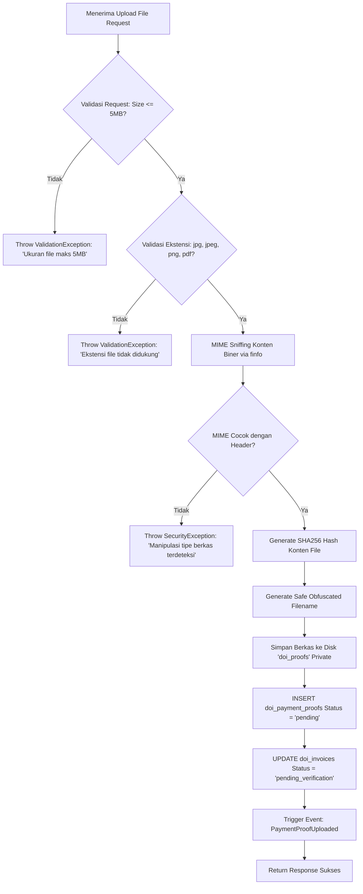
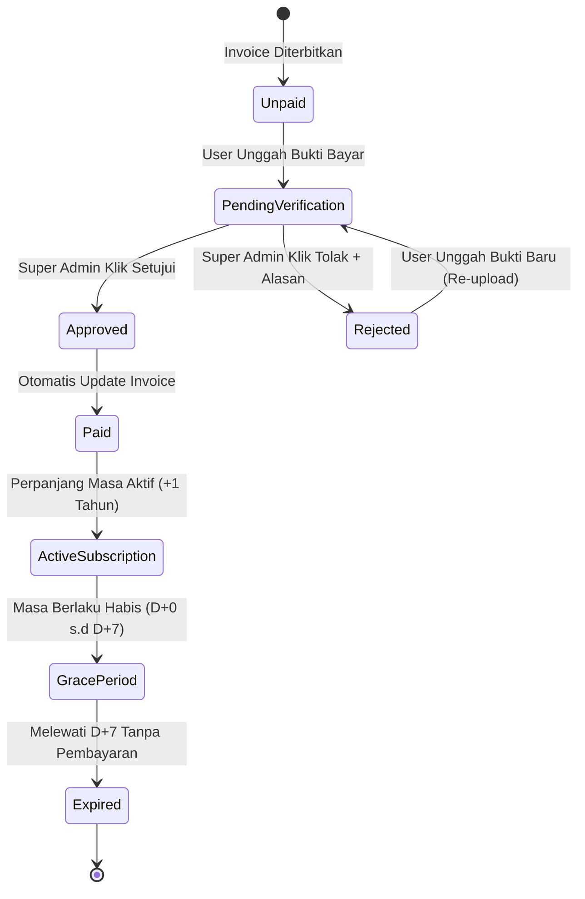
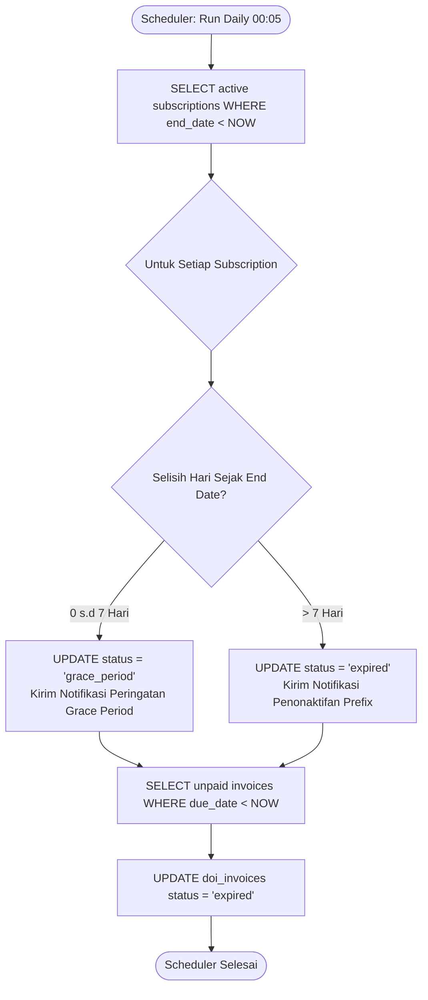

# Algorithms & Business Logic Specification
## Modul Menu Langganan DOI & Similarity Check
**Platform**: Laravel 12 / PHP 8.2+  
**Versi**: 1.0.0  
**Tanggal**: 15 Agustus 2026  
**Dokumentasi Terkait**: [PRD.md](file:///c:/xampp/htdocs/jurnal_mu/docs/features/doi-subscription/PRD.md) | [ARCHITECTURE.md](file:///c:/xampp/htdocs/jurnal_mu/docs/features/doi-subscription/ARCHITECTURE.md) | [SCHEMA.md](file:///c:/xampp/htdocs/jurnal_mu/docs/features/doi-subscription/SCHEMA.md) | [UI_DESIGN.md](file:///c:/xampp/htdocs/jurnal_mu/docs/features/doi-subscription/UI_DESIGN.md) | [TESTING_LOGS.md](file:///c:/xampp/htdocs/jurnal_mu/docs/features/doi-subscription/TESTING_LOGS.md)

---

## 1. Algoritma 1: Pembuatan Nomor Invoice Unik & Konkurensi Aman

### 1.1 Deskripsi
Menghasilkan nomor invoice resmi dengan format `INV/DOI/{YYYY}{MM}/{0001}` secara atomik untuk mencegah *race condition* saat beberapa tagihan digenerate bersamaan.

```mermaid
flowchart TD
    Start([Mulai Generate Invoice]) --> GetPeriod[Ambil Tahun & Bulan: YYYYMM]
    GetPeriod --> LockDB[Kunci Baris / Mutex Lock Transaksi DB]
    LockDB --> QueryMax[SELECT MAX invoice_number WHERE prefix = 'INV/DOI/YYYYMM/']
    QueryMax --> CheckExists{Apakah Ada Data Bulan Ini?}
    CheckExists -- Tidak --> SetSeq[Sequence = 1]
    CheckExists -- Ya --> IncSeq[Sequence = Last_Sequence + 1]
    SetSeq --> FormatStr[Format: INV/DOI/YYYYMM/ + StrPad(Sequence, 4, '0')]
    IncSeq --> FormatStr
    FormatStr --> InsertInvoice[INSERT doi_invoices dengan Invoice Number]
    InsertInvoice --> ReleaseLock[Commit Transaksi & Lepas Lock]
    ReleaseLock --> End([Selesai: Return Invoice])
```

### 1.2 Pseudocode Implementation
```php
function generateInvoiceNumber(): string
{
    return DB::transaction(function () {
        $currentMonth = now()->format('Ym'); // e.g. "202608"
        $prefix = "INV/DOI/{$currentMonth}/";

        // Lock table row for update to prevent concurrent duplicate sequences
        $lastInvoice = DoiInvoice::where('invoice_number', 'LIKE', "{$prefix}%")
            ->lockForUpdate()
            ->orderBy('invoice_number', 'desc')
            ->first();

        if (!$lastInvoice) {
            $nextSequence = 1;
        } else {
            $lastSequenceNumber = (int) substr($lastInvoice->invoice_number, -4);
            $nextSequence = $lastSequenceNumber + 1;
        }

        $formattedSequence = str_pad((string) $nextSequence, 4, '0', STR_PAD_LEFT);
        return "{$prefix}{$formattedSequence}";
    });
}
```

---

## 2. Algoritma 2: Validasi Multi-Layer & Upload Bukti Pembayaran

### 2.1 Deskripsi
Menjamin berkas bukti pembayaran yang diunggah aman dari injeksi skrip/malware, tidak melebihi kuota 5MB, berformat valid (`jpg`, `jpeg`, `png`, `pdf`), dan tersimpan pada storage terenkripsi/privat.



---

## 3. Algoritma 3: State Machine Verifikasi Pembayaran & Aktivasi Langganan

### 3.1 Diagram Transisi Status



### 3.2 Verification Logic Pseudocode
```php
function verifyPaymentProof(int $proofId, string $decision, ?string $adminNotes, int $adminUserId): void
{
    DB::transaction(function () use ($proofId, $decision, $adminNotes, $adminUserId) {
        $proof = DoiPaymentProof::lockForUpdate()->findOrFail($proofId);
        $invoice = DoiInvoice::lockForUpdate()->findOrFail($proof->invoice_id);
        $subscription = DoiSubscription::lockForUpdate()->findOrFail($invoice->subscription_id);

        if ($decision === 'approved') {
            // 1. Update status bukti pembayaran
            $proof->update([
                'status' => 'approved',
                'verified_by' => $adminUserId,
                'verified_at' => now(),
                'admin_notes' => $adminNotes,
            ]);

            // 2. Tandai invoice lunas
            $invoice->update([
                'status' => 'paid',
                'paid_at' => now(),
            ]);

            // 3. Hitung masa aktif langganan baru (+1 Tahun)
            $package = $subscription->package;
            $currentEndDate = $subscription->end_date;
            
            // Jika langganan masih aktif, perpanjang dari end_date lama. Jika sudah expired/baru, hitung dari hari ini.
            $newStartDate = ($subscription->status === 'active' && $currentEndDate && $currentEndDate->isFuture())
                ? $subscription->start_date
                : now()->toDateString();

            $newEndDate = ($subscription->status === 'active' && $currentEndDate && $currentEndDate->isFuture())
                ? $currentEndDate->copy()->addYear()
                : now()->copy()->addYear()->toDateString();

            $subscription->update([
                'status' => 'active',
                'start_date' => $newStartDate,
                'end_date' => $newEndDate,
                'similarity_quota_total' => $subscription->similarity_quota_total + $package->similarity_quota_included,
            ]);

            // 4. Catat log penambahan kuota
            DoiSimilarityQuotaLog::create([
                'subscription_id' => $subscription->id,
                'user_id' => $adminUserId,
                'change_type' => 'renewal',
                'amount' => $package->similarity_quota_included,
                'balance_after' => $subscription->similarity_quota_total - $subscription->similarity_quota_used,
                'description' => "Penambahan kuota perpanjangan invoice {$invoice->invoice_number}",
            ]);

            event(new PaymentProofVerified($proof, 'approved'));
        } elseif ($decision === 'rejected') {
            if (empty($adminNotes)) {
                throw new InvalidArgumentException("Catatan admin wajib diisi ketika menolak bukti pembayaran.");
            }

            $proof->update([
                'status' => 'rejected',
                'verified_by' => $adminUserId,
                'verified_at' => now(),
                'admin_notes' => $adminNotes,
            ]);

            // Kembalikan invoice ke unpaid agar user bisa upload ulang
            $invoice->update(['status' => 'unpaid']);

            event(new PaymentProofVerified($proof, 'rejected'));
        }
    });
}
```

---

## 4. Algoritma 4: Scheduler Otomatis Grace Period & Status Kadaluwarsa

### 4.1 Deskripsi
Cron job harian (`dailyAt('00:05')`) untuk memeriksa seluruh entitas `doi_subscriptions` dan `doi_invoices` terhadap tanggal jatuh tempo / kadaluwarsa.



---

## 5. Algoritma 5: Pemotongan Kuota Similarity Check Realtime

### 5.1 Business Rules
1. Pemotongan kuota terjadi saat berkas artikel ilmiah dikirimkan untuk uji plagiasi Turnitin/iThenticate.
2. Jika `(similarity_quota_total - similarity_quota_used) <= 0`, sistem menolak permintaan pengecekan dan menampilkan modal peringatan kuota habis.
3. Transaksi pemotongan kuota dilakukan secara atomik menggunakan `increment('similarity_quota_used')`.
