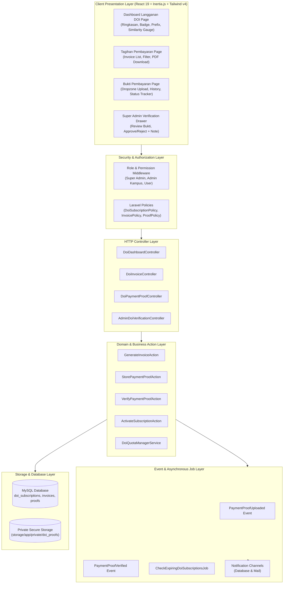
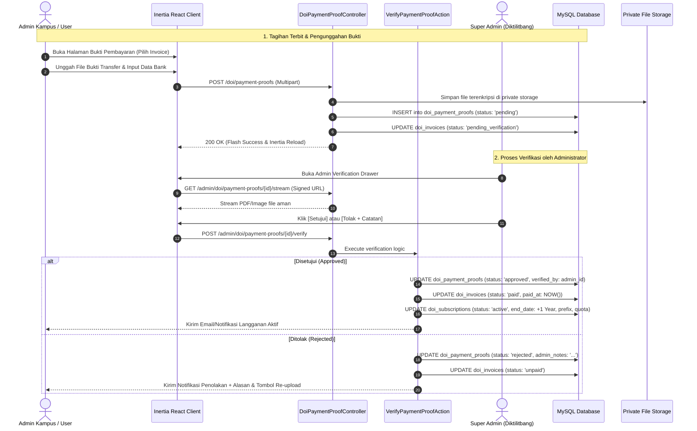

# Architecture & System Design
## Modul Menu Langganan DOI & Similarity Check
**Platform**: Jurnal MU (Laravel 12 + Inertia.js React 19 + TypeScript + Tailwind CSS)  
**Versi**: 1.0.0  
**Tanggal**: 15 Agustus 2026  
**Dokumentasi Terkait**: [PRD.md](file:///c:/xampp/htdocs/jurnal_mu/docs/features/doi-subscription/PRD.md) | [SCHEMA.md](file:///c:/xampp/htdocs/jurnal_mu/docs/features/doi-subscription/SCHEMA.md) | [ALGORITHM.md](file:///c:/xampp/htdocs/jurnal_mu/docs/features/doi-subscription/ALGORITHM.md) | [UI_DESIGN.md](file:///c:/xampp/htdocs/jurnal_mu/docs/features/doi-subscription/UI_DESIGN.md) | [TESTING_LOGS.md](file:///c:/xampp/htdocs/jurnal_mu/docs/features/doi-subscription/TESTING_LOGS.md)

---

## 1. High-Level Architecture Overview

Modul Langganan DOI dibangun di atas arsitektur monolith modern dengan pemisahan *concern* yang tegas antara lapisan backend (Laravel) dan frontend (Inertia.js React SPA). Seluruh aliran data dirancang aman, terisolasi per institusi (*multi-tenant safe*), dan terintegrasi dengan event-driven notification.



---

## 2. Backend Component Architecture

### 2.1 Directory & Namespace Structure

```text
app/
├── Http/
│   ├── Controllers/
│   │   ├── Doi/
│   │   │   ├── DoiDashboardController.php
│   │   │   ├── DoiInvoiceController.php
│   │   │   └── DoiPaymentProofController.php
│   │   └── Admin/
│   │       └── Doi/
│   │           ├── AdminDoiPackageController.php
│   │           ├── AdminDoiInvoiceController.php
│   │           └── AdminDoiVerificationController.php
│   ├── Requests/
│   │   └── Doi/
│   │       ├── StorePaymentProofRequest.php
│   │       ├── VerifyPaymentProofRequest.php
│   │       └── StoreDoiInvoiceRequest.php
│   └── Resources/
│       └── Doi/
│           ├── DoiSubscriptionResource.php
│           ├── DoiInvoiceResource.php
│           └── DoiPaymentProofResource.php
├── Actions/
│   └── Doi/
│       ├── GenerateInvoiceAction.php
│       ├── StorePaymentProofAction.php
│       ├── VerifyPaymentProofAction.php
│       └── ActivateSubscriptionAction.php
├── Services/
│   └── Doi/
│       ├── DoiSubscriptionService.php
│       ├── DoiInvoiceService.php
│       └── DoiQuotaManagerService.php
├── Policies/
│   ├── DoiSubscriptionPolicy.php
│   ├── DoiInvoicePolicy.php
│   └── DoiPaymentProofPolicy.php
├── Models/
│   ├── DoiPackage.php
│   ├── DoiSubscription.php
│   ├── DoiInvoice.php
│   ├── DoiInvoiceItem.php
│   ├── DoiPaymentProof.php
│   ├── DoiBankAccount.php
│   └── DoiSimilarityQuotaLog.php
├── Events/
│   └── Doi/
│       ├── PaymentProofUploaded.php
│       ├── PaymentProofVerified.php
│       └── SubscriptionStatusChanged.php
├── Listeners/
│   └── Doi/
│       ├── NotifyAdminOfNewPaymentProof.php
│       ├── NotifyUserOfVerificationResult.php
│       └── ProcessSubscriptionOnPaymentApproved.php
└── Jobs/
    ├── CheckExpiringDoiSubscriptionsJob.php
    └── SendInvoiceDueReminderJob.php
```

---

## 3. Data Flow & Transaction Lifecycle

### 3.1 End-to-End Subscription & Payment Lifecycle



---

## 4. Frontend Architecture & Component Hierarchy

### 4.1 Inertia Page & Component Tree

```text
resources/js/
├── pages/
│   ├── doi-subscription/
│   │   ├── dashboard.tsx              # Dashboard Langganan DOI Utama
│   │   ├── invoices/
│   │   │   ├── index.tsx              # List Tagihan Pembayaran & Filter
│   │   │   └── show.tsx               # Rincian Tagihan & Cetak Proforma
│   │   └── payment-proofs/
│   │       ├── index.tsx              # Riwayat Bukti Pembayaran
│   │       └── upload.tsx             # Form Unggah Bukti Bayar
│   └── admin/
│       └── doi-management/
│           ├── index.tsx              # Kelola Seluruh Langganan & Tagihan
│           └── verification-drawer.tsx # Modal Review Bukti Transfer
├── components/
│   └── doi/
│       ├── doi-status-badge.tsx       # Badge status aktif/belum aktif/grace
│       ├── doi-quota-gauge.tsx        # Visualisasi kuota similarity check
│       ├── doi-prefix-card.tsx        # Kartu prefix Crossref + copy action
│       ├── invoice-status-pill.tsx    # Badge status invoice (Lunas/Unpaid)
│       ├── payment-dropzone.tsx       # Drag-and-drop secure file uploader
│       ├── bank-account-card.tsx      # Info rekening transfer tujuan
│       ├── admin-feedback-alert.tsx   # Banner merah catatan penolakan admin
│       └── verification-timeline.tsx  # Timeline status verifikasi
└── types/
    └── doi.d.ts                       # TypeScript interfaces & enums
```

---

## 5. Security & Storage Strategy

### 5.1 Private Storage Architecture
File bukti transfer keuangan berisi informasi sensitif perbankan, sehingga tidak boleh dapat diakses secara publik pada folder `public/storage`.
* **Storage Disk**: `'doi_proofs' => ['driver' => 'local', 'root' => storage_path('app/private/doi_proofs')]`.
* **File Naming Sanitization**: Format penyimpanan hash teracak: `proof_{invoice_id}_{timestamp}_{random_hash}.{ext}`.
* **Access Control Endpoint**: File hanya dapat diakses melalui rute aman bertanda tangan (`URL::temporarySignedRoute()`) dengan validasi hak akses melalui `DoiPaymentProofPolicy@view`.

### 5.2 Multi-Tenant Scoping & IDOR Protection
* Semua query tagihan dan bukti pembayaran pada sisi user/admin kampus di-scope secara eksplisit terhadap `university_id` atau `user_id` milik sesi yang sedang aktif.
* Akses langsung ke ID invoice atau bukti transfer milik instansi lain akan menghasilkan HTTP 403 Forbidden.
