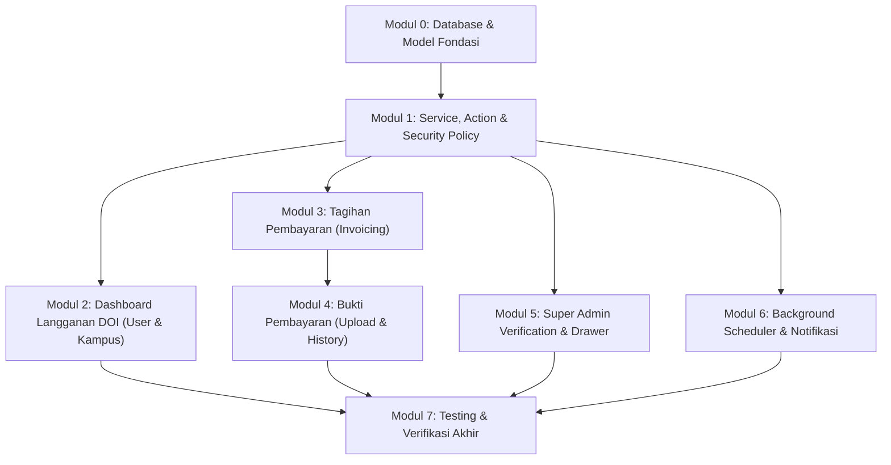

# Tahapan Pengembangan per Modul
## Fitur Menu Langganan DOI & Similarity Check
**Ecosystem**: Jurnal MU (Laravel 12 + Inertia.js React 19 + TypeScript + Tailwind CSS)  
**Versi**: 1.0.0  
**Tanggal**: 16 Agustus 2026  
**Dokumentasi Terkait**: [PRD.md](./PRD.md) | [ARCHITECTURE.md](./ARCHITECTURE.md) | [SCHEMA.md](./SCHEMA.md) | [ALGORITHM.md](./ALGORITHM.md) | [UI_DESIGN.md](./UI_DESIGN.md) | [TESTING_LOGS.md](./TESTING_LOGS.md)

---

## 1. Roadmap Ketergantungan Antar Modul



---

## 2. Rincian Tahapan Pengembangan

### Modul 0: Database & Fondasi Model
1. **Migrasi Schema (7 Tabel)**:
   - Membuat berkas migrasi database:
     - `doi_packages`
     - `doi_subscriptions`
     - `doi_invoices`
     - `doi_invoice_items`
     - `doi_payment_proofs`
     - `doi_bank_accounts`
     - `doi_similarity_quota_logs`
   - Eksekusi migrasi:
     ```bash
     docker exec -it jurnal-mu-app php artisan migrate
     ```
2. **Eloquent Models & PHP 8.2 Enums**:
   - Model Class & Relasi (`hasMany`, `belongsTo`, `hasOne`).
   - Enum Casts: `SubscriptionStatus`, `InvoiceStatus`, `PaymentProofStatus`.
3. **Database Seeders**:
   - `DoiPackageSeeder` (paket resmi institusi & mandiri).
   - `DoiBankAccountSeeder` (rekening bank BSI & Mandiri Diktilitbang PPM).

---

### Modul 1: Core Action, Service & Security Policy
1. **Business Actions & Services**:
   - `GenerateInvoiceAction`: Penomoran atomik format `INV/DOI/YYYYMM/XXXX`.
   - `StorePaymentProofAction`: Upload aman ke private storage disk `doi_proofs`.
   - `VerifyPaymentProofAction`: State machine approval $\rightarrow$ invoice lunas $+1$ tahun, atau reject $+$ catatan.
   - `DoiQuotaManagerService`: Validasi & pemotongan kuota similarity check.
2. **Security & Storage**:
   - Konfigurasi private disk di `config/filesystems.php`.
   - Endpoint file stream bertanda tangan (`/doi/payment-proofs/{id}/stream`).
   - Authorization Policies: `DoiSubscriptionPolicy`, `DoiInvoicePolicy`, `DoiPaymentProofPolicy` (isolasi multi-tenant antar-kampus).

---

### Modul 2: Dashboard Langganan DOI (Frontend & Backend)
1. **Backend**:
   - `DoiDashboardController@index`: Agregasi status aktif, masa berlaku, prefix Crossref, sisa kuota similarity check.
2. **Frontend Inertia**:
   - Halaman `resources/js/pages/doi-subscription/dashboard.tsx`.
3. **Komponen UI**:
   - `DoiStatusBadge`: Status pulse (`AKTIF`, `GRACE_PERIOD`, `KADALUWARSA`, `MENUNGGU VERIFIKASI`).
   - `DoiPrefixCard`: Tampilan prefix `10.xxxxx/` + tombol *Copy to Clipboard*.
   - `DoiQuotaGauge`: Progress gauge persentase kuota Turnitin/iThenticate.
   - Banner peringatan jatuh tempo.

---

### Modul 3: Tagihan Pembayaran (Invoices Management)
1. **Backend**:
   - `DoiInvoiceController`: Listing tagihan, filter status, detail breakdown, generate PDF invoice resmi.
2. **Frontend Inertia**:
   - Halaman `resources/js/pages/doi-subscription/invoices/index.tsx` & `show.tsx`.
3. **Komponen UI**:
   - Tabel data tagihan (Nomor Invoice, Periode, Jatuh Tempo, Nominal IDR, Status).
   - Filter bar (status & tahun/tanggal) + tabular numeric formatting.
   - Slide-over drawer rincian tagihan & tombol aksi langsung "Bayar Sekarang".

---

### Modul 4: Bukti Pembayaran (Payment Proof Workflow)
1. **Backend**:
   - `DoiPaymentProofController`: Form upload, store multipart, riwayat bukti.
2. **Form Request Validation**:
   - `StorePaymentProofRequest`: MIME sniffing biner `finfo`, batas 5MB, format JPG/PNG/PDF.
3. **Frontend Inertia**:
   - Halaman `resources/js/pages/doi-subscription/payment-proofs/upload.tsx` & `index.tsx`.
4. **Komponen UI**:
   - `PaymentDropzone`: Drag-and-drop file uploader + file preview interaktif.
   - Informasi rekening tujuan transfer resmi Diktilitbang + copy rekening.
   - Tabel riwayat bukti & `VerificationTimeline`.
   - `AdminFeedbackAlert`: Kotak merah catatan penolakan admin + tombol *Unggah Ulang*.

---

### Modul 5: Super Admin Management & Verification Drawer
1. **Backend**:
   - `AdminDoiSubscriptionController`, `AdminDoiVerificationController@verify`.
2. **Frontend Inertia**:
   - Halaman `resources/js/pages/admin/doi-management/index.tsx`.
3. **Komponen UI**:
   - Split-view verification drawer: sisi kiri dokumen preview (PDF/Image viewer), sisi kanan data transaksi.
   - Tombol [Setujui Pembayaran] & [Tolak Bukti] (textarea catatan penolakan wajib diisi).

---

### Modul 6: Background Scheduler & Notifikasi
1. **Console Jobs**:
   - `CheckExpiringDoiSubscriptionsJob`: Cron harian evaluasi `end_date` $\rightarrow$ set `grace_period` (D+0 s.d D+7) atau `expired` (> D+7).
   - `SendInvoiceDueReminderJob`: Notifikasi tagihan H-30, H-14, H-7, H-1.
2. **Event & Notifications**:
   - `PaymentProofUploaded` $\rightarrow$ Notifikasi ke Super Admin.
   - `PaymentProofVerified` $\rightarrow$ Notifikasi hasil review ke email/in-app user.

---

### Modul 7: Testing & Verifikasi Akhir
1. **Unit & Feature Tests**:
   - Eksekusi test suite via Docker:
     ```bash
     docker exec -it jurnal-mu-app php artisan test --filter=Doi
     ```
2. **Frontend Component Tests**:
   ```bash
   npm run test -- doi
   ```
3. **E2E Smoke Test**: Skenario invoice terbit $\rightarrow$ upload bukti $\rightarrow$ verifikasi admin $\rightarrow$ aktivasi langganan otomatis.
