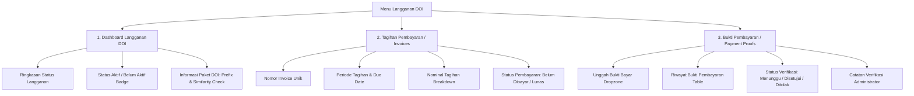

# Product Requirements Document (PRD)
## Modul Menu Langganan DOI (Digital Object Identifier) & Similarity Check
**Platform**: Jurnal MU (Muhammadiyah Journal Management & Indexing Portal)  
**Versi**: 1.0.0  
**Tanggal**: 15 Agustus 2026  
**Status**: Ready for Implementation  
**Dokumentasi Terkait**: [ARCHITECTURE.md](file:///c:/xampp/htdocs/jurnal_mu/docs/features/doi-subscription/ARCHITECTURE.md) | [SCHEMA.md](file:///c:/xampp/htdocs/jurnal_mu/docs/features/doi-subscription/SCHEMA.md) | [ALGORITHM.md](file:///c:/xampp/htdocs/jurnal_mu/docs/features/doi-subscription/ALGORITHM.md) | [UI_DESIGN.md](file:///c:/xampp/htdocs/jurnal_mu/docs/features/doi-subscription/UI_DESIGN.md) | [TESTING_LOGS.md](file:///c:/xampp/htdocs/jurnal_mu/docs/features/doi-subscription/TESTING_LOGS.md)

---

## 1. Executive Summary & Background

### 1.1 Latar Belakang
Setiap jurnal ilmiah berkualifikasi di bawah naungan Perguruan Tinggi Muhammadiyah & 'Aisyiyah (PTMA) memerlukan identifikasi digital permanen melalui **Crossref DOI (Digital Object Identifier)** dan akses penapisan plagiasi **Similarity Check (iThenticate)**. Sebelumnya, proses pemesanan paket DOI, penerbitan invoice tahunan, pembayaran, serta pengunggahan bukti bayar dilakukan secara terpisah/manual (melalui formulir terpisah atau WhatsApp), yang mengakibatkan keterlambatan verifikasi, pencatatan status prefix yang tersebar, dan kesulitan pemantauan kuota.

### 1.2 Tujuan Produk
Membangun modul terpadu **"Langganan DOI"** di portal Jurnal MU yang melayani seluruh siklus hidup langganan DOI bagi Admin Kampus / Pengelola Jurnal dan Super Admin (Diktilitbang PPM). Modul ini menyediakan visualisasi status langganan, manajemen tagihan (invoicing), dan alur pengunggahan serta verifikasi bukti pembayaran yang transparan, aman, dan realtime.

---

## 2. User Personas & Role Matrix

| Persona / Role | Deskripsi & Tanggung Jawab | Hak Akses Fitur Langganan DOI |
| :--- | :--- | :--- |
| **Super Admin** *(Diktilitbang PPM)* | Pengelola pusat seluruh langganan DOI PTMA, penetapan paket, verifikator pembayaran. | - Manajemen master paket DOI. - Generate invoice tagihan manual / massal. - Verifikasi bukti pembayaran (Approve / Reject + catatan). - Pengaturan prefix Crossref & alokasi kuota similarity check. - Melihat statistik seluruh institusi. |
| **Admin Kampus** *(LPPM Universitas)* | Penanggung jawab institusional yang mengelola anggaran langganan jurnal di level kampus. | - Melihat Dashboard Langganan DOI institusi. - Melihat daftar Tagihan Pembayaran institusi. - Mengunggah Bukti Pembayaran untuk invoice aktif. - Mengunduh Invoice resmi (PDF). |
| **Pengelola Jurnal** *(User)* | Editor / pengelola teknis jurnal individual. | - Memantau status aktif DOI jurnal miliknya. - Melihat alokasi prefix Crossref jurnal. - Memantau sisa kuota Similarity Check jurnal. |

---

## 3. Fitur Utama & Functional Requirements

Modul Menu Langganan DOI terdiri dari **3 Fitur Utama**:

### 3.1 Fitur 1: Dashboard Langganan DOI
Dashboard bertindak sebagai *single source of truth* bagi institusi/jurnal terkait status keanggotaan DOI mereka.

* **FR-DSH-01 (Ringkasan Status Langganan)**:
  * Menampilkan kartu status langganan utama: Tanggal mulai langganan, tanggal berakhir langganan, dan sisa hari masa aktif (*countdown timer*).
  * Menampilkan peringatan jatuh tempo (Warning Alert) jika masa berlaku sisa ≤ 30 hari.
* **FR-DSH-02 (Status Aktif / Belum Aktif)**:
  * Status Badge dinamis dengan state:
    * `AKTIF`: Langganan valid, lunas, dan berada dalam periode aktif.
    * `BELUM AKTIF`: Belum pernah berlangganan atau masa aktif belum dimulai.
    * `MENUNGGU VERIFIKASI`: Bukti pembayaran telah diunggah dan sedang direview admin.
    * `GRACE PERIOD`: Masa aktif habis dalam toleransi 7 hari sebelum penonaktifan prefix.
    * `KADALUWARSA`: Langganan berakhir dan belum diperpanjang.
* **FR-DSH-03 (Informasi Paket DOI)**:
  * Nama Paket (misal: *Paket Institusi Gold*, *Paket Mandiri Jurnal*).
  * **Alokasi Prefix Crossref**: Menampilkan nomor prefix resmi (misal: `10.22219/` atau `10.18196/`) dengan tombol *Copy to Clipboard* dan tautan ke Crossref Metadata Manager.
  * **Similarity Check (iThenticate)**:
    * Total kuota dokumen yang dialokasikan.
    * Jumlah kuota dokumen yang telah digunakan.
    * Sisa kuota dokumen yang tersedia.
    * Visualisasi *Progress Gauge / Bar* persentase penggunaan kuota.
* **FR-DSH-04 (Quick Action Links)**:
  * Tombol cepat "Lihat Tagihan Aktif", "Unggah Bukti Bayar", dan "Hubungi Helpdesk DOI".

---

### 3.2 Fitur 2: Tagihan Pembayaran (Invoices)
Halaman manajemen seluruh faktur tagihan biaya tahunan DOI dan top-up kuota Similarity Check.

* **FR-INV-01 (Nomor Invoice)**:
  * Format nomor invoice terstandarisasi dan berurutan: `INV/DOI/{YYYY}{MM}/{SEQUENCE_4_DIGIT}` (contoh: `INV/DOI/202608/0042`).
  * Nomor invoice bersifat *immutable* dan dapat dicari secara instan via search bar.
* **FR-INV-02 (Periode Tagihan)**:
  * Menampilkan rentang tanggal periode layanan yang ditagihkan (contoh: `01 Jan 2026 - 31 Des 2026` untuk langganan tahunan).
* **FR-INV-03 (Rincian Nominal Tagihan)**:
  * Menampilkan nominal tagihan dengan format Rupiah (`Rp XX.XXX.XXX`).
  * Modal/Detail view menampilkan breakdown: Biaya Tahunan Prefix Crossref, Biaya Kuota Similarity Check, Potongan Diskon Afiliasi Diktilitbang, dan Total Akhir.
* **FR-INV-04 (Tanggal Jatuh Tempo / Due Date)**:
  * Menampilkan batas akhir pembayaran yang jelas.
  * Indikator warna teks (Merah jika mendekati / melewati jatuh tempo).
* **FR-INV-05 (Status Pembayaran)**:
  * State status tagihan:
    * `BELUM DIBAYAR` (*Unpaid* - Badge Kuning/Amber): Belum ada pembayaran atau bukti belum diverifikasi.
    * `LUNAS` (*Paid* - Badge Hijau/Emerald): Bukti telah disetujui admin atau pembayaran terkonfirmasi.
    * `MENUNGGU VERIFIKASI` (*Pending* - Badge Biru): Bukti bayar telah diunggah, menunggu persetujuan Super Admin.
    * `KADALUWARSA` (*Expired* - Badge Abu-abu): Melewati batas tanggal jatuh tempo.
    * `DIBATALKAN` (*Cancelled* - Badge Merah): Dibatalkan oleh administrator.
* **FR-INV-06 (Aksi & Ekspor)**:
  * Tombol "Unduh Invoice (PDF)" resmi dengan kop surat Majelis Diktilitbang PPM dan QR-Code validasi.
  * Tombol langsung "Bayar Sekarang / Unggah Bukti" pada invoice berstatus `BELUM DIBAYAR`.

---

### 3.3 Fitur 3: Bukti Pembayaran (Payment Proofs)
Fasilitas pelaporan dan verifikasi transfer pembayaran untuk mempercepat aktivasi layanan.

* **FR-PRF-01 (Formulir Unggah Bukti Pembayaran)**:
  * Pemilihan Nomor Invoice yang akan dibayar (otomatis terpilih jika dibuka dari tombol invoice terkait).
  * Informasi Rekening Tujuan Transfer Resmi (Bank Syariah Indonesia / Bank Mandiri atas nama Majelis Diktilitbang PPM) lengkap dengan tombol *1-Click Copy No. Rekening*.
  * Input Bank Pengirim (Dropdown bank umum / syariah di Indonesia).
  * Input Nama Pemilik Rekening Pengirim (Atas Nama).
  * Input Tanggal & Waktu Transfer (Datepicker).
  * Input Nominal Transfer Aktual (Validasi kesesuaian dengan total invoice).
  * File Upload Zone (Dropzone):
    * Format yang didukung: `JPG`, `JPEG`, `PNG`, `PDF`.
    * Batas ukuran maksimum: **5 MB**.
    * Preview file interaktif (Image preview / PDF reader modal).
  * Input Catatan Tambahan Pengirim (Opsional).
* **FR-PRF-02 (Riwayat Bukti Pembayaran)**:
  * Tabel riwayat bukti bayar yang pernah dikirimkan untuk institusi/jurnal tersebut.
  * Menampilkan tanggal unggah, nama file, nominal, invoice tujuan, status verifikasi, dan catatan admin.
* **FR-PRF-03 (Alur Status Verifikasi)**:
  * `Menunggu Verifikasi (Pending)`: Bukti baru diunggah, antrian review admin.
  * `Disetujui (Approved)`: Admin memvalidasi dana masuk. Otomatis mengubah status Invoice menjadi `LUNAS` dan memperpanjang masa aktif langganan DOI.
  * `Ditolak (Rejected)`: Admin menolak bukti pembayaran (misal nominal kurang, bukti buram/palsu).
* **FR-PRF-04 (Catatan dari Administrator)**:
  * Kolom catatan wajib diisi oleh Super Admin jika status verifikasi `Ditolak`.
  * Ditampilkan secara menonjol (*Danger Alert Box*) pada dashboard & detail bukti bayar user agar user mengetahui kesalahan dan dapat melakukan unggah ulang (*Re-upload*).
* **FR-PRF-05 (Aksi Re-upload)**:
  * Jika bukti bayar sebelumnya berstatus `Ditolak`, user diberikan tombol "Unggah Bukti Baru" untuk invoice tersebut tanpa menghilangkan catatan riwayat penolakan sebelumnya (audit trail terjaga).

---

## 4. Non-Functional Requirements (NFR)

1. **Security & Data Protection**:
   * File bukti pembayaran disimpan pada direktori penyimpanan terproteksi (`private storage`) dan hanya dapat diakses melalui signed URL bertempo (TTL 15 menit).
   * Validasi multi-layer pada file upload: validasi ekstensi, MIME type sniffing, dan sanitasi nama file untuk mencegah eksekusi skrip berbahaya (RCE / XSS).
   * Kebijakan otorisasi ketat (Laravel Policy & RBAC) untuk mencegah *Insecure Direct Object Reference* (IDOR) antar kampus.
2. **Performance & SLA**:
   * Waktu muat Dashboard Langganan DOI < 1.0 detik.
   * Upload bukti transfer asynchronous dengan feedback progress bar.
   * Seluruh query tagihan dan bukti bayar terindeks secara optimal pada foreign key dan status.
3. **Auditability & Integrity**:
   * Setiap pergantian status pembayaran dan langganan mencatat timestamp dan `user_id` eksekutor (Super Admin verifikator).
   * Data nominal menggunakan tipe data numerik presisi tinggi (`DECIMAL(12,2)`).

---

## 5. Matriks Prioritas Rilis (Roadmap)

| Fase | Cakupan Fitur | Target Waktu |
| :--- | :--- | :--- |
| **Fase 1 (MVP)** | - Schema Database & Model Eloquent. - Dashboard Ringkasan & Status Aktif/Belum Aktif. - List & Detail Tagihan Pembayaran. - Form Unggah Bukti Pembayaran. - Approval Drawer untuk Super Admin. | Iterasi 1 |
| **Fase 2 (Enhancement)** | - Generate PDF Invoice Resmi & Kuitansi Lunas. - Email Notification & In-App Notification saat invoice terbit / bukti disetujui. - Automated Grace Period & Expiration cron job. | Iterasi 2 |
| **Fase 3 (Advanced)** | - Integrasi API Crossref untuk live sync prefix metadata. - Integrasi Similarity Check webhook untuk sinkronisasi pemakaian kuota otomatis. | Iterasi 3 |
