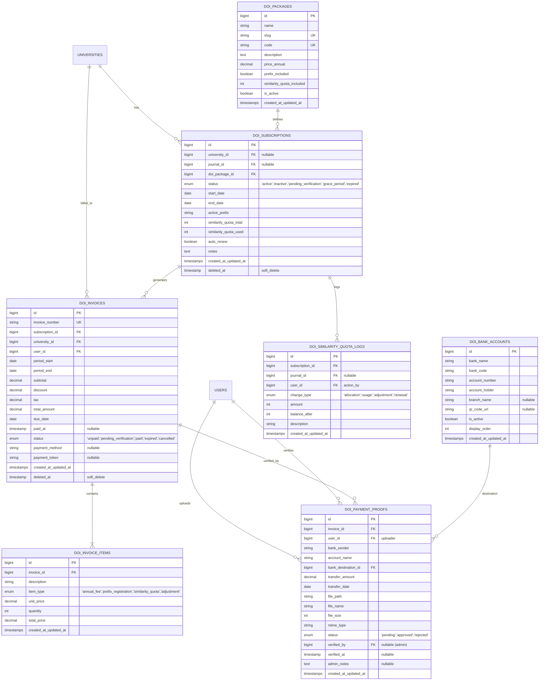

# Database Schema & Data Models
## Modul Menu Langganan DOI & Similarity Check
**Platform**: MySQL 8.0+ / MariaDB 10.4+ (Laravel 12 Eloquent ORM)  
**Versi**: 1.0.0  
**Tanggal**: 15 Agustus 2026  
**Dokumentasi Terkait**: [PRD.md](file:///c:/xampp/htdocs/jurnal_mu/docs/features/doi-subscription/PRD.md) | [ARCHITECTURE.md](file:///c:/xampp/htdocs/jurnal_mu/docs/features/doi-subscription/ARCHITECTURE.md) | [ALGORITHM.md](file:///c:/xampp/htdocs/jurnal_mu/docs/features/doi-subscription/ALGORITHM.md) | [UI_DESIGN.md](file:///c:/xampp/htdocs/jurnal_mu/docs/features/doi-subscription/UI_DESIGN.md) | [TESTING_LOGS.md](file:///c:/xampp/htdocs/jurnal_mu/docs/features/doi-subscription/TESTING_LOGS.md)

---

## 1. Entity Relationship Diagram (ERD)



---

## 2. Detailed Table Definitions & Data Dictionary

### 2.1 Table: `doi_packages`
Master paket langganan DOI resmi Majelis Diktilitbang PPM.

| Column | Type | Nullable | Default | Index / Constraint | Description |
| :--- | :--- | :--- | :--- | :--- | :--- |
| `id` | `BIGINT UNSIGNED` | NO | AUTO_INCREMENT | PRIMARY KEY | ID unik paket |
| `name` | `VARCHAR(100)` | NO | - | - | Nama paket (e.g., "Paket Institusi Platinum") |
| `slug` | `VARCHAR(100)` | NO | - | UNIQUE | Slug URL ramah SEO |
| `code` | `VARCHAR(30)` | NO | - | UNIQUE | Kode SKU paket (e.g., `DOI-INST-01`) |
| `description` | `TEXT` | YES | NULL | - | Rincian fitur & benefit paket |
| `price_annual` | `DECIMAL(12,2)` | NO | 0.00 | - | Biaya langganan per tahun (IDR) |
| `prefix_included` | `BOOLEAN` | NO | 1 | - | Apakah termasuk 1 alokasi Crossref Prefix |
| `similarity_quota_included` | `INT` | NO | 100 | - | Kuota dokumen Turnitin/iThenticate awal |
| `is_active` | `BOOLEAN` | NO | 1 | INDEX | Status aktif penawaran paket |
| `created_at` / `updated_at` | `TIMESTAMP` | YES | NULL | - | Timestamps standar Laravel |

---

### 2.2 Table: `doi_subscriptions`
Entitas langganan DOI aktif untuk satu universitas / institusi atau jurnal mandiri.

| Column | Type | Nullable | Default | Index / Constraint | Description |
| :--- | :--- | :--- | :--- | :--- | :--- |
| `id` | `BIGINT UNSIGNED` | NO | AUTO_INCREMENT | PRIMARY KEY | ID langganan |
| `university_id` | `BIGINT UNSIGNED` | YES | NULL | FK -> `universities(id)` | Relasi ke institusi kampus (ON DELETE CASCADE) |
| `journal_id` | `BIGINT UNSIGNED` | YES | NULL | FK -> `journals(id)` | Relasi ke jurnal mandiri jika per-jurnal |
| `doi_package_id` | `BIGINT UNSIGNED` | NO | - | FK -> `doi_packages(id)` | Paket yang dipilih |
| `status` | `ENUM` | NO | `'inactive'` | INDEX | `'active'`, `'inactive'`, `'pending_verification'`, `'grace_period'`, `'expired'` |
| `start_date` | `DATE` | YES | NULL | INDEX | Tanggal awal masa aktif layanan |
| `end_date` | `DATE` | YES | NULL | INDEX | Tanggal berakhir masa aktif layanan |
| `active_prefix` | `VARCHAR(50)` | YES | NULL | INDEX | Prefix resmi terdaftar (e.g., `10.22219`) |
| `similarity_quota_total` | `INT` | NO | 0 | - | Total kuota similarity check dialokasikan |
| `similarity_quota_used` | `INT` | NO | 0 | - | Kuota similarity check yang telah digunakan |
| `auto_renew` | `BOOLEAN` | NO | 0 | - | Flag opsi tagihan otomatis tahun berikutnya |
| `notes` | `TEXT` | YES | NULL | - | Catatan teknis Diktilitbang |
| `created_at` / `updated_at` | `TIMESTAMP` | YES | NULL | - | Timestamps |
| `deleted_at` | `TIMESTAMP` | YES | NULL | - | Soft delete timestamp |

---

### 2.3 Table: `doi_invoices`
Faktur tagihan pembayaran berkala untuk perpanjangan atau aktivasi langganan.

| Column | Type | Nullable | Default | Index / Constraint | Description |
| :--- | :--- | :--- | :--- | :--- | :--- |
| `id` | `BIGINT UNSIGNED` | NO | AUTO_INCREMENT | PRIMARY KEY | ID invoice |
| `invoice_number` | `VARCHAR(50)` | NO | - | UNIQUE, INDEX | No invoice (e.g., `INV/DOI/202608/0001`) |
| `subscription_id` | `BIGINT UNSIGNED` | NO | - | FK -> `doi_subscriptions(id)` | Relasi ke langganan terkait |
| `university_id` | `BIGINT UNSIGNED` | NO | - | FK -> `universities(id)` | Universitas pembayar |
| `user_id` | `BIGINT UNSIGNED` | NO | - | FK -> `users(id)` | PIC yang bertanggung jawab / pembuat |
| `period_start` | `DATE` | NO | - | - | Awal periode yang ditagihkan |
| `period_end` | `DATE` | NO | - | - | Akhir periode yang ditagihkan |
| `subtotal` | `DECIMAL(12,2)` | NO | 0.00 | - | Subtotal sebelum diskon/pajak |
| `discount` | `DECIMAL(12,2)` | NO | 0.00 | - | Potongan subsidi / promo Diktilitbang |
| `tax` | `DECIMAL(12,2)` | NO | 0.00 | - | Pajak PPN (jika berlaku) |
| `total_amount` | `DECIMAL(12,2)` | NO | 0.00 | INDEX | Total nominal yang wajib dibayarkan (IDR) |
| `due_date` | `DATE` | NO | - | INDEX | Batas akhir pembayaran |
| `paid_at` | `TIMESTAMP` | YES | NULL | - | Waktu pembayaran terkonfirmasi lunas |
| `status` | `ENUM` | NO | `'unpaid'` | INDEX | `'unpaid'`, `'pending_verification'`, `'paid'`, `'expired'`, `'cancelled'` |
| `payment_method` | `VARCHAR(50)` | YES | NULL | - | Metode (e.g., `'manual_bank_transfer'`) |
| `payment_token` | `VARCHAR(100)` | YES | NULL | - | Token verifikasi keamanan invoice |
| `created_at` / `updated_at` | `TIMESTAMP` | YES | NULL | - | Timestamps |
| `deleted_at` | `TIMESTAMP` | YES | NULL | - | Soft delete |

---

### 2.4 Table: `doi_payment_proofs`
Arsip bukti pengunggahan transfer dana beserta hasil verifikasi dari administrator.

| Column | Type | Nullable | Default | Index / Constraint | Description |
| :--- | :--- | :--- | :--- | :--- | :--- |
| `id` | `BIGINT UNSIGNED` | NO | AUTO_INCREMENT | PRIMARY KEY | ID bukti pembayaran |
| `invoice_id` | `BIGINT UNSIGNED` | NO | - | FK -> `doi_invoices(id)` | Invoice tujuan pembayaran |
| `user_id` | `BIGINT UNSIGNED` | NO | - | FK -> `users(id)` | User pengunggah bukti transfer |
| `bank_sender` | `VARCHAR(100)` | NO | - | - | Nama bank pengirim (e.g., "Bank BSI") |
| `account_name` | `VARCHAR(150)` | NO | - | - | Atas nama rekening pengirim |
| `bank_destination_id` | `BIGINT UNSIGNED` | NO | - | FK -> `doi_bank_accounts(id)` | Rekening tujuan Diktilitbang |
| `transfer_amount` | `DECIMAL(12,2)` | NO | 0.00 | - | Nominal yang ditransfer |
| `transfer_date` | `DATE` | NO | - | - | Tanggal transfer sesuai struk |
| `file_path` | `VARCHAR(255)` | NO | - | - | Lokasi path file pada private storage |
| `file_name` | `VARCHAR(255)` | NO | - | - | Nama file asli yang diunggah |
| `file_size` | `INT UNSIGNED` | NO | 0 | - | Ukuran file dalam bytes |
| `mime_type` | `VARCHAR(50)` | NO | - | - | MIME type valid (`image/jpeg`, `application/pdf`) |
| `status` | `ENUM` | NO | `'pending'` | INDEX | `'pending'`, `'approved'`, `'rejected'` |
| `verified_by` | `BIGINT UNSIGNED` | YES | NULL | FK -> `users(id)` | Super Admin yang melakukan approval/reject |
| `verified_at` | `TIMESTAMP` | YES | NULL | - | Waktu verifikasi dieksekusi |
| `admin_notes` | `TEXT` | YES | NULL | - | Catatan alasan penolakan atau keterangan admin |
| `created_at` / `updated_at` | `TIMESTAMP` | YES | NULL | - | Timestamps |

---

### 2.5 Table: `doi_bank_accounts`
Daftar rekening bank resmi Majelis Diktilitbang PPM untuk penerimaan pembayaran.

| Column | Type | Nullable | Default | Index / Constraint | Description |
| :--- | :--- | :--- | :--- | :--- | :--- |
| `id` | `BIGINT UNSIGNED` | NO | AUTO_INCREMENT | PRIMARY KEY | ID rekening |
| `bank_name` | `VARCHAR(100)` | NO | - | - | Nama bank (e.g., "Bank Syariah Indonesia") |
| `bank_code` | `VARCHAR(20)` | NO | - | - | Kode bank (e.g., "BSI" / "451") |
| `account_number` | `VARCHAR(50)` | NO | - | INDEX | Nomor rekening transfer |
| `account_holder` | `VARCHAR(150)` | NO | - | - | Nama pemilik rekening resmi |
| `branch_name` | `VARCHAR(100)` | YES | NULL | - | Kantor cabang pembuka rekening |
| `qr_code_url` | `VARCHAR(255)` | YES | NULL | - | URL gambar QRIS dinamis/statis |
| `is_active` | `BOOLEAN` | NO | 1 | INDEX | Status aktif rekening |
| `display_order` | `INT` | NO | 0 | - | Urutan tampilan prioritas |
| `created_at` / `updated_at` | `TIMESTAMP` | YES | NULL | - | Timestamps |

---

## 3. Laravel Migration Code Snippets

```php
// database/migrations/2026_08_15_000001_create_doi_subscriptions_schema.php
use Illuminate\Database\Migrations\Migration;
use Illuminate\Database\Schema\Blueprint;
use Illuminate\Support\Facades\Schema;

return new class extends Migration
{
    public function up(): void
    {
        Schema::create('doi_packages', function (Blueprint $table) {
            $table->id();
            $table->string('name', 100);
            $table->string('slug', 100)->unique();
            $table->string('code', 30)->unique();
            $table->text('description')->nullable();
            $table->decimal('price_annual', 12, 2)->default(0);
            $table->boolean('prefix_included')->default(true);
            $table->integer('similarity_quota_included')->default(100);
            $table->boolean('is_active')->default(true)->index();
            $table->timestamps();
        });

        Schema::create('doi_subscriptions', function (Blueprint $table) {
            $table->id();
            $table->foreignId('university_id')->nullable()->constrained('universities')->cascadeOnDelete();
            $table->foreignId('journal_id')->nullable()->constrained('journals')->nullOnDelete();
            $table->foreignId('doi_package_id')->constrained('doi_packages')->restrictOnDelete();
            $table->enum('status', ['active', 'inactive', 'pending_verification', 'grace_period', 'expired'])->default('inactive')->index();
            $table->date('start_date')->nullable()->index();
            $table->date('end_date')->nullable()->index();
            $table->string('active_prefix', 50)->nullable()->index();
            $table->integer('similarity_quota_total')->default(0);
            $table->integer('similarity_quota_used')->default(0);
            $table->boolean('auto_renew')->default(false);
            $table->text('notes')->nullable();
            $table->timestamps();
            $table->softDeletes();
        });

        Schema::create('doi_bank_accounts', function (Blueprint $table) {
            $table->id();
            $table->string('bank_name', 100);
            $table->string('bank_code', 20);
            $table->string('account_number', 50)->index();
            $table->string('account_holder', 150);
            $table->string('branch_name', 100)->nullable();
            $table->string('qr_code_url', 255)->nullable();
            $table->boolean('is_active')->default(true)->index();
            $table->integer('display_order')->default(0);
            $table->timestamps();
        });

        Schema::create('doi_invoices', function (Blueprint $table) {
            $table->id();
            $table->string('invoice_number', 50)->unique()->index();
            $table->foreignId('subscription_id')->constrained('doi_subscriptions')->cascadeOnDelete();
            $table->foreignId('university_id')->constrained('universities')->cascadeOnDelete();
            $table->foreignId('user_id')->constrained('users')->cascadeOnDelete();
            $table->date('period_start');
            $table->date('period_end');
            $table->decimal('subtotal', 12, 2)->default(0);
            $table->decimal('discount', 12, 2)->default(0);
            $table->decimal('tax', 12, 2)->default(0);
            $table->decimal('total_amount', 12, 2)->index();
            $table->date('due_date')->index();
            $table->timestamp('paid_at')->nullable();
            $table->enum('status', ['unpaid', 'pending_verification', 'paid', 'expired', 'cancelled'])->default('unpaid')->index();
            $table->string('payment_method', 50)->nullable();
            $table->string('payment_token', 100)->nullable();
            $table->timestamps();
            $table->softDeletes();
        });

        Schema::create('doi_payment_proofs', function (Blueprint $table) {
            $table->id();
            $table->foreignId('invoice_id')->constrained('doi_invoices')->cascadeOnDelete();
            $table->foreignId('user_id')->constrained('users')->cascadeOnDelete();
            $table->string('bank_sender', 100);
            $table->string('account_name', 150);
            $table->foreignId('bank_destination_id')->constrained('doi_bank_accounts')->restrictOnDelete();
            $table->decimal('transfer_amount', 12, 2);
            $table->date('transfer_date');
            $table->string('file_path', 255);
            $table->string('file_name', 255);
            $table->unsignedInteger('file_size');
            $table->string('mime_type', 50);
            $table->enum('status', ['pending', 'approved', 'rejected'])->default('pending')->index();
            $table->foreignId('verified_by')->nullable()->constrained('users')->nullOnDelete();
            $table->timestamp('verified_at')->nullable();
            $table->text('admin_notes')->nullable();
            $table->timestamps();
        });
    }

    public function down(): void
    {
        Schema::dropIfExists('doi_payment_proofs');
        Schema::dropIfExists('doi_invoices');
        Schema::dropIfExists('doi_bank_accounts');
        Schema::dropIfExists('doi_subscriptions');
        Schema::dropIfExists('doi_packages');
    }
};
```
