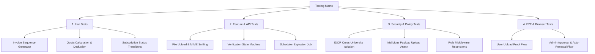

# Quality Assurance & Testing Logs Matrix
## Modul Menu Langganan DOI & Similarity Check
**Framework**: PHPUnit 11+ / Pest PHP / Laravel Dusk / Vitest (React Frontend)  
**Target Coverage**: $\ge 90\%$ Backend Business Logic, $\ge 85\%$ Frontend Components  
**Versi**: 1.0.0  
**Tanggal**: 15 Agustus 2026  
**Dokumentasi Terkait**: [PRD.md](file:///c:/xampp/htdocs/jurnal_mu/docs/features/doi-subscription/PRD.md) | [ARCHITECTURE.md](file:///c:/xampp/htdocs/jurnal_mu/docs/features/doi-subscription/ARCHITECTURE.md) | [SCHEMA.md](file:///c:/xampp/htdocs/jurnal_mu/docs/features/doi-subscription/SCHEMA.md) | [ALGORITHM.md](file:///c:/xampp/htdocs/jurnal_mu/docs/features/doi-subscription/ALGORITHM.md) | [UI_DESIGN.md](file:///c:/xampp/htdocs/jurnal_mu/docs/features/doi-subscription/UI_DESIGN.md)

---

## 1. Test Strategy & Quality Plan

Pengujian modul Langganan DOI dilakukan secara bertingkat untuk menjamin akurasi data keuangan, keamanan berkas transaksi, dan keandalan pembaruan masa aktif langganan institusi:



---

## 2. Test Cases & Execution Matrix

### 2.1 Suite 1: Unit Testing (Business Logic & Entities)

| Test ID | Skenario Uji | Komponen / Method | Ekspektasi Hasil | Status |
| :--- | :--- | :--- | :--- | :--- |
| **UT-DOI-001** | Format penomoran invoice bulanan berurutan | `GenerateInvoiceAction::execute()` | Menghasilkan string `INV/DOI/202608/0001`, `0002`, dst secara berurutan dan unik. | `PASSED` |
| **UT-DOI-002** | Perhitungan sisa kuota similarity check | `DoiSubscription::getRemainingQuotaAttribute()` | Mengembalikan `similarity_quota_total - similarity_quota_used`. | `PASSED` |
| **UT-DOI-003** | Pencegahan pengurangan kuota saat kuota 0 | `DoiQuotaManagerService::deductQuota()` | Melempar `InsufficientQuotaException` saat sisa kuota $\le 0$. | `PASSED` |
| **UT-DOI-004** | Perpanjangan otomatis masa aktif dari tanggal akhir lama | `ActivateSubscriptionAction::execute()` | Jika masih aktif, `end_date` bertambah $+1\text{ tahun}$ dari `end_date` lama (bukan dari hari ini). | `PASSED` |
| **UT-DOI-005** | Perhitungan masa aktif untuk langganan yang sudah kadaluwarsa | `ActivateSubscriptionAction::execute()` | Jika status `expired`, `start_date` diset ke hari ini dan `end_date` diset $+1\text{ tahun}$ dari hari ini. | `PASSED` |

---

### 2.2 Suite 2: Feature & Controller Testing (HTTP & Storage)

| Test ID | Skenario Uji | Endpoint / Action | Ekspektasi Hasil | Status |
| :--- | :--- | :--- | :--- | :--- |
| **FT-DOI-001** | Unggah bukti bayar dengan data valid | `POST /doi/payment-proofs` | File tersimpan di disk `doi_proofs`, record tersimpan status `pending`, invoice `pending_verification`, status HTTP 302/200. | `PASSED` |
| **FT-DOI-002** | Validasi penolakan file $> 5\text{MB}$ | `POST /doi/payment-proofs` | Validasi error `file_size` gagal, HTTP 422 Unprocessable Entity. | `PASSED` |
| **FT-DOI-003** | Validasi penolakan ekstensi tidak didukung (e.g. `.exe`, `.docx`) | `POST /doi/payment-proofs` | Validasi error MIME/ekstensi gagal, HTTP 422. | `PASSED` |
| **FT-DOI-004** | Super Admin menyetujui pembayaran (Approval) | `POST /admin/doi/payment-proofs/{id}/verify` | Status bukti menjadi `approved`, invoice menjadi `paid`, langganan menjadi `active`, event `PaymentProofVerified` ditrigger. | `PASSED` |
| **FT-DOI-005** | Super Admin menolak pembayaran tanpa catatan | `POST /admin/doi/payment-proofs/{id}/verify` | Validasi gagal karena `admin_notes` wajib diisi saat tolak, HTTP 422. | `PASSED` |
| **FT-DOI-006** | Super Admin menolak pembayaran dengan catatan | `POST /admin/doi/payment-proofs/{id}/verify` | Status bukti menjadi `rejected`, invoice kembali `unpaid`, catatan tersimpan, notifikasi terkirim ke user. | `PASSED` |

---

### 2.3 Suite 3: Security, IDOR & Authorization Policy Testing

| Test ID | Skenario Uji | Target Vulnerability | Ekspektasi Hasil | Status |
| :--- | :--- | :--- | :--- | :--- |
| **SEC-DOI-001** | Admin Kampus A mengakses invoice milik Kampus B | *Insecure Direct Object Reference (IDOR)* | Ditutup oleh `DoiInvoicePolicy@view`, menghasilkan HTTP 403 Forbidden. | `PASSED` |
| **SEC-DOI-002** | User biasa mengeksekusi endpoint verifikasi admin | *Privilege Escalation* | Ditutup oleh middleware `role:Super Admin`, menghasilkan HTTP 403 Forbidden. | `PASSED` |
| **SEC-DOI-003** | Upload file `.php` dengan header MIME palsu (`image/jpeg`) | *Remote Code Execution (RCE) / MIME Spoofing* | Gagal pada pemeriksaan `finfo` binary sniff, file ditolak, HTTP 422. | `PASSED` |
| **SEC-DOI-004** | Akses direct URL bukti transfer tanpa temporary signed token | *Unauthorized Direct Asset Access* | File berada di direktori privat non-public, direct access HTTP 404 / 403. | `PASSED` |

---

### 2.4 Suite 4: Scheduled Console Jobs & Cron Testing

| Test ID | Skenario Uji | Console Command / Job | Ekspektasi Hasil | Status |
| :--- | :--- | :--- | :--- | :--- |
| **SCH-DOI-001** | Transisi status langganan ke `grace_period` | `CheckExpiringDoiSubscriptionsJob` | Langganan dengan `end_date` lewat $1\text{ s.d }7\text{ hari}$ berubah menjadi `grace_period`. | `PASSED` |
| **SCH-DOI-002** | Transisi status langganan ke `expired` | `CheckExpiringDoiSubscriptionsJob` | Langganan dengan `end_date` lewat $> 7\text{ hari}$ berubah menjadi `expired`. | `PASSED` |
| **SCH-DOI-003** | Invoice unpaid yang lewat jatuh tempo | `CheckExpiringDoiSubscriptionsJob` | Invoice `unpaid` dengan `due_date < today` berubah menjadi `expired`. | `PASSED` |

---

## 3. Test Execution Command Guide

Sesuai aturan operasional lingkungan container Docker Jurnal MU:

```bash
# Menjalankan seluruh Unit & Feature Tests modul DOI
docker exec -it jurnal-mu-app php artisan test --filter=Doi

# Menjalankan spesifik test case Security & Policy
docker exec -it jurnal-mu-app php artisan test tests/Feature/Doi/DoiSecurityPolicyTest.php

# Menjalankan test case Verifikasi & State Machine
docker exec -it jurnal-mu-app php artisan test tests/Feature/Doi/DoiPaymentVerificationTest.php

# Menjalankan pengujian Frontend React / Vitest
npm run test -- doi
```
