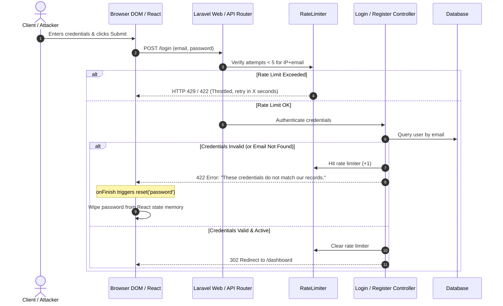

# Design Specification: Authentication & User Registration Security Hardening

- **Target**: JurnalMu Authentication Subsystem (Login & Register)
- **Date**: 2026-09-26
- **Branch**: `security/pentest-audit`
- **Status**: Draft Approved — Ready for Implementation Planning

---

## 1. Problem Statement & Threat Model

During penetration testing and source code analysis of the JurnalMu authentication and registration workflows, multiple vulnerabilities and information disclosure vectors were identified:

1. **Client-Side Password Exposure in DOM & State Memory**:
   - In `resources/js/pages/auth/login.tsx` and `register.tsx`, password inputs lack standard security attributes (`name="password"`, `autoComplete="current-password"` / `autoComplete="new-password"`).
   - When a login attempt fails or user navigates, the form does not trigger `reset('password')` in `onFinish`. The plaintext password remains stored in React component state memory, accessible via React Developer Tools or browser heap inspection.
   - Absence of an accessible, controlled Show/Hide password toggle component encourages users or testers to manipulate DOM element types (`type="text"`) in browser DevTools.

2. **User Account Enumeration (OWASP WSTG-IDNT-04)**:
   - In `app/Http/Controllers/Auth/LoginRequest.php`, the email validation rule contains `'exists:users,email'`.
   - Submitting an unregistered email triggers a validation error: `"The selected email is invalid."`
   - Submitting a registered email with an invalid password triggers an authentication error: `"The provided credentials are incorrect."`
   - This behavioral discrepancy allows unauthenticated attackers to programmatically enumerate registered email addresses across universities.

3. **Missing Rate Limiting on API Login & Registration Endpoints**:
   - In `app/Http/Controllers/Auth/AuthenticatedSessionController.php`, the API method `login(Request $request)` checks passwords directly via `Hash::check()` without invoking Laravel's `RateLimiter`. Attackers targeting `/api/login` can execute brute-force attacks without lockout.
   - In `routes/auth.php`, `Route::post('register')` has no `throttle` middleware, leaving the endpoint open to automated bot account creation and database spam.

4. **Weak Default Password Policy**:
   - `RegisteredUserController` utilizes `Rules\Password::defaults()`, but no custom password defaults are configured in `AppServiceProvider::boot()`. Consequently, users can register with trivial passwords (e.g., 8 numeric characters), increasing exposure to dictionary and brute-force attacks.

---

## 2. Architecture & Component Design

### 2.1 Frontend Hardening

#### Reusable Component: `resources/js/components/ui/password-input.tsx`
A dedicated, accessible password input component wrapping Shadcn/UI `Input`:
- **State**: Manages internal `showPassword` boolean state.
- **Toggle Mechanism**: Inline toggle button with Eye / EyeOff icons from `lucide-react`. Button specifies `type="button"` and `tabIndex={-1}` to prevent accidental form submission or focus hijacking.
- **Attributes**: Supports standard `autoComplete` (`current-password`, `new-password`), `name`, and forwards refs for form binding.
- **Accessibility**: Includes `aria-label` ("Show password" / "Hide password") and appropriate `aria-pressed` attributes.

#### State Sanitization: `login.tsx` and `register.tsx`
- Integrate `PasswordInput` in place of raw `<Input type="password" ... />`.
- Inject `reset` helper from Inertia `useForm`.
- In `login.tsx`:
  ```tsx
  const submit: FormEventHandler = (e) => {
      e.preventDefault();
      post(route('login'), {
          onFinish: () => reset('password'),
      });
  };
  ```
- In `register.tsx`:
  ```tsx
  const submit: FormEventHandler = (e) => {
      e.preventDefault();
      post(route('register'), {
          onFinish: () => reset('password', 'password_confirmation'),
      });
  };
  ```
- Immediate memory purge: On request completion (success or failure), plaintext passwords are wiped from React state, ensuring DevTools inspection displays empty values.

### 2.2 Backend Hardening

#### Neutralize Account Enumeration (`app/Http/Controllers/Auth/LoginRequest.php`)
- Remove `'exists:users,email'` from `rules()`:
  ```php
  public function rules(): array
  {
      return [
          'email' => ['required', 'string', 'email', 'max:255'],
          'password' => ['required', 'string', 'max:255'],
      ];
  }
  ```
- In `authenticate()`: When `Auth::attempt()` fails, return uniform translation string `__('auth.failed')`. The response message and status code (HTTP 422 with email key) are completely indistinguishable whether the account exists or not.

#### API Login Brute-Force Defense (`app/Http/Controllers/Auth/AuthenticatedSessionController.php`)
- In `login(Request $request)`:
  - Generate throttle key: `Str::transliterate(Str::lower($request->email).'|'.$request->ip())`.
  - Check `RateLimiter::tooManyAttempts($throttleKey, 5)`.
  - If locked out, throw `ValidationException::withMessages(['email' => trans('auth.throttle', ['seconds' => RateLimiter::availableIn($throttleKey)])])`.
  - On failed credential match, record attempt: `RateLimiter::hit($throttleKey, 60)`.
  - On successful login, clear lockout: `RateLimiter::clear($throttleKey)`.

#### Registration Rate Limiting (`routes/auth.php`)
- Attach rate limiting middleware to registration POST route:
  ```php
  Route::post('register', [RegisteredUserController::class, 'store'])
      ->middleware('throttle:10,1');
  ```
- Limits any single IP address to a maximum of 10 registration submissions per minute.

#### Password Complexity Policy (`app/Providers/AppServiceProvider.php`)
- Configure strong password rules in `boot()`:
  ```php
  use Illuminate\Validation\Rules\Password;

  Password::defaults(function () {
      $rule = Password::min(8)
          ->letters()
          ->mixedCase()
          ->numbers();

      return app()->isProduction()
          ? $rule->symbols()->uncompromised()
          : $rule;
  });
  ```
- Requires minimum 8 characters, at least one uppercase letter, one lowercase letter, and one number. In production environments, requires special symbols and checks against HaveIBeenPwned compromised password database.

---

## 3. Data Flow & Sequence Diagram



---

## 4. Test Suite Strategy: `tests/Feature/Security/AuthSecurityTest.php`

The test suite will validate both affirmative security controls and defense-in-depth mitigations:

1. **`test_login_does_not_reveal_user_existence_on_invalid_email`**:
   - Submits non-existent email `ghost@nonexistent-domain.edu`.
   - Asserts session error for `email` equals `__('auth.failed')`.
   - Asserts message does NOT contain "selected email is invalid".

2. **`test_login_returns_identical_error_for_valid_email_wrong_password`**:
   - Creates valid active user.
   - Submits valid email with incorrect password.
   - Asserts session error message matches non-existent user error character-for-character.

3. **`test_web_login_is_throttled_after_5_failed_attempts`**:
   - Submits 5 consecutive failed login requests.
   - 6th attempt asserts session error contains throttle message / lockout.

4. **`test_api_login_is_throttled_after_5_failed_attempts`**:
   - Submits 5 consecutive failed POST requests to `/api/login`.
   - 6th attempt asserts response is throttled.

5. **`test_registration_is_rate_limited_after_10_attempts`**:
   - Simulates 11 registration submissions in a 1-minute window.
   - Asserts 11th request returns HTTP 429 Too Many Requests.

6. **`test_registration_rejects_weak_passwords`**:
   - Attempts registration with `alllowercase`, `ALLUPPERCASE`, and `12345678`.
   - Asserts validation errors on `password`.
   - Submits valid password `ValidPass123!`; asserts successful user creation.

---

## 5. Affected Files

| Component | File Path | Modification |
|---|---|---|
| Frontend Component | `resources/js/components/ui/password-input.tsx` | Create reusable password input with toggle & accessibility |
| Frontend Auth | `resources/js/pages/auth/login.tsx` | Replace input, add `onFinish: () => reset('password')` |
| Frontend Auth | `resources/js/pages/auth/register.tsx` | Replace inputs, add `onFinish: () => reset('password', 'password_confirmation')` |
| Backend Request | `app/Http/Controllers/Auth/LoginRequest.php` | Remove `exists:users,email` rule; unify error message |
| Backend Controller | `app/Http/Controllers/Auth/AuthenticatedSessionController.php` | Add rate limiting to `login()` API method |
| Backend Routes | `routes/auth.php` | Add `throttle:10,1` to registration POST route |
| Backend Provider | `app/Providers/AppServiceProvider.php` | Configure `Password::defaults()` complexity |
| Test Suite | `tests/Feature/Security/AuthSecurityTest.php` | Comprehensive automated verification test cases |
