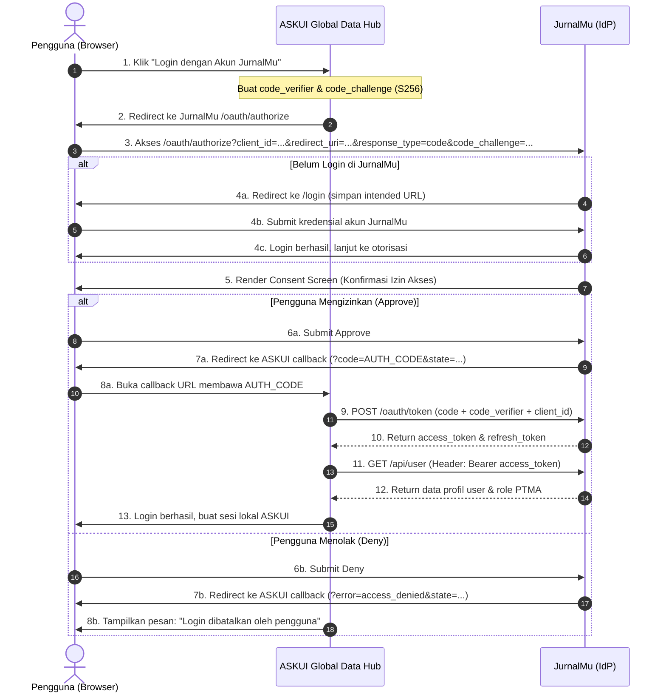

# Spesifikasi Desain Arsitektur SSO: JurnalMu (IdP) & ASKUI Global Data Hub (Client)

**Tanggal:** 2026-10-02  
**Status:** DRAFT (Menunggu Review)  
**Protokol:** OAuth 2.0 Authorization Code Grant with PKCE (RFC 7636)  
**Tumpukan Teknologi:** Laravel 12, Laravel Passport, React (Inertia.js), MySQL/PostgreSQL

---

## 1. Latar Belakang & Tujuan

JurnalMu bertindak sebagai **Identity Provider (IdP)** terpusat untuk ekosistem aplikasi di lingkungan terkait, termasuk sistem informasi baru **ASKUI Global Data Hub**.
Tujuan desain:
1. Menyediakan Single Sign-On (SSO) standar industri yang aman dan dapat digunakan oleh ASKUI maupun aplikasi mitra lainnya di masa mendatang.
2. Memastikan **nol risiko (zero impact)** terhadap data pengguna publik dari berbagai PTMA yang sudah ada di database produksi.
3. Memberikan pengalaman pengguna yang transparan melalui layar persetujuan izin akses (**Consent Screen**) sebelum data dibagikan ke ASKUI.

---

## 2. Jaminan Keamanan Data Pengguna Existing (PTMA)

1. **Struktur Tabel Pengguna Tidak Berubah**:
   - Tabel `users`, `roles`, `user_roles`, dan data profil existing tidak diubah skemanya atau dihapus.
   - Migrasi Passport hanya menambahkan tabel spesifik OAuth (`oauth_*`).
2. **Hash Sandi Utuh**:
   - Mekanisme hashing sandi tetap menggunakan Bcrypt/Argon2 standar Laravel yang sudah ada.
   - Pengguna PTMA tidak perlu melakukan reset sandi atau aktivasi ulang akun.
3. **Isolasi Sesi**:
   - Sesi berbasis web/cookie (`web` guard) untuk frontend Inertia JurnalMu tetap beroperasi independen.
   - Token OAuth Passport dikhususkan untuk otentikasi lintas aplikasi (`auth:api` guard).

---

## 3. Arsitektur Komponen

### 3.1 Paket & Dependensi
- **Paket:** `laravel/passport` (^12.0)
- **Kunci Enkripsi:** RSA private/public keys (`storage/oauth-private.key` dan `storage/oauth-public.key`).

### 3.2 Isolasi Guard & Autentikasi
- `config/auth.php`:
  ```php
  'guards' => [
      'web' => [
          'driver' => 'session',
          'provider' => 'users',
      ],
      'api' => [
          'driver' => 'passport',
          'provider' => 'users',
      ],
  ],
  ```

### 3.3 Penyesuaian Model Pengguna
Pada `app/Models/User.php`:
- Mengintegrasikan trait `Laravel\Passport\HasApiTokens`.

---

## 4. Alur SSO & Protokol PKCE



---

## 5. Kontrak Data & Endpoint API

### 5.1 Endpoint Otorisasi
- **GET `/oauth/authorize`**: Validasi client, cek session user. Jika terotentikasi, render antarmuka persetujuan (Consent Screen).
- **POST `/oauth/authorize`**: Menerima keputusan user (`approve` atau `deny`).
- **POST `/oauth/token`**: Penukaran `code` menjadi `access_token` dengan validasi `code_verifier`.

### 5.2 Endpoint Profil Pengguna (`GET /api/user`)
- **Guard:** `auth:api` (Passport Bearer Token)
- **Format Respon:**
  ```json
  {
    "id": 105,
    "name": "Ahmad Dahlan",
    "email": "ahmad@ptma.ac.id",
    "email_verified": true,
    "avatar": "https://jurnalmu.test/storage/avatars/105.png",
    "status": "approved",
    "roles": [
      {
        "id": 2,
        "name": "Author",
        "slug": "author"
      },
      {
        "id": 4,
        "name": "Reviewer",
        "slug": "reviewer"
      }
    ],
    "primary_role": "Author",
    "affiliation": {
      "ptma_name": "Universitas Muhammadiyah Contoh",
      "department": "Teknik Informatika"
    }
  }
  ```

### 5.3 Endpoint Revokasi / Logout (`POST /api/oauth/revoke-token`)
- **Guard:** `auth:api`
- **Fungsi:** Mencabut masa aktif `access_token` saat user melakukan logout dari ASKUI.

---

## 6. Antarmuka Layanan Persetujuan (Consent Screen UI)

- **Komponen:** `resources/js/pages/auth/oauth-authorize.tsx` (Inertia + React).
- **Elemen Tampilan:**
  1. Header: Logo JurnalMu terhubung ke Logo ASKUI Global Data Hub.
  2. Pemberitahuan: "Aplikasi **ASKUI Global Data Hub** meminta izin untuk mengakses informasi akun JurnalMu Anda."
  3. Cakupan Izin (Scopes):
     - Profil dasar (Nama, Email, Foto Profil).
     - Peran (Role) dan Afiliasi PTMA.
  4. Tombol Aksi:
     - `Izinkan Akses` (Aksi: Approve).
     - `Tolak & Kembali` (Aksi: Deny).

---

## 7. Kebijakan Keamanan & Siklus Token

1. **Masa Berlaku Token:**
   - `access_token`: 1 jam.
   - `refresh_token`: 30 hari.
   - `auth_code`: 10 menit (single-use).
2. **Validasi Redirect URI:**
   - Whitelist ketat di tabel `oauth_clients`. Permintaan dengan URL callback yang tidak terdaftar akan langsung ditolak (`invalid_client`).
3. **Penegakan PKCE:**
   - Wajib menyertakan `code_challenge` (metode `S256`) pada saat inisiasi permintaan otorisasi.

---

## 8. Rencana Pengujian (Testing & Verifikasi)

1. **Pest Feature Tests:**
   - `tests/Feature/OAuth/AuthorizeTest.php`:
     - Test guest diarahkan ke halaman login.
     - Test user login melihat Consent Screen.
     - Test aksi Deny menghasilkan redirect `error=access_denied`.
     - Test aksi Approve menghasilkan redirect berisi `code`.
   - `tests/Feature/OAuth/TokenExchangeTest.php`:
     - Test penukaran authorization code valid + PKCE verifier mengembalikan access token.
     - Test penukaran code kedaluwarsa atau mismatch verifier menghasilkan error `400 Bad Request`.
   - `tests/Feature/OAuth/UserInfoTest.php`:
     - Test pemanggilan `GET /api/user` dengan Bearer token valid mengembalikan data lengkap PTMA.
     - Test pemanggilan dengan token tidak valid mengembalikan `401 Unauthorized`.
2. **Uji Integrasi End-to-End:**
   - Registrasi client simulasi melalui command `docker exec -it jurnal-mu-app php artisan passport:client`.
   - Simulasi alur penuh dari browser hingga token exchange.
